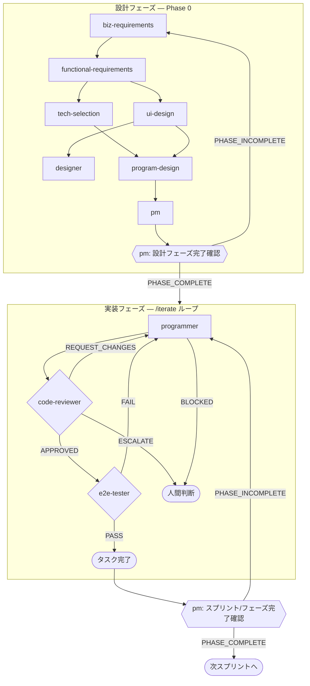

# A2P — Amazon Automated Publishing Tool

This repository builds a personal, web-based tool that automates the end-to-end production of Amazon KDP books (実用書・ビジネス書・自己啓発) using a team of AI agents. It also automates its own development through a harness of Claude Code subagents.

## Mental model

Two distinct agent layers coexist in this repo. **Do not confuse them.**

| Layer | Where defined | Purpose |
|---|---|---|
| **Runtime agents** | `packages/agents/` (Claude Agent SDK) | Run inside the deployed app to produce books — Marketer, Writer, Editor, Thumbnail Designer, Quality Judge, Prompt Optimizer |
| **Harness agents** | `.claude/agents/` (Claude Code subagents) | Run during development inside this repo — Business/Functional/Tech/UI/Program design, Designer, PM, Programmer, Code Reviewer, E2E Tester |

When the user says "ライターを直して" they mean the runtime Writer agent in `packages/agents/`. When they say "プログラマーエージェントを呼んで" they mean the Claude Code subagent invoked via `Agent(subagent_type=programmer, ...)`.

## Harness agents — roles

10 個のハーネスエージェントは「設計フェーズ」と「実装フェーズ」に二分される。

### 設計フェーズ (Phase 0)

| # | エージェント | 役割 | 入力 | 出力 |
|---|---|---|---|---|
| 1 | `biz-requirements` | 業務要件定義 — 誰が何のために何を得るか | `CLAUDE.md` | `docs/01-business-requirements.md` |
| 2 | `functional-requirements` | 機能要件定義 — 各機能の入出力・受入基準・非機能要件 | `docs/01` | `docs/02-functional-requirements.md` |
| 3 | `tech-selection` | 技術選定 — CLAUDE.md の確定スタックを肉付け＋未決領域を選定 | `docs/01`, `docs/02` | `docs/03-tech-selection.md` |
| 4 | `ui-design` | 画面設計 — 画面一覧・遷移・各画面のセクション/コンポーネント | `docs/01`, `docs/02` | `docs/04-ui-design.md` |
| 5 | `designer` | ワイヤーフレーム作成 (ASCII/mermaid) | `docs/04` | `docs/wireframes/{S-xxx}-*.md` |
| 6 | `program-design` | プログラム設計 — DB/API/ジョブ/エージェント仕様/シーケンス | `docs/01..04` | `docs/05-program-design.md` |
| 7 | `pm` | 開発計画とスプリント分解 (タスク粒度まで) | `docs/01..05` | `docs/dev-plan.md`, `docs/sprints/SP-NN-*.md` |

### 実装フェーズ (Phase 1+)

| # | エージェント | 役割 | 入力 | 出力 |
|---|---|---|---|---|
| 8 | `programmer` | コード実装 (1 タスク = 1 起動) | タスク ID または指示 + `docs/05` | コード変更 + `## DONE`/`## BLOCKED` |
| 9 | `code-reviewer` | コードレビュー (要件・設計・型・テスト・セキュリティ) | programmer の変更 + `docs/05` | `## APPROVED`/`## REQUEST_CHANGES`/`## ESCALATE` |
| 10 | `e2e-tester` | Playwright で E2E テスト作成・実行 | タスクが触る機能 + `docs/02`/`docs/05` | `## DONE` (= PASS) / `## BLOCKED` (= FAIL) |

## Harness execution flow



設計フェーズは **上流から順に1回ずつ** 実行。後段エージェントは必ず前段ドキュメントを読む契約。
実装フェーズは **タスクごとに `/iterate` を起動** し、内部で programmer → code-reviewer → e2e-tester の三段ループを APPROVED+PASS まで回す。

### フェーズ/スプリント完了確認

各フェーズ（設計フェーズ全体、各実装スプリント、Phase 1〜4 の各マイルストーン）の完了時、**`pm` エージェントを「完了確認モード」で起動**し、以下を機械的に検証する：

- 当該フェーズに紐づく全タスク (`docs/sprints/SP-NN-*.md` の `T-NN-MM`) が完了状態か
- 各タスクの受け入れ基準を満たす成果物（コード/ドキュメント/テスト）が存在するか
- 申し送り事項（前フェーズドキュメント末尾の「後続エージェントへの申し送り」）が後段で全て参照・対応されているか
- 次フェーズの前提条件（依存ドキュメント、DB マイグレーション、env 変数等）が揃っているか

PM は最後に `## PHASE_COMPLETE` または `## PHASE_INCOMPLETE: <未消化リスト>` を出力する。INCOMPLETE の場合、不足項目を担当エージェント（programmer / 該当設計エージェント）へ差し戻し、解消後に再確認する。

### `/iterate` の合否判定プロトコル

`/iterate "<タスク ID または指示>"` で起動。programmer の 1 回呼び出しを 1 iteration とカウント、**最大 5 iterations**。

1. `programmer` 実行 → `## DONE` を待つ（`## BLOCKED` なら停止し人間に escalation）
2. `code-reviewer` 実行
   - `## APPROVED` → 次のステップへ
   - `## REQUEST_CHANGES` → フィードバックを次回 programmer に渡して step 1 へ戻る
   - `## ESCALATE` → 停止し人間に escalation
3. `e2e-tester` 実行
   - `## DONE` (= 全 PASS) → タスク完了
   - `## BLOCKED` (= FAIL or 環境問題) → 失敗詳細を次回 programmer に渡して step 1 へ戻る

5 iteration 経過しても完了しなければ、`## /iterate ESCALATED` を出力して人間判断に委ねる。

## Project layout (target)

```
.claude/
  agents/              ← harness subagents
  commands/            ← slash commands (/iterate, etc.)
docs/                  ← design artifacts produced by harness
apps/
  web/                 ← Next.js 15 (App Router) — UI + API routes
  worker/              ← graphile-worker process — long-running pipelines
packages/
  agents/              ← Claude Agent SDK subagents (Marketer, Writer, ...)
  db/                  ← Prisma schema + client
  storage/             ← Cloudflare R2 client
  contracts/           ← shared TypeScript types (job payloads, agent IO)
tests/
  e2e/                 ← Playwright specs
```

The codebase will be a `pnpm` workspace.

## Tech stack (decided)

- **Framework:** Next.js 15 + TypeScript
- **Hosting:** Railway (Web service + Worker service + Postgres)
- **DB:** PostgreSQL via Prisma
- **Job queue:** `graphile-worker` (PG-backed, no Redis needed)
- **AI orchestration:** 二層構造 — `AISdkClient` = Vercel AI SDK (`ai` ^5 + `@ai-sdk/{anthropic,openai,google}` ^2) で全 LLM 汎用呼び出し、`AgentSdkClient` = `@anthropic-ai/sdk` (公式 Messages API) で Marketer の Web 検索付き呼び出し。Opus 4.7 for creative, Sonnet 4.6 for judging
- **Web search:** Anthropic Messages API `web_search_20250305` server tool（`@anthropic-ai/sdk` 経由）
- **Image gen:** OpenAI `gpt-image-1`
- **Word output:** `docx` (npm)
- **PDF output:** `@react-pdf/renderer`
- **Object storage:** Cloudflare R2 (S3 compatible)
- **Auth:** NextAuth Credentials provider (single user, env-based password)
- **UI:** Tailwind + shadcn/ui
- **Testing:** Vitest (unit), Playwright (E2E)

Reasoning is in `docs/03-tech-selection.md` once produced.

## Phased roadmap

- **Phase 0 (now):** Harness setup — 10 subagents + `/iterate` + `docs/01..05` produced
- **Phase 1 (MVP):** Pipeline Marketer→Writer→Editor→Thumbnail, Word/PDF/PNG output, dashboard skeleton
- **Phase 2:** Quality Judge + prompt versioning + sales tracking + Prompt Optimizer batch
- **Phase 3:** Playwright-based KDP auto-publish (separate worker, 2FA via push-and-wait)
- **Phase 4:** Additional output channels (note articles, etc.)

## Hard rules for any agent in this repo

1. **Single user.** No multi-tenant abstractions, no org/team models. Just `accounts` (= KDP publishing accounts), all owned by the operator.
2. **Japanese is the primary content language.** UI, generated books, prompts — all 日本語. Code/comments may be English.
3. **Don't invent files outside the documented layout.** If a new top-level concept is needed, propose it in `docs/05-program-design.md` first.
4. **Prompt templates live in DB**, not in code. The `prompts` table is the source of truth for runtime agent system prompts. Seed scripts populate initial versions.
5. **Cost & token usage is observable.** Every Claude/OpenAI call records into `token_usage`. Don't add a model call without wiring this.
6. **Never commit secrets.** `.env.local`, `.env.production` are gitignored. Use Railway env vars in production.
