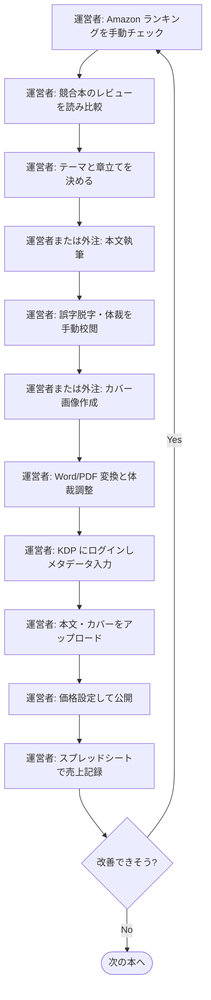
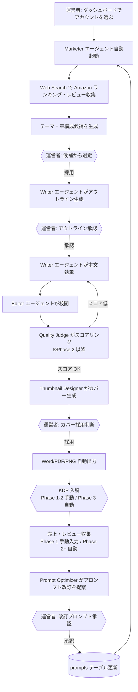

# 01. 業務要件

> 本ドキュメントは `biz-requirements` ハーネスエージェントが生成・更新する。
> 構造の指示は `.claude/agents/biz-requirements.md` を参照。
> 後続の `02-functional-requirements.md`・`03-tech-selection.md`・`04-ui-design.md`・`05-program-design.md` はすべて本ドキュメントを起点に作成される。

---

## 1. 背景・課題 (BR-01)

### 1.1 市場背景

Amazon KDP (Kindle Direct Publishing) は、個人が低コストで書籍を電子・ペーパーバック形式で出版できる主要プラットフォームである。特に「実用書・ノウハウ本」「ビジネス書・自己啓発」のジャンルは需要が安定しており、回転率が高い反面、同種コンテンツが乱立しているため **「企画力 × 速度 × 品質改善サイクル」** で勝負が決まる市場になっている。

### 1.2 現状の手作業負荷

KDP 出版を個人で継続的に回す場合、1 冊あたり概ね以下の工程が発生する。すべて手作業だと 1 冊数日〜数週間を要し、月数冊の出版が現実的な上限となる。

| # | 工程 | 主な作業 | 主な負荷 |
|---|---|---|---|
| 1 | テーマ選定 | Amazon ランキング・関連語調査、競合書のレビュー分析 | 1 冊あたり数時間の調査、判断の属人化 |
| 2 | 構成設計 | 章立て・想定読者・ベネフィット定義 | 「売れる構成」のノウハウ依存 |
| 3 | 執筆 | 章単位の本文執筆、トーンの一貫性維持 | 1 冊数万字、最も時間を食う工程 |
| 4 | 校閲 | 誤字脱字・論理矛盾・表記ゆれの修正 | 集中力を要する繰り返し作業 |
| 5 | サムネ作成 | カバー画像生成・ジャンル別の意匠調整 | デザインスキル要、外注コスト発生しがち |
| 6 | 形式変換 | Word/PDF/PNG など KDP 入稿用ファイルへ変換 | 体裁トラブルが頻発 |
| 7 | KDP 登録 | メタデータ入力、ファイルアップロード、価格設定 | 規約変更追従、2FA を伴うログイン |
| 8 | 効果測定 | 売上・レビュー・順位の継続観測 | スプレッドシート手集計、改善に繋がりにくい |

### 1.3 自動化の動機

- **時間レバレッジ**: 1 工程を AI に肩代わりさせれば全体スループットが線形以上に伸びる。
- **品質改善ループの実装**: 売上・レビューを観測 → プロンプトを自動更新する **「コンテンツ生成自身が学習する」サイクル** を回したい。これは個人の手作業では物理的に不可能で、本ツール最大の差別化要素となる。
- **市場シグナルの即時反映**: Amazon ランキングや競合レビューを Web Search で取得し、テーマ提案・章構成・サムネ意匠に即時反映したい。
- **再現性のある運用**: 属人ノウハウを「プロンプト + 評価ロジック」としてシステム化し、暗黙知を資産化する。

---

## 2. 対象ユーザー (BR-02)

### 2.1 利用者プロフィール

| 項目 | 内容 |
|---|---|
| 利用者数 | **1 名のみ**（本ツール運営者本人） |
| 役割 | 企画者・編集者・KDP アカウントオーナーを兼務 |
| KDP 経験レベル | 出版経験あり（少なくとも数冊の出版実績がある中級者を想定） |
| 技術リテラシー | Web ツールの操作可。CLI/SQL レベルの開発作業は本ツール内では行わない（行うのはハーネスエージェント） |
| 主要デバイス | PC ブラウザ（Chrome 系）。スマホは状況確認のみ |
| 稼働時間 | 専業/副業のいずれかは未確定（Open Questions 参照） |

### 2.2 利用シーン

- 朝/夜のまとまった時間に「テーマ候補確認 → 生成キック → 出力レビュー → KDP 入稿」を一気に流す。
- 隙間時間にダッシュボードで売上・レビュー・進捗を確認し、必要なら指示を投入する。

### 2.3 マルチユーザー化の方針

CLAUDE.md の Hard Rule に従い、**マルチテナント設計は行わない**。`accounts` テーブルは KDP 出版アカウント (= ペンネーム単位) を意味し、利用者本人は常に 1 人。SaaS 化検討は §8 ステークホルダーに後述。

---

## 3. ビジネスゴール (BR-03)

### 3.1 ゴールの方向性（定性）

| ゴール | 内容 |
|---|---|
| G1: スループット最大化 | 1 人の運営者が月に複数冊を継続出版できる状態を作る |
| G2: 1 冊あたり工数最小化 | テーマ確定から KDP 入稿可能ファイル生成までを大幅短縮 |
| G3: 売上の右肩上がり | 出版数 × 1 冊あたり平均売上 の双方を改善し、月間売上を成長させる |
| G4: 品質の自己改善 | 売上・レビュー結果をプロンプトに反映し、出すたびに上達するシステムにする |
| G5: 運営コストを売上以下に維持 | AI 利用料・インフラ費を売上総利益の妥当な比率に抑える |
| G6: ペンネーム別の長期戦略運用 | アカウント (ペンネーム) ごとに「シリーズ展開」「ジャンル特化」をマーケターエージェントが計画する |

### 3.2 定量目標（確定）

| KPI | 目標値 | 出典 |
|---|---|---|
| 月間出版冊数 | **100 冊 / 月** | Q1 |
| 月間売上 (ロイヤリティ) | **15 万円 / 月** | Q2 |
| 1 冊あたり運営者操作時間 | **30 分以内** | Q3 |
| 月額 AI/インフラコスト上限 | **5 万円** | Q4 |
| 運営者の稼働レベル | **副業レベル**（週 10〜15 時間想定） | Q5 |

**整合チェック**: Q1 × Q7 = 100 × 1,500 円 = 15 万円 (= Q2)、Q1 × Q10 = 100 × 500 円 = 5 万円 (= Q4)、コスト/売上比率 = 5 万 / 15 万 = **33%**（Q13 30% 目標に対し許容範囲内）。3 つの数値は内的に矛盾しない。

### 3.3 ゴールから導かれる設計含意（要注意）

確定数値から、以下が非機能要件・技術選定に強い制約として降りてくる：

- **並列スループット**: 100 冊/月 ≈ 3.3 冊/日。1 晩 (Q6) で複数冊を完成させるため、ジョブキューでの **並列実行 (最低 3〜5 並列)** が前提。
- **モデルコスト最適化**: 1 冊 500 円 (≒ $3.5) の予算で本文〜校閲〜評価まで賄う。**初期推奨は Writer/Editor が Sonnet 主体、Quality Judge は Haiku/Sonnet、Marketer や Prompt Optimizer など要創造性の局面で Opus** という配分。文字数 5 万字 × Sonnet 主体なら 200〜400 円程度に収まる見込みで、Opus を一部工程で使う余地もある。マルチプロバイダ対応により運営者がいつでも切り替えられる。
- **マルチプロバイダ対応**: モデルは Anthropic に固定せず、**OpenAI (GPT 系) / Google (Gemini 系) を含め、運営者が役割（Writer / Editor / Marketer / Judge / Thumbnail）ごとに UI から選択できる**ようにする。新モデルの相対性能向上やプロバイダ別の価格改定に即時追従するための必須要件。
- **モデル単価カタログの日次取得**: 各プロバイダの最新モデル一覧と入力/出力トークン単価を **日次でバッチ取得**し、`model_catalog` テーブルに保管。ダッシュボードに常時表示し、1 冊あたり予測コスト・実績コストの根拠とする。
- **運営者操作時間 30 分**: 100 冊 × 30 分 = 50 時間/月。副業時間内に収まる前提だが、UI は「テーマ候補一覧の一括承認」「アウトライン承認のバッチ操作」など **N 冊まとめて捌けるダッシュボード設計** が必須。1 冊ずつ画面遷移する設計では破綻する。

---

## 4. 業務スコープ (BR-04)

### 4.1 工程別の責任分担

「自動」= ランタイムエージェントまたはジョブが実行。「人間チェックポイント」= 運営者が UI 上で承認/修正する地点。Phase により自動化範囲が拡大する。

| # | 工程 | Phase 1 (MVP) | Phase 2 | Phase 3 | 人間チェックポイント |
|---|---|---|---|---|---|
| 1 | 市場リサーチ・テーマ提案 | 自動 (Marketer) | 自動 | 自動 | 候補リストからの **選定** |
| 2 | アウトライン (章立て) 生成 | 自動 (Writer) | 自動 | 自動 | アウトライン **承認/修正** |
| 3 | 本文執筆 | 自動 (Writer) | 自動 | 自動 | 章単位の **流し読みレビュー** |
| 4 | 校閲・編集 | 自動 (Editor) | 自動 | 自動 | 任意の **最終確認** |
| 5 | 品質評価 | — | 自動 (Quality Judge) | 自動 | 低スコア時の **再生成判断** |
| 6 | サムネ (カバー) 生成 | 自動 (Thumbnail Designer) | 自動 | 自動 | デザイン **採用/再生成** |
| 7 | Word/PDF/PNG 出力 | 自動 | 自動 | 自動 | — |
| 8 | KDP 登録 (メタデータ・本文・カバー入稿) | **手動** | 手動 | 自動 (Playwright) | 2FA・最終公開ボタン |
| 9 | 売上・レビュー収集 | 手動入力 | 自動取得 | 自動取得 | — |
| 10 | プロンプト改善 | 手動編集 | 自動 (Prompt Optimizer 提案) → 人間承認 | 自動 + 自動承認の閾値運用 | 提案プロンプトの **承認** |

### 4.2 スコープ外

- 紙の流通在庫管理、外部 EC 連携、広告運用 (Amazon 広告等) は **本ツールの責務外**。
- KDP 以外の出版チャネル (note 記事等) は Phase 4 で検討する拡張領域。MVP には含めない。
- 著者の個人ブランディング (SNS 運用等) は本ツールのスコープ外。

### 4.3 ジャンル取り扱い方針

- 取扱ジャンル: **実用書・ノウハウ本 / ビジネス書 / 自己啓発** を主戦場とする。
- **ジャンルごとに専用プロンプトを切り替える**。プロンプト本体は DB (`prompts` テーブル) に格納し、Marketer / Writer / Editor / Thumbnail Designer がジャンルキーをもとに動的に取り出す。
- 同一ジャンル内でも複数バージョンのプロンプトを A/B 的に運用し、Quality Judge と売上データを根拠に Prompt Optimizer が改訂版を提案する。

---

## 5. 業務フロー (BR-05)

### 5.1 現状フロー（このツールがない場合 — 想定）

**ボトルネック**: S3〜S5 が運営者の集中時間を最も消費し、S11 → S1 の改善ループが回らず属人ノウハウに留まる。

### 5.2 理想フロー（A2P 導入後）

**期待効果**: 集中作業 (S3〜S5) がエージェントに置き換わり、運営者は「選定・承認・公開」の判断ポイントのみに専念。M → PO → DB のループが回ることで、出版を重ねるたびに生成品質が改善する。

---

## 6. 主要 KPI / 成功指標 (BR-06)

### 6.1 KPI 一覧

| カテゴリ | KPI | 定義 | 目標 |
|---|---|---|---|
| スループット | 月間出版冊数 | KDP に公開できた冊数 / 月 | **100 冊** |
| 効率 | 1 冊あたりリードタイム | テーマ確定〜出力ファイル完成までの実時間 | **8〜12 時間以内（夜セット→朝完成）** |
| 効率 | 1 冊あたり運営者操作時間 | 運営者がブラウザで操作した実時間 | **30 分以内** |
| 売上 | 月間ロイヤリティ売上 | KDP 入金ベース | **15 万円** |
| 売上 | 1 冊あたり初月売上中央値 | 初月 30 日間の中央値 | **1,500 円** |
| 品質 | Quality Judge 合格スコア | 0–100。下回ったら再生成 (Phase 2+) | **80 以上** |
| 品質 | Amazon レビュー平均星 | 1 冊あたり平均 | **4.0 以上** |
| 学習 | プロンプト改訂サイクル数 | Prompt Optimizer の改訂提案頻度 | **10 冊出版ごとに 1 回** |
| コスト | 1 冊あたり AI コスト | Claude + OpenAI API 課金 / 冊 | **500 円以内** |
| コスト | コスト/売上比率 | AI+インフラ費 ÷ ロイヤリティ売上 | **30% 目標、上限 33%**（5 万 / 15 万 = 33%） |
| 信頼性 | パイプライン成功率 | エラー無く Word/PDF/PNG 出力まで到達した割合 | **95% 以上** |
| 自動学習 | プロンプト自動承認条件 | 改訂版を運営者承認なしに本番適用する条件 | **直近 5 冊連続で Quality Judge スコアが改善** (Phase 2+) |

### 6.2 KPI 観測手段

- すべての Claude / OpenAI 呼び出しは `token_usage` テーブルに記録する (CLAUDE.md Hard Rule 5)。
- 売上・レビューは Phase 1 では運営者の手入力、Phase 2 で自動取得を実装。
- ダッシュボード上で月次・冊単位の KPI を可視化する。

---

## 7. 制約・前提 (BR-07)

### 7.1 法務・規約上の制約

| 区分 | 制約 |
|---|---|
| KDP 規約 | AI 生成コンテンツであることの開示義務 (KDP の "AI Content" ポリシー) を遵守する。サムネに第三者の著作物・実在人物画像を含めない |
| 著作権 | 引用は法的範囲内に留める。Web Search で取得した競合本の文章を **そのまま転載しない** |
| 個人情報 | 運営者本人以外の個人情報を扱わない (単独運営のため発生しない想定) |
| 商標 | 書名・カバーで他社商標を侵害しない自動チェックを将来課題とする |

### 7.2 技術・運用前提

| 区分 | 内容 |
|---|---|
| 利用者 | 1 名固定 (NextAuth Credentials, 単一パスワード) |
| 言語 | UI・生成コンテンツとも **日本語が一次** (CLAUDE.md Hard Rule 2) |
| ホスティング | Railway (Web + Worker + Postgres)。Cloudflare R2 を成果物保管に使用 |
| シークレット | `.env.*` は git 管理外。Railway 環境変数で配布 |
| KDP 自動入稿 | Phase 3 まで未実装。2FA は push-and-wait 方式を想定 |
| 監視 | コスト・トークン消費は `token_usage` に必ず記録 (Hard Rule 5) |

### 7.3 コスト前提

- **月額 AI/インフラ利用料の上限: 5 万円**（Claude + OpenAI + Gemini + Railway + R2 の合計）。
- 1 冊あたり目標コスト 500 円 × 100 冊 = 5 万円が上限と一致するため、**1 冊単位のコスト管理が必須**。`token_usage` テーブルを使い、書籍 ID 単位でコストを集計する。
- **モデルはユーザー設定可能**。役割（Writer / Editor / Marketer / Judge / Thumbnail）ごとに、運営者が UI からプロバイダ・モデルを選択する。初期推奨は下記だが、運営者はいつでも変更でき、変更前後のコスト/品質差を比較できるダッシュボードを持つ。

  | 役割 | 初期推奨モデル | 推奨理由 |
  |---|---|---|
  | Marketer | Claude Opus 4.7 | テーマ提案・タイトル決定の創造性 |
  | Writer | Claude Sonnet 4.6 | 量産時のコスト/品質バランス |
  | Editor | Claude Sonnet 4.6 | 量産工程 |
  | Quality Judge | Claude Sonnet 4.6 または Haiku | 採点はコスト最優先 |
  | Prompt Optimizer | Claude Opus 4.7 | プロンプト改訂は質重視・低頻度 |
  | Thumbnail（テキスト） | Claude Sonnet 4.6 | タイトル文言生成 |
  | Thumbnail（画像） | OpenAI `gpt-image-1` | 表紙画像生成 |

- **対応プロバイダ（Phase 1 から）**: Anthropic (Claude) / OpenAI (GPT) / Google (Gemini)。新規プロバイダ追加は将来課題。
- **モデル単価カタログの自動取得**: 各プロバイダの最新モデル一覧と入出力トークン単価を **日次で自動取得**し、`model_catalog` テーブルに保存。ダッシュボードで常時表示。手動更新も可能。
- 画像生成回数の上限ポリシーは Phase 1 で計測してから定める。

### 7.4 運用前提

- **運営者の稼働レベル: 副業**（週 10〜15 時間、月 40〜60 時間想定）。
- 100 冊/月 × 30 分/冊 = 50 時間/月 が運営者操作時間の上限ライン。これを超えると副業として持続不能になるため、**UI は「N 冊一括承認」設計を必須要件とする**。
- 出版アカウント (ペンネーム) は **初期 1 アカウント** で開始。マーケターエージェントはアカウント単位で長期プランニングを行い、将来複数アカウント運用にも対応可能なデータモデルとする。
- 障害発生時の復旧責任は運営者本人。SLA は設けない。

---

## 8. ステークホルダー (BR-08)

| ステークホルダー | 関与 | 関与度 |
|---|---|---|
| 運営者 (本人) | 企画選定・承認・KDP 入稿 (Phase 1-2) ・売上回収 | 唯一の意思決定者 |
| Amazon KDP | コンテンツ受入・販売・ロイヤリティ支払 | 外部プラットフォーム (規約遵守の対象) |
| Anthropic / OpenAI | Claude・GPT-image-1 を提供 | 外部 API ベンダー |
| Cloudflare / Railway | R2・ホスティングを提供 | 外部インフラベンダー |
| 読者 | 書籍の購入・レビュー投稿 | 売上とプロンプト改善ループのインプット源 |

**将来拡張に関する 1 行注記**: 本ツールはまず単独運営者のためのプライベートツールとして構築するが、将来的にプロンプト資産・パイプラインを基盤として **マルチテナント SaaS 化** する可能性は否定しない（その際は CLAUDE.md Hard Rule 1 の見直しを伴う大改修になる前提）。

---

## Open Questions（解決済み — 2026-05-21 ユーザー回答）

すべての Open Questions に運営者から回答を得たため、本表は履歴として残す。各回答は本ドキュメント本文 §3.2 / §6.1 / §7.3 / §7.4 に反映済み。後段エージェントは本文の確定値を参照すること。

| # | 問い | 回答 | 反映先 |
|---|---|---|---|
| Q1 | 月間出版冊数の目標値 | **100 冊/月** | §3.2, §6.1 |
| Q2 | 月間売上目標 (ロイヤリティ) | **15 万円/月** | §3.2, §6.1 |
| Q3 | 1 冊あたり運営者操作時間上限 | **30 分以内** | §3.2, §6.1, §7.4 |
| Q4 | 月額 AI / インフラ利用料上限 | **5 万円** | §3.2, §7.3 |
| Q5 | 運営者の稼働レベル | **副業レベル**（週 10〜15 時間） | §3.2, §7.4 |
| Q6 | 1 冊あたりリードタイム目標 | **一晩で（夜セット→朝完成、8〜12 時間）** | §6.1 |
| Q7 | 1 冊あたり初月売上中央値目標 | **1,500 円** | §6.1 |
| Q8 | Quality Judge 合格スコア閾値 | **80 / 100 以上**（下回ったら再生成） | §6.1 |
| Q9 | プロンプト改訂サイクル頻度 | **10 冊出版ごとに 1 回** | §6.1 |
| Q10 | 1 冊あたり AI コスト許容上限 | **500 円/冊** | §6.1, §7.3 |
| Q11 | 初期運用 KDP アカウント数 | **1 アカウント** | §7.4 |
| Q12 | Amazon レビュー平均星の目標値 | **4.0 以上** | §6.1 |
| Q13 | コスト/売上比率上限 | **30%** で確定 | §6.1 |
| Q14 | パイプライン成功率目標 | **95% 以上** で確定 | §6.1 |
| Q15 | プロンプト自動承認の条件 | **直近 5 冊連続で Quality Judge スコアが改善** | §6.1 |

## 後続エージェントへの申し送り

確定数値から導かれる、`functional-requirements` 以降で必ず考慮すべき制約：

1. **並列実行が機能要件レベルで必須** — 1 晩で 3〜4 冊を完成させるため、ジョブキューでの並列実行 (最低 3〜5 並列) を機能要件 / 非機能要件に明記すること。
2. **マルチプロバイダ抽象化が機能要件レベルで必須** — Anthropic / OpenAI / Google Gemini を Phase 1 から扱える。**役割（Writer / Editor / Marketer / Judge / Thumbnail）ごとに運営者が UI からモデルを切替可能**にする。`tech-selection` ではプロバイダ非依存の LLM クライアント抽象（例: Vercel AI SDK や LangChain 風のアダプタ）を選定し、`program-design` で「役割→モデル」マッピングを `model_assignments` テーブル等で表現すること。
3. **モデル単価カタログ自動取得バッチ** — 各プロバイダの最新モデル一覧と入出力トークン単価を **日次で取得**し `model_catalog` テーブルに保存する機能を Phase 1 から実装。ダッシュボードでカタログ閲覧と「実コスト/単価」の即時可視化が要件。プロバイダ公式ページ HTML/API のスクレイピング・公式 API 併用の手段は `tech-selection` で検討。
4. **「N 冊一括操作」が UI 必須機能** — テーマ候補一括承認、アウトライン一括承認、サムネ一括採用、KDP 入稿チェックリスト一括処理など、`ui-design` で「バルクオペレーション画面」を必ず設けること。
5. **コスト追跡が書籍 ID × プロバイダ × モデル単位で必要** — `token_usage` テーブルに `book_id` / `provider` / `model` / `input_tokens` / `output_tokens` / `unit_price_snapshot` / `cost_jpy` を持たせ、1 冊単位で **500 円超過アラート**、月次でプロバイダ別/モデル別の集計を出せる構造にすること（`program-design` での DB スキーマ反映必須）。
6. **Phase 2 の自動承認ロジック** — 「5 冊連続スコア改善」を判定するため、`eval_results` に時系列でスコアを蓄積し、Prompt バージョンと紐付けて参照可能にする必要あり。
7. **AI 出力への人間修正コメント機能と運営者トリガーの一括修正** — 章本文・サムネ・タイトル等の AI 出力に運営者がコメントを残し、蓄積したコメントを **運営者の任意タイミング（ボタン押下）で一括修正**できる機能が必須（朝レビュー時に複数冊・複数箇所にコメント → 「一括反映」ボタン押下で即時/順次実行、というワークフロー）。自動スケジュール実行は採用しない（運営者が実行判断を持つ）。`revision_comments` テーブルと、それを入力に受ける修正適用ジョブが必要。30 分/冊の運営者操作時間を守るための核となる機能。
