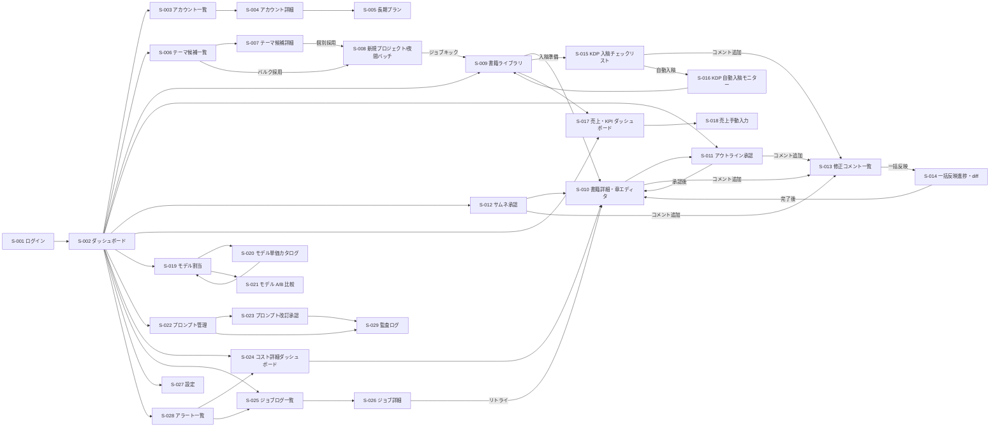

# 04. 画面設計

> 本ドキュメントは `ui-design` ハーネスエージェントが生成・更新する。
> 構造の指示は `.claude/agents/ui-design.md` を参照。
> 起点ドキュメント: `docs/01-business-requirements.md`, `docs/02-functional-requirements.md`（F-001〜F-050、UC-01〜UC-06）。
> 後続: `docs/wireframes/{S-xxx}-*.md`（designer エージェントが各画面の ASCII/mermaid ワイヤーを描く）、`docs/05-program-design.md`（API/DB に落とす際の参照元）。

---

## 0. 本ドキュメントの読み方

- 画面 ID は `S-001` から連番。**機能削除/統廃合があっても ID は欠番として維持**し、安定参照を保つ。
- 1 画面 = 1 ルート（Next.js App Router 上の 1 ページ）。モーダル/ドロワーは親画面の中に含めて記述。
- 「対応機能 ID」は逆引き索引としても使う。§1 末尾の「機能 → 画面 逆引き表」で全 P0/P1 機能の対応を保証する。
- ビジュアル詳細（色コード・ピクセル値）は本ドキュメントでは扱わない。Phase 1 実装時に shadcn/ui のトークンで具体化する。

---

## 1. 画面一覧

### 1.1 画面 ID 一覧表

| ID | 画面名 | 対応機能 ID | UC | 優先度 | フェーズ |
|---|---|---|---|---|---|
| S-001 | ログイン | F-043 | 全 UC 前提 | P0 | Phase 1 |
| S-002 | ダッシュボード（ホーム） | F-008, F-010, F-011, F-016, F-032, F-034, F-035, F-036, F-039, F-045, F-049, F-050 | UC-01, UC-04, UC-06 | P0 | Phase 1 |
| S-003 | アカウント一覧 | F-044, F-048 | UC-01 前提 | P0 | Phase 1 |
| S-004 | アカウント詳細・編集 | F-002, F-044 | UC-01 前提 | P0 | Phase 1 |
| S-005 | 長期出版プラン | F-002 | UC-01 | P1 | Phase 1 |
| S-006 | テーマ候補一覧（バルク承認） | F-001, F-017 | UC-01 | P0 | Phase 1 |
| S-007 | テーマ候補詳細 | F-001, F-017, F-049 | UC-01 | P0 | Phase 1 |
| S-008 | 新規プロジェクト / 夜間バッチ計画 | F-010, F-021, F-022, F-036 | UC-01 | P0 | Phase 1 |
| S-009 | 書籍ライブラリ（一覧） | F-008, F-012, F-013, F-014, F-015, F-033, F-039, F-049 | UC-01, UC-06 | P0 | Phase 1 |
| S-010 | 書籍詳細・章エディタ | F-003, F-004, F-005, F-008, F-012〜F-015, F-018, F-033, F-049 | UC-01, UC-06 | P0 | Phase 1 |
| S-011 | アウトライン承認（バルク） | F-003, F-018, F-049 | UC-01 | P0 | Phase 1 |
| S-012 | サムネ承認（バルク + 単冊） | F-006, F-007, F-014, F-019, F-049 | UC-01, UC-06 | P0 | Phase 1 |
| S-013 | 修正コメント一覧（横断） | F-049, F-050 | UC-06 | P0 | Phase 1 |
| S-014 | 修正一括反映 実行・進捗・diff レビュー | F-050, F-008, F-049 | UC-06 | P0 | Phase 1 |
| S-015 | KDP 入稿チェックリスト | F-020, F-040, F-049 | UC-05 | P1 | Phase 1 |
| S-016 | KDP 自動入稿モニター | F-041, F-042 | UC-05 | P0 | Phase 3 |
| S-017 | 売上・KPI ダッシュボード | F-037, F-038, F-039 | UC-01 後段, UC-02 | P0 | Phase 1 |
| S-018 | 売上手動入力 | F-037 | UC-01 後段 | P0 | Phase 1 |
| S-019 | モデル割当（役割×ジャンル） | F-022, F-023, F-025 | UC-02, UC-04 | P0 | Phase 1 |
| S-020 | モデル単価カタログ | F-024, F-025 | UC-02 | P0 | Phase 1 |
| S-021 | モデル A/B 比較ビュー | F-026 | UC-02 | P1 | Phase 2 |
| S-022 | プロンプト管理（テンプレ一覧・履歴） | F-027, F-028, F-031 | UC-03 | P0 | Phase 1 |
| S-023 | プロンプト改訂承認 | F-009, F-029, F-030 | UC-03 | P0 | Phase 2 |
| S-024 | コスト詳細ダッシュボード | F-032, F-033, F-034, F-035, F-036 | UC-04 | P0 | Phase 1 |
| S-025 | ジョブログ一覧・リトライ | F-016, F-045, F-046 | UC-04 | P1 | Phase 1 |
| S-026 | ジョブ詳細・実行ログ | F-016, F-045, F-046 | UC-04 | P1 | Phase 1 |
| S-027 | 設定（通知・アラート閾値） | F-030, F-034, F-036, F-038 | UC-04 | P0 | Phase 1 |
| S-028 | アラート一覧 | F-024, F-034, F-036 | UC-04 | P1 | Phase 1 |
| S-029 | 監査ログ | F-029, F-030, F-046 | UC-03, UC-04 | P1 | Phase 1 |

合計 **29 画面**（S-001〜S-029、欠番なし）。

### 1.2 機能 → 画面 逆引き表（P0/P1 全機能の網羅確認）

| 機能 ID | 機能名 | 主担当画面 | 補助画面 |
|---|---|---|---|
| F-001 | テーマ候補生成 | S-006 | S-007, S-008 |
| F-002 | 長期出版プラン | S-005 | S-004 |
| F-003 | アウトライン生成 | S-011 | S-010 |
| F-004 | 章単位執筆 | S-010 | S-014, S-025 |
| F-005 | 校閲 | S-010 | S-014 |
| F-006 | カバーテキスト生成 | S-012 | S-010 |
| F-007 | カバー画像生成 | S-012 | S-010 |
| F-008 | Quality Judge 採点 | S-002, S-010 | S-014, S-017, S-021 |
| F-009 | プロンプト改訂提案生成 | S-023 | S-022 |
| F-010 | 書籍ジョブ作成 | S-008 | S-006, S-002 |
| F-011 | 並列ジョブ実行 | S-002, S-025 | S-008 |
| F-012 | Word 出力 | S-010 | S-009 |
| F-013 | PDF 出力 | S-010 | S-009 |
| F-014 | カバー PNG 出力 | S-010, S-012 | S-009 |
| F-015 | R2 永続化 | S-010 | S-009 |
| F-016 | リトライ・部分再開 | S-025, S-026 | S-002 |
| F-017 | テーマバルク採用/却下 | S-006 | — |
| F-018 | アウトラインバルク承認/差戻し | S-011 | S-010 |
| F-019 | サムネバルク採用/再生成 | S-012 | S-010 |
| F-020 | KDP 入稿チェックリスト | S-015 | S-002 |
| F-021 | 夜間バッチ計画 | S-008 | S-002 |
| F-022 | 役割×ジャンルモデル割当 | S-019 | S-008 |
| F-023 | UI からのモデル切替 | S-019 | S-020 |
| F-024 | 単価カタログ日次取得 | S-020 | S-028 |
| F-025 | 単価カタログ表示 | S-020 | S-019 |
| F-026 | モデル A/B 比較 | S-021 | S-024 |
| F-027 | 動的プロンプトテンプレ | S-022 | — |
| F-028 | プロンプトバージョン履歴 | S-022 | S-029 |
| F-029 | プロンプト改訂承認 UI | S-023 | S-029 |
| F-030 | プロンプト自動承認ルール | S-023 | S-027, S-029 |
| F-031 | プロンプト A/B 配信 | S-022 | S-021 |
| F-032 | トークン使用量記録 | S-024 | S-010, S-002 |
| F-033 | 書籍別コスト集計 | S-024 | S-010 |
| F-034 | 1 冊 500 円超過アラート | S-002, S-028 | S-024, S-027 |
| F-035 | 月次コストダッシュボード | S-024 | S-002 |
| F-036 | 月次 5 万円到達予測 | S-024, S-028 | S-002, S-027 |
| F-037 | 売上手動入力 | S-018 | S-017 |
| F-038 | 売上 Amazon 自動取得 | S-017 | S-027 |
| F-039 | 書籍別 KPI ダッシュボード | S-017 | S-009, S-010 |
| F-040 | KDP メタデータ生成 | S-015 | S-010 |
| F-041 | KDP 自動入稿 | S-016 | S-015 |
| F-042 | ASIN 取り込み | S-016 | S-009 |
| F-043 | シングルユーザー認証 | S-001 | — |
| F-044 | アカウント登録・編集 | S-004 | S-003 |
| F-045 | ジョブ実行ログ閲覧 | S-025, S-026 | — |
| F-046 | 失敗ジョブのリトライ | S-025, S-026 | S-002 |
| F-049 | AI 出力への修正コメント | S-010, S-011, S-012, S-015 | S-013 |
| F-050 | 修正コメント一括適用 | S-013, S-014 | S-002 |

P2（Phase 4）機能 F-047 / F-048 は本ドキュメントの主要画面に含めない。F-048 のマルチアカウント対応は S-003 のデータ構造で先行対応（UI は 1 アカウント運用を前提に描画）。

---

## 2. 画面遷移図

### 2.1 主要遷移（UC-01〜UC-06 をカバー）



### 2.2 ユースケース別画面シーケンス

| UC | シーケンス（画面 ID） |
|---|---|
| UC-01 一晩 5 冊バッチ | S-001 → S-002 → S-006 → S-008 → (バッチ実行) → S-002 → S-009 → S-010 → S-012 → S-015 |
| UC-02 モデル切替検証 | S-002 → S-020 → S-019 → (10 冊出版) → S-021 → S-019 |
| UC-03 プロンプト改訂サイクル | S-002 → S-023 → S-022 → S-029 |
| UC-04 1 冊 500 円超過アラート | S-002（赤バッジ）→ S-028 → S-024 → S-026 → S-019 → S-026（再開） |
| UC-05 KDP 自動入稿 | S-009 → S-015 → S-016 → S-009 → S-017 |
| UC-06 コメント→一括修正 | S-002 → S-010 → (S-049 でコメント) → S-013 → S-014 → S-010 |

### 2.3 統合・補足判断

ユーザー要件で挙げられた候補画面のうち、以下は分離/統合した：

- **「テーマ候補一覧」と「新規プロジェクト/夜間バッチ計画」を別画面に分離**: バッチ計画は採用済みテーマを集めて並列度・開始時刻・予測コストを設定する独立ステップであり、テーマ承認とは認知負荷が異なる。S-006（テーマ承認）→ S-008（バッチ計画）の 2 段で運用。
- **「コスト詳細ダッシュボード」と「売上 KPI ダッシュボード」は別画面**: コスト軸（プロバイダ/モデル/役割）と売上軸（書籍/ASIN/月）の縦軸/横軸が異なり、1 画面に詰めると密度過多になる。S-017（売上）と S-024（コスト）に分離し、S-002 ホームの上部 KPI ストリップでクロス参照させる。
- **「アラート一覧」を S-028 として独立**: F-034 / F-036 / F-024 単価変動など複数のアラート源があり、横断確認画面が必要。ダッシュボードのバッジから遷移。
- **「監査ログ」を S-029 として独立**: F-029 / F-030 / F-046 の操作監査要件があり、規模が小さくても専用画面が運用上有用。
- **「修正コメント一覧」と「一括反映進捗」は別画面**: コメントの溜め込み・選別（S-013）と、実行ジョブの進捗・diff レビュー（S-014）はワークフロー段階が異なる。S-013 で対象を絞り込み → ボタン押下で S-014 に遷移。

---

## 3. 共通レイアウト

### 3.1 グローバル構造

```
+---------------------------------------------------+
|  Header (固定)                                    |
+--------+------------------------------------------+
|        |                                          |
| Side   |  Main Content                            |
| Nav    |                                          |
|        |                                          |
+--------+------------------------------------------+
```

レスポンシブ: PC ブラウザ (Chrome 系) を主環境とし、最小幅 1280px を想定。スマホは S-002 / S-016 / S-028 のみ閲覧最適化（運営者は状況確認のみ）。

### 3.2 ヘッダー（全画面共通）

- 左: A2P ロゴ / 現在のアカウント切替プルダウン（Phase 1 は 1 アカウント、Phase 4 で複数）
- 中央: グローバル検索（書籍タイトル・ASIN・テーマ ID で全文検索）
- 右:
  - **CostMeter**: 当月コスト / 上限 5 万円の進捗バー + 残額表示（クリックで S-024 へ）。0–80% = 緑、80–95% = 黄、95–100% = 橙、100%+ = 赤（F-036 連動）
  - **AlertBadge**: 未読アラート件数（クリックで S-028 へ）
  - **CommentBadge**: 未消化修正コメント件数 + うち must 件数（クリックで S-013 へ）
  - 設定アイコン → S-027
  - ログアウト

CostMeter / AlertBadge / CommentBadge の 3 つは **どの画面でも常に視界に入る** ことが必須要件（業務要件 §3.3 「コスト常時可視化」、§後続申し送り 7「コメント常時把握」）。

### 3.3 サイドバー（全画面共通）

階層構造（ナビゲーション）:

```
ホーム                           → S-002
出版パイプライン
  ├ テーマ候補                   → S-006
  ├ 新規プロジェクト/バッチ計画  → S-008
  ├ アウトライン承認             → S-011
  ├ サムネ承認                   → S-012
  └ KDP 入稿                     → S-015
書籍
  ├ 書籍ライブラリ               → S-009
  └ 修正コメント                 → S-013
分析
  ├ 売上・KPI                    → S-017
  └ コスト詳細                   → S-024
モデル & プロンプト
  ├ モデル割当                   → S-019
  ├ モデルカタログ               → S-020
  ├ A/B 比較                     → S-021
  ├ プロンプト管理               → S-022
  └ 改訂承認                     → S-023
運用
  ├ ジョブログ                   → S-025
  ├ アラート                     → S-028
  ├ KDP 自動入稿                 → S-016（Phase 3）
  ├ 監査ログ                     → S-029
  ├ アカウント管理               → S-003
  └ 設定                         → S-027
```

サイドバー下部: アクティブジョブの **JobTicker**（実行中ジョブ件数 / 並列度上限。クリックで S-025 へ）。

### 3.4 メインコンテンツ規約

- ページタイトル + パンくず + プライマリアクションボタンを上部に配置
- 表 (DataTable) はチェックボックス列を左端に置き、選択行に対するバルクアクションバーを下部固定（業務要件 §3.3 バルク必須）
- 全画面でコメント関連 UI（CommentAffordance）を AI 出力に対し常設

---

## 4. 画面詳細

各画面は以下のテンプレートで記述する: 目的 / 主要コンテンツセクション / 主要コンポーネント / ユーザー操作と結果 / 空状態・ローディング・エラー / 関連画面。

---

### S-001 ログイン

- **目的**: F-043 単一ユーザー認証。env 配布の単一パスワードで運営者がセッションを取得する。
- **主要コンテンツセクション**:
  1. A2P ロゴと「Amazon Automated Publishing」コピー
  2. ログインフォーム（ユーザー名 + パスワード）
  3. エラーメッセージ領域
- **主要コンポーネント**:
  - LoginForm: 入力 `{username, password}` → NextAuth `signIn` 呼び出し
  - PasswordInput: マスク表示・visibility toggle
- **ユーザー操作と結果**:
  - 「ログイン」クリック → `POST /api/auth/callback/credentials` → 成功で S-002 にリダイレクト
  - 連続 5 回失敗で 15 分ロック表示（F-043 受け入れ基準）
- **空状態 / ローディング / エラー**:
  - ローディング: ボタンに spinner
  - エラー: 「ユーザー名またはパスワードが正しくありません」/ ロック中は残り時間表示
- **関連画面**: → S-002

---

### S-002 ダッシュボード（ホーム）

- **目的**: 運営者が朝/夜に最初に開く画面。「今やるべきこと」を 30 秒で把握できる集約 HUD。UC-01 / UC-04 / UC-06 の起点。
- **主要コンテンツセクション**:
  1. **トップ KPI ストリップ**: 当月出版数 / 月間目標 100 冊、当月売上 / 目標 15 万円、当月コスト / 上限 5 万円、平均 Quality Judge スコア、進行中ジョブ数
  2. **アクション要求カード（最優先表示）**: 「テーマ候補 N 件 未承認」「アウトライン N 件 承認待ち」「サムネ N 件 採用待ち」「修正コメント N 件（うち must M 件）未反映」「プロンプト改訂提案 N 件」「KDP 入稿待ち N 冊」をカード列で表示。各カードに件数 + 主要 CTA ボタン
  3. **進行中ジョブ**: 並列実行中の書籍とそのフェーズ（Marketer→Writer→Editor→Thumbnail→Judge）を進捗バーで表示
  4. **最近の本**: 直近 10 冊（サムネ・タイトル・ステータス・Quality スコア・累計コスト）
  5. **未読アラート**: 当日発生のアラート上位 5 件（F-034/F-036/F-024 単価変動）
  6. **コスト推移ミニグラフ**: 当月日次コスト + 上限ライン
- **主要コンポーネント**:
  - KPIStripe: 入力 `{period: 'this_month'}` → KPI 集計
  - ActionRequiredCard × 6: 件数バッジ + CTA。クリックで対応画面へ
  - JobProgressList: WebSocket または 5 秒ポーリングで進捗更新
  - RecentBooksTable: ソート可・行クリックで S-010
  - AlertList: アラート種別アイコン + 1 行サマリ
  - CostSparkline: 当月日次積み上げ
- **ユーザー操作と結果**:
  - 「テーマ候補 N 件未承認」CTA → S-006
  - 「修正コメント N 件未反映」CTA → S-013
  - 進行中ジョブ行クリック → S-026
  - 最近の本のサムネクリック → S-010
  - アラート行クリック → S-028
- **空状態 / ローディング / エラー**:
  - 空（初回）: 「最初のアカウントを登録しましょう」ガイド → S-004
  - ローディング: 各セクション skeleton
  - エラー: セクション単位で「再読み込み」ボタン（ダッシュボード全体が落ちないようにする）
- **関連画面**: → S-003〜S-029 すべてへの起点

---

### S-003 アカウント一覧

- **目的**: F-044 / F-048。KDP ペンネームの一覧と新規追加。Phase 1 は 1 件運用だが UI は複数アカウント対応構造。
- **主要コンテンツセクション**:
  1. アカウント一覧テーブル（ペンネーム / ジャンル方針 / 累計出版数 / 累計売上 / 最終出版日）
  2. 「新規アカウント追加」ボタン
- **主要コンポーネント**:
  - AccountsTable: 行クリック → S-004
  - AddAccountButton → S-004（新規モード）
- **ユーザー操作と結果**:
  - 行クリック → S-004（詳細）
  - 削除アクション → 確認モーダル → `DELETE /api/accounts/:id`（出版済み書籍がある場合はソフト削除のみ）
- **空状態**: 「アカウントを 1 つ登録してください」とプライマリ CTA
- **関連画面**: → S-004

---

### S-004 アカウント詳細・編集

- **目的**: F-044 / F-002。ペンネーム / ジャンル方針 / ターゲット読者 / KDP 認証情報の登録・編集。
- **主要コンテンツセクション**:
  1. 基本情報（ペンネーム、表示名、自己紹介、ターゲット読者像）
  2. ジャンル方針（実用書/ビジネス書/自己啓発の比率や注力テーマ）
  3. KDP 認証情報（メール / パスワード / 2FA バックアップコード、AES-256 暗号化保存、UI は常にマスク + 「再入力」ボタン）
  4. 長期出版プラン要約（直近 3 ヶ月の計画概要 + 「詳細」リンク → S-005）
  5. アカウント別 KPI（累計出版数 / 累計売上 / 平均 Quality スコア）
- **主要コンポーネント**:
  - AccountForm: 入力 `{pen_name, target_reader, genre_policy_json}` → `POST/PUT /api/accounts`
  - SecretField: マスク表示 / 「変更」モードでのみ入力
  - PlanSummaryCard → S-005
  - AccountKpiCard
- **ユーザー操作と結果**:
  - 「保存」→ DB 更新 → 成功トースト
  - 「長期プランを再生成」→ F-002 起動 → 完了後 S-005 に遷移
- **空状態**: 新規モードでは KDP 認証情報セクションを「Phase 3 で必要」と注記
- **エラー**: KDP 認証情報の暗号化失敗時はフォーム保存をブロックし、再試行を促す
- **関連画面**: ← S-003, → S-005

---

### S-005 長期出版プラン

- **目的**: F-002。アカウント単位のマーケター長期プラン（月別シリーズ展開・推奨ペース）を可視化。
- **主要コンテンツセクション**:
  1. 期間セレクタ（3 / 6 / 12 ヶ月）と「プラン再生成」ボタン
  2. 月別カレンダー: 月ごとに「予定冊数」「テーマカテゴリ」「シリーズ名候補」
  3. シリーズ系統図（mermaid: 既存シリーズ → 続編候補）
  4. アクション: 「この月のテーマ候補を生成」→ F-001 を月別に呼び出し → S-006 へ
- **主要コンポーネント**:
  - PlanCalendar: 月セル表示
  - SeriesGraph
  - RegeneratePlanButton: `POST /api/plans/regenerate`
- **ユーザー操作と結果**:
  - 月セルの「テーマ生成」→ F-001 ジョブキック → 完了で通知 → S-006
- **空状態**: 「プランがまだありません」+ 生成 CTA
- **関連画面**: ← S-004, → S-006

---

### S-006 テーマ候補一覧（バルク承認）

- **目的**: F-001 / F-017 / UC-01。生成済みテーマ候補を **一括採用/却下** する核となる画面。50 時間/月制約の最初のボトルネック解消ポイント。
- **主要コンテンツセクション**:
  1. フィルタバー（アカウント / ジャンル / 生成日時 / ステータス pending/accepted/rejected）
  2. 「新規テーマ生成」ボタン（生成数指定モーダル → F-001 ジョブキック）
  3. テーマ候補グリッド/テーブル（チェックボックス、タイトル、想定読者、差別化要素、競合 ASIN/URL、想定売上シグナル、生成日時、ステータス）
  4. 選択行に対する **BulkActionBar**（下部固定）: 「採用」「却下」「採用してバッチ計画へ」「コメント追加」
- **主要コンポーネント**:
  - ThemeCandidatesTable: 入力 `{filter}` → ページネーション + ソート
  - BulkSelectionState: 選択行 ID 保持
  - BulkActionBar:
    - 「採用」→ `POST /api/themes/bulk-accept` → S-006 にとどまる（ステータス更新）
    - 「採用してバッチ計画へ」→ 採用と同時に選択中の ID を S-008 にハンドオフ
    - 「却下」→ `POST /api/themes/bulk-reject`
  - GenerateThemesModal: 入力 `{account_id, genre, count}` → F-001 起動
- **ユーザー操作と結果**:
  - 20 件以上を 1 操作で承認可能（F-017 受け入れ基準）
  - 行クリック → S-007（詳細）
- **空状態**: 「テーマを生成しましょう」CTA
- **ローディング**: テーブル skeleton + 上部に「生成中: N 件」プログレス
- **エラー**: 個別行で失敗した場合はインライン赤バッジ、リトライボタン
- **関連画面**: ← S-002, S-005, → S-007, S-008

---

### S-007 テーマ候補詳細

- **目的**: F-001 / F-017 / F-049。1 件のテーマに対する根拠（競合分析・Web Search 結果スニペット）の確認と、修正コメント記入。
- **主要コンテンツセクション**:
  1. テーマヘッダー（タイトル / 想定読者 / ジャンル / アカウント）
  2. 差別化要素
  3. 競合本リスト（ASIN / タイトル / 順位 / レビュー要約）
  4. Web Search 取得スニペット
  5. 想定売上シグナル
  6. **CommentPanel**: F-049 コメント記入・既存コメント表示
  7. アクションボタン（採用 / 却下 / バッチ計画へ追加 / 再生成）
- **主要コンポーネント**:
  - ThemeDetailHeader
  - CompetitorsTable
  - WebSearchSnippetList
  - CommentPanel: `target_kind = theme`（拡張領域。Phase 1 は chapter/outline/cover/cover_text/metadata が主だが、テーマへのコメントもこのコンポーネントで扱う）
  - ActionButtonGroup
- **ユーザー操作と結果**:
  - 「採用」→ `POST /api/themes/:id/accept`
  - 「コメント追加」→ CommentPanel に入力 → `POST /api/revision-comments`
- **エラー**: 採用後の重複テーマ検出時は警告モーダル
- **関連画面**: ← S-006, → S-008

---

### S-008 新規プロジェクト / 夜間バッチ計画

- **目的**: F-010 / F-021 / F-022 / F-036。採用済みテーマから「N 冊分の夜セット」を計画し、開始時刻 + 並列度 + 役割別モデルを確定してキック。UC-01 の中核。
- **主要コンテンツセクション**:
  1. 採用済みテーマ選択リスト（S-006 から引き継ぎ済み、追加/削除可）
  2. バッチ設定フォーム（開始時刻、並列度（1–5）、希望完了時刻）
  3. **モデル割当プレビュー**: 役割 × ジャンルごとの現在割当（S-019 を埋め込み表示）と「この実行だけ上書き」オプション
  4. **予測コスト・予測完了時刻**: 採用テーマ数 × 平均コスト × モデル単価 から自動算出。月次残高との突き合わせ（F-036 連動）
  5. バリデーション結果（月次予算超過予測、選択テーマ数 > 並列度の許容かなど）
  6. 「バッチ保存」「即時キック」ボタン
- **主要コンポーネント**:
  - SelectedThemesList
  - BatchScheduleForm: 入力 `{start_at, concurrency, deadline}`
  - ModelAssignmentPreview: S-019 のサブセット表示
  - CostForecastCard: 予測コスト + 月次残高 + 警告レベル
  - SaveBatchButton: `POST /api/batches` → `batch_plans` 作成
  - KickNowButton: `POST /api/batches/:id/kick` → F-010 起動
- **ユーザー操作と結果**:
  - 「バッチ保存」→ 開始時刻にスケジューラがキック
  - 「即時キック」→ 直ちにジョブ起動 → S-002 に遷移して進捗確認
  - 月次予算超過予測時はキックボタンが disabled、運営者強制続行スイッチで解除可能
- **空状態**: 「採用済みテーマがありません」→ S-006 CTA
- **エラー**: モデル割当未設定の役割があれば赤バナーで S-019 へ誘導
- **関連画面**: ← S-006, S-007, → S-002, S-019

---

### S-009 書籍ライブラリ（一覧）

- **目的**: F-008 / F-012〜F-015 / F-033 / F-039 / F-049。出版済み + 進行中の全書籍を横断管理。フィルタ・ソート・一括ダウンロード・KDP 入稿チェックリストへの遷移。
- **主要コンテンツセクション**:
  1. フィルタバー（アカウント / ジャンル / ステータス / Quality スコア閾値 / コスト範囲 / 期間 / コメント有無 / KDP 入稿状況）
  2. 書籍一覧テーブル（チェックボックス、サムネ、タイトル、アカウント、ジャンル、ステータス、Quality スコア、累計コスト、コメント数バッジ、最終更新、ダウンロードリンク群 docx/pdf/png、ASIN）
  3. BulkActionBar: 「KDP 入稿チェックリストへ」「一括ダウンロード zip」「コメント一括反映へ」「ステータス変更」
- **主要コンポーネント**:
  - BooksTable: 100 冊規模で 2 秒以内表示（F-039 受け入れ基準）
  - ArtifactDownloadGroup × 3 (docx/pdf/png)
  - CommentBadge: 書籍ごとのコメント数 + must 件数
  - BulkActionBar
- **ユーザー操作と結果**:
  - 行クリック → S-010
  - 「KDP 入稿チェックリストへ」→ 選択行を S-015 に引き継ぎ
  - 「コメント一括反映へ」→ S-013（対象書籍プリセット済み）
  - 個別ダウンロードクリック → R2 署名付き URL 取得 → ブラウザダウンロード
- **空状態**: 「最初の本を作成しましょう」CTA → S-008
- **ローディング**: 仮想スクロール + skeleton
- **エラー**: 個別書籍のサムネ取得失敗時はプレースホルダ
- **関連画面**: ← S-002, → S-010, S-013, S-015, S-017

---

### S-010 書籍詳細・章エディタ

- **目的**: F-003〜F-005 / F-008 / F-012〜F-015 / F-018 / F-033 / F-049。1 冊の全成果物（アウトライン / 各章本文 / カバー / メタデータ / 評価 / コスト内訳）にアクセスし、任意箇所にコメントを記入する作業画面。
- **主要コンテンツセクション**:
  1. 書籍ヘッダー（タイトル / サブタイトル / アカウント / ジャンル / ステータス / Quality スコア / ASIN / 累計コスト + 500/750 円閾値表示）
  2. タブ: 「アウトライン」「章本文」「カバー」「メタデータ」「評価履歴」「コスト内訳」「ジョブ履歴」「コメント」
  3. **アウトライン タブ**: 章リスト + 「承認」「差戻し」（→ S-011 と同等操作の単冊版）
  4. **章本文 タブ**: 章セレクタ + Markdown ビュー + 行/段落単位のコメント記入（CommentAffordance を段落単位に配置）
  5. **カバー タブ**: 採用カバー大画像 + 候補一覧 + コメント記入（座標領域指定可）
  6. **メタデータ タブ**: F-040 出力（紹介文 / カテゴリ / キーワード / 価格）+ コメント記入
  7. **評価履歴 タブ**: F-008 Quality Judge の各回スコアと軸別コメント、再採点トリガー
  8. **コスト内訳 タブ**: F-033。プロバイダ × モデル × 役割 × フェーズの積み上げ表、500 円ライン
  9. **ジョブ履歴 タブ**: この書籍に紐づく `jobs` 一覧 → 各行から S-026 へ
  10. **コメント タブ**: この書籍に紐づく全 `revision_comments`（章/サムネ/メタデータ横断）+ 状態
  11. アクションバー: 「成果物ダウンロード」「KDP 入稿準備」（→ S-015）「コメント一括反映」（→ S-014）「再生成」「アーカイブ」
- **主要コンポーネント**:
  - BookHeader
  - TabbedContent
  - ChapterMarkdownViewer: 段落単位の CommentAffordance
  - CoverViewer: 座標選択でコメントアンカー
  - MetadataView
  - EvaluationHistoryTable
  - CostBreakdownTable: F-033 を 1 秒以内に描画
  - JobHistoryTable
  - CommentList: 書籍内横断
  - ActionBar
- **ユーザー操作と結果**:
  - 「コメント追加」→ CommentDrawer → `POST /api/revision-comments` → CommentBadge 更新
  - 「再採点」→ F-008 起動 → 評価履歴に追加
  - 「コメント一括反映」→ 書籍 ID プリセットで S-014 にハンドオフ
  - 「成果物ダウンロード」→ docx/pdf/png 個別または zip
- **空状態**:
  - 章本文未生成時はスケルトン + 「Writer ジョブ進行中」表示
  - コメント 0 件時は「コメントを追加して品質を改善できます」ガイド
- **ローディング**: タブ別 lazy load
- **エラー**: 個別タブで再読み込みボタン
- **関連画面**: ← S-009, S-011, S-012, → S-013, S-014, S-015, S-026

---

### S-011 アウトライン承認（バルク）

- **目的**: F-003 / F-018 / F-049。N 冊分のアウトラインを横並びで確認し、一括承認/差戻し。
- **主要コンテンツセクション**:
  1. フィルタバー（バッチ ID / アカウント / ステータス）
  2. アウトラインカードグリッド（1 カード = 1 書籍）。カード内には章リスト（見出し + 想定文字数）、ジャンル、想定読者、コメント数
  3. 選択チェックボックス + BulkActionBar: 「承認」「差戻し（コメント必須）」「アウトライン編集」
- **主要コンポーネント**:
  - OutlineCardGrid
  - BulkApproveButton: `POST /api/outlines/bulk-approve`
  - BulkRejectModal: 差戻しコメント入力（Writer の再実行プロンプトに含まれる、F-018 受け入れ基準）→ `POST /api/outlines/bulk-reject`
  - CommentAffordance: 章単位コメント
  - OutlineEditDrawer: 単冊編集モード
- **ユーザー操作と結果**:
  - 「承認」→ `outlines.status = approved` → 後段 Writer ジョブ自動起動（F-004 ピックアップ）
  - 「差戻し」→ コメント記入必須 → Writer ジョブ再キック
- **空状態**: 「アウトライン承認待ちはありません」
- **エラー**: 個別差戻し失敗時はカードに赤バッジ
- **関連画面**: ← S-002, S-009, → S-010, S-013

---

### S-012 サムネ承認（バルク + 単冊）

- **目的**: F-006 / F-007 / F-014 / F-019 / F-049。サムネ候補（書籍ごとに 1〜3 枚）を一括採用 / 再生成。バルクモードと単冊比較モードを両立。
- **主要コンテンツセクション**:
  1. 表示モード切替（バルクグリッド / 単冊詳細）
  2. **バルクグリッドモード**: 書籍ごとの「採用候補プレビュー（既定 3 枚）+ チェックボックス」を縦並びカードで多数表示。各カードに「最良候補を採用」「個別比較へ」ボタン
  3. **単冊詳細モード**: 1 書籍の 3 枚を大きく並列表示 + カバーテキスト案 3〜5 案、ジャンル別意匠原則表示、コメント記入
  4. BulkActionBar: 「選択候補を一括採用」「全候補を再生成」「カバーテキスト再生成」
- **主要コンポーネント**:
  - ThumbnailGrid
  - ThumbnailComparator (単冊モード)
  - CoverTextProposalsList (F-006)
  - RegenerateThumbnailButton: パラメータ調整モーダル → F-007 再起動
  - CommentAffordance: 画像の座標領域選択（例: 「文字色をもう少し落ち着いた色に」を表紙上のタイトル部分にアンカー）
- **ユーザー操作と結果**:
  - 「採用」→ `covers.status = adopted` → F-014 で KDP 寸法 PNG 出力ジョブ起動
  - 「再生成」→ F-007 を別パラメータで再起動 → 候補が増える
  - コメント追加 → `revision_comments` `target_kind = cover or cover_text`
- **空状態**: 「サムネ承認待ちはありません」
- **エラー**: 画像生成失敗時はカードにエラーアイコン + リトライ
- **関連画面**: ← S-002, S-009, → S-010, S-013

---

### S-013 修正コメント一覧（横断）

- **目的**: F-049 / F-050 / UC-06。複数書籍・複数種別の修正コメントを横断確認し、対象を絞り込んで **一括反映ボタンを押下**する画面。50 時間/月制約の品質改善ループの中枢。
- **主要コンテンツセクション**:
  1. フィルタバー（書籍 / 種別 chapter/outline/cover/cover_text/metadata/theme / 優先度 must/should/may / ステータス pending/applied/not_applicable / 作成日）
  2. サマリ KPI（pending 件数、うち must 件数、影響書籍数、推定実行コスト、推定実行時間）
  3. コメント一覧テーブル（チェックボックス、書籍タイトル、対象種別アイコン、対象範囲スニペット、コメント本文、優先度バッジ、作成日、ステータス）
  4. グルーピング切替（書籍別 / 種別別 / 優先度別）
  5. **BulkActionBar**（下部固定、目立つ位置）:
     - 「選択を一括反映」（プライマリ、選択 0 件時は disabled）
     - 「対象書籍の全 pending コメントを反映」（包括選択ショートカット）
     - 「優先度変更」「削除」
- **主要コンポーネント**:
  - CommentsFilterBar
  - CommentsSummaryKpi: pending 件数 / must 件数 / 推定コスト
  - CommentsTable (BulkSelectionState 連動)
  - BulkApplyButton:
    - クリック → 確認モーダル（対象書籍数・コメント数・推定コスト・推定実行時間）
    - 「実行」→ `POST /api/revision-runs` で `revision_runs` 作成 → S-014 に遷移
- **ユーザー操作と結果**:
  - 一括反映ボタン → S-014（実行進捗・diff レビュー）に遷移
  - **自動スケジュール実行は提供しない**（F-050 受け入れ基準）。常に運営者の明示クリックがトリガー
  - 書籍単位の排他制御: 実行中ジョブで対象書籍が含まれる場合は「実行中のジョブがあります」と警告して二重起動を防ぐ
- **空状態**: 「未消化の修正コメントはありません」
- **ローディング**: テーブル skeleton + 推定コスト計算中インジケータ
- **エラー**: 推定コスト算出失敗時は「概算なし」表示で続行可
- **関連画面**: ← S-002, S-009, S-010, S-011, S-012, S-015, → S-014

---

### S-014 修正一括反映 実行・進捗・diff レビュー

- **目的**: F-050 / F-008 / F-049。`revision_runs` の進捗を監視し、完了後に差分（章本文 Markdown diff、サムネ before/after、メタデータ JSON diff）を確認して承認/追加コメント。
- **主要コンテンツセクション**:
  1. 実行ヘッダー（run_id / triggered_at / 対象書籍数 / コメント件数 / ステータス queued/running/done/failed / 経過時間）
  2. 全体進捗バー（n/m コメント処理済 + ETA）
  3. 書籍別進捗カード一覧（各書籍の対象コメント数、適用済み/適用不可/エラー件数、現在処理中の種別）
  4. 完了後セクション（done 時のみ表示）:
     - **DiffReview タブ**: コメントごとに「対象種別 / 元出力 / 修正後出力 / 適用結果」を並列表示
       - 章本文: Markdown diff（追加行緑 / 削除行赤）
       - サムネ: before / after 画像並列表示
       - メタデータ: JSON diff
       - 適用不可（not_applicable）: AI が判断した理由表示
     - **再採点結果** (Phase 2 以降): F-008 再採点の前後スコア比較
     - **コスト記録**: この run で消費した token_usage（role='revision'）
  5. アクション: 「承認（コメントを applied に確定）」「追加コメント記入」「ロールバック（適用失敗時のみ）」「書籍詳細へ」
- **主要コンポーネント**:
  - RunHeader
  - GlobalProgressBar
  - BookProgressCardList: WebSocket または 5 秒ポーリング更新
  - DiffReviewer: 種別ごとのレンダラ
  - RescoreComparison
  - CostRecordTable
  - ActionBar
- **ユーザー操作と結果**:
  - 実行中: ブラウザを閉じても worker は走る。完了時に CommentBadge 更新 + メール通知（F-050 受け入れ基準）
  - 「ロールバック」→ `chapters` 履歴テーブルから旧版復元 → 該当コメントは pending に戻る
  - 「追加コメント記入」→ S-013 に戻ってもう 1 ループ可能（UC-06 ステップ 5）
- **空状態**: 実行履歴が無い場合は「修正実行履歴がありません」（通常は S-013 経由で必ず run があるはず）
- **ローディング**: 全体進捗バーは常時表示
- **エラー**:
  - 個別コメント適用失敗時はカードに赤バッジ + 失敗理由
  - run 全体失敗時はリトライボタン
- **関連画面**: ← S-013, → S-010

---

### S-015 KDP 入稿チェックリスト

- **目的**: F-020 / F-040 / F-049。Phase 1-2 は手動入稿支援、Phase 3 で F-041 自動入稿への入口を兼ねる。
- **主要コンテンツセクション**:
  1. 入稿対象書籍リスト（S-009 から引き継ぎ）
  2. 各書籍ごとの入稿チェックリストテーブル: タイトル / サブタイトル / 著者名 / 紹介文 / カテゴリ 1 / カテゴリ 2 / キーワード 7 個 / 価格 / カバー URL / 本文 URL（コピーボタンとチェックボックス併設）
  3. 入稿可否ステータス: **`must` 優先度のコメントが残っている書籍はブロック**（F-049 受け入れ基準 + コメント追加 CTA）
  4. アクションバー: 「進捗保存」「KDP を新規タブで開く」「自動入稿を実行（Phase 3）」
- **主要コンポーネント**:
  - SubmissionChecklistTable: 各セルに CopyToClipboardButton
  - BlockReasonBanner: must コメント残時のブロック表示 + コメント一覧リンク
  - SubmitToKdpButton (Phase 3): → S-016
- **ユーザー操作と結果**:
  - 各セルの「コピー」クリック → クリップボード + チェック自動 ON
  - 「進捗保存」→ `kdp_submission_progress.checklist_state_json` 更新（ブラウザリロード後も状態保持）
  - 「自動入稿」→ F-041 起動 → S-016
- **空状態**: 「入稿待ち書籍がありません」CTA → S-009
- **エラー**: メタデータ未生成書籍は「F-040 が未完了」と表示し再生成ボタン
- **関連画面**: ← S-009, S-010, → S-016

---

### S-016 KDP 自動入稿モニター（Phase 3）

- **目的**: F-041 / F-042。Playwright worker による KDP 自動入稿の進捗監視と 2FA 承認待ち応答。
- **主要コンテンツセクション**:
  1. 進行中入稿ジョブ一覧（書籍タイトル / フェーズ ログイン→メタデータ入力→ファイルアップロード→価格設定→公開待ち / 経過時間 / スクリーンショット）
  2. **2FA 承認待ちパネル**（最優先表示）: 該当書籍 + 「2FA コード入力」フィールド + 残りタイムアウト（最大 10 分、F-041）
  3. 失敗ジョブセクション（スクリーンショット保存リンク + リトライボタン）
  4. 完了履歴 + ASIN 取り込み状況（F-042、入稿翌日に ASIN が紐付く）
- **主要コンポーネント**:
  - SubmissionJobList: 5 秒ポーリングまたは WebSocket
  - TwoFaPrompt: 入力 `{code}` → `POST /api/kdp/2fa/:job_id`
  - ScreenshotPreview: R2 保存スクショ
  - RetryButton
- **ユーザー操作と結果**:
  - 2FA コード入力 → worker が継続実行
  - 10 分タイムアウト → ジョブ失敗 → 運営者通知
  - 失敗ジョブ「リトライ」→ F-016 再開
- **空状態**: 「進行中の自動入稿はありません」
- **ローディング**: ジョブごとの進捗インジケータ
- **エラー**: スクショ + エラーメッセージ表示。「人手 KDP 入稿に切替」ボタンで S-015 へ戻れる
- **関連画面**: ← S-015, → S-009

---

### S-017 売上・KPI ダッシュボード

- **目的**: F-037 / F-038 / F-039。書籍別 KPI（売上 / 順位 / レビュー星 / Quality スコア / 累計コスト）を横断分析。
- **主要コンテンツセクション**:
  1. 期間セレクタ（今月 / 過去 3 / 6 / 12 ヶ月）+ アカウント / ジャンル フィルタ
  2. 集計 KPI ストリップ（累計売上 / 累計冊数 / 平均 1 冊売上 / 平均レビュー星 / コスト/売上比率）
  3. 売上推移グラフ（月次積み上げ、ジャンル別色分け）
  4. 書籍別 KPI テーブル（サムネ / タイトル / 出版日 / ASIN / 月次売上 / 累計売上 / 順位 / レビュー星 / Quality スコア / 累計コスト / ROI）
  5. ヒートマップ（ジャンル × 月の売上、薄い→濃い）
  6. 「売上を手動入力」CTA → S-018
- **主要コンポーネント**:
  - KpiStripe
  - SalesTrendChart
  - BooksKpiTable: F-039 受け入れ基準 100 冊 2 秒以内
  - GenreMonthHeatmap
- **ユーザー操作と結果**:
  - 行クリック → S-010
  - 自動取得（Phase 2、F-038）のステータス表示 + 手動更新ボタン
- **空状態**: 「売上データがありません」+ S-018 CTA
- **ローディング**: グラフ skeleton
- **エラー**: 自動取得失敗時はバナー表示
- **関連画面**: ← S-002, S-009, → S-018, S-010

---

### S-018 売上手動入力

- **目的**: F-037（Phase 1 手動入力、Phase 2 で F-038 自動取得に切替後も補完用に維持）。
- **主要コンテンツセクション**:
  1. 入力対象選択（書籍 / 月）
  2. 売上入力フォーム（ロイヤリティ JPY / レビュー件数 / 平均星 / 順位）
  3. 一括入力モード（CSV インポート）
- **主要コンポーネント**:
  - SalesInputForm: 入力 `{book_id, year_month, royalty_jpy, review_count, avg_stars}` → `POST /api/sales` (upsert)
  - CsvImportButton: テンプレート DL + ファイル選択
- **ユーザー操作と結果**:
  - 保存 → `sales_records` upsert → S-017 でグラフ更新
- **エラー**: CSV パース失敗時は行番号付きエラー表示
- **関連画面**: ← S-017

---

### S-019 モデル割当（役割×ジャンル）

- **目的**: F-022 / F-023 / F-025。役割（Writer/Editor/Marketer/Judge/Thumbnail/Optimizer）× ジャンル × プロバイダ × モデルの割当を一画面で管理。**S-020 モデルカタログを並列表示**し、切替前後のコスト差を即時確認できるレイアウト。
- **主要コンテンツセクション**:
  1. 現在の割当マトリクス（縦軸: 役割、横軸: ジャンル + デフォルト列）。各セルに「プロバイダ / モデル名 / 入力単価 / 出力単価」
  2. **モデルカタログサイドペイン**（S-020 のサブセット）: プロバイダ別のモデル一覧を右側に常設、ドラッグ&ドロップで割当変更も可
  3. セル選択時の編集パネル: プロバイダ・モデルプルダウン + 「変更前後のコスト差」プレビュー（過去 30 日実績ベース）
  4. 履歴セクション: 過去の割当変更履歴（誰が / いつ / 何を変更したか、F-022 受け入れ基準「過去の割当に戻せる」）
  5. アクション: 「保存（次回ジョブから適用）」「過去版に戻す」
- **主要コンポーネント**:
  - AssignmentMatrix
  - ModelCatalogSidePane
  - AssignmentEditor: 入力 `{role, genre, provider, model}` → `POST /api/model-assignments`
  - CostDiffPreview: 切替前後の予測コスト
  - AssignmentHistoryTable
- **ユーザー操作と結果**:
  - 「保存」→ DB 更新 + トースト「次回ジョブから適用されます。進行中ジョブは旧モデルで完走します」（F-023 受け入れ基準）
  - 「過去版に戻す」→ 履歴行から復元 → 確認モーダル
- **空状態**: 初回は推奨デフォルト（業務要件 §7.3 表）でプリセット表示
- **エラー**: カタログ未取得モデルを指定しようとした場合はバリデーションエラー
- **関連画面**: ← S-002, S-008, → S-020, S-021

---

### S-020 モデル単価カタログ

- **目的**: F-024 / F-025。全プロバイダ × 全モデルの最新単価と 1 冊あたり予測コストを一覧。
- **主要コンテンツセクション**:
  1. プロバイダフィルタ（Anthropic / OpenAI / Gemini / 全て）
  2. ソート（入力単価 / 出力単価 / 1 冊予測コスト / 更新日時）
  3. カタログテーブル（プロバイダ / モデル名 / 入力 1k 単価 / 出力 1k 単価 / 1 冊あたり予測コスト（入力 5,000・出力 30,000 トークン想定）/ 更新日時 / ソース / 前回比 ±%）
  4. CSV エクスポートボタン
  5. 「カタログ手動更新」ボタン（バッチを即時起動）
  6. 変動履歴セクション（±10% 超変動のアラート履歴、F-024）
- **主要コンポーネント**:
  - CatalogFilterBar
  - CatalogTable
  - CsvExportButton
  - ManualRefreshButton: `POST /api/model-catalog/refresh` → F-024 即時起動
  - PriceChangeHistory
- **ユーザー操作と結果**:
  - 「手動更新」→ ジョブキック → 完了で再描画
  - 行クリック → S-019 にハンドオフ（このモデルを割当）
- **空状態**: 初回は自動取得バッチ完了を待つ。失敗時は手動更新 CTA
- **エラー**: バッチ失敗時はバナー + F-016 リトライ可
- **関連画面**: ← S-002, S-019, → S-019

---

### S-021 モデル A/B 比較ビュー（Phase 2）

- **目的**: F-026。モデル切替前後の期間 A/B でコスト・品質・リードタイム・売上を統計比較。UC-02 の最終ステップ。
- **主要コンテンツセクション**:
  1. 比較設定（対象役割 / 期間 A / 期間 B / 比較指標選択）。切替日を境界に自動分割するオプション
  2. サンプル数表示（各期間の冊数。5 冊未満は注意メッセージ、F-026 受け入れ基準）
  3. 並列指標カード（平均 Quality スコア / 平均 1 冊コスト / 平均リードタイム / 売上中央値 / レビュー星）。各カードに A 値・B 値・差分・有意性簡易表示
  4. 詳細グラフ（期間 A/B の各メトリクスの分布をボックスプロット）
  5. 対象書籍リスト（A 群 / B 群、行から S-010 へ）
- **主要コンポーネント**:
  - ComparisonForm
  - ComparisonKpiCards
  - DistributionBoxPlot
  - BookListPerGroup
- **ユーザー操作と結果**:
  - 結果に基づき「Writer を A に戻す」CTA → S-019
- **空状態**: サンプル不足時は「最低 5 冊蓄積後に再アクセスしてください」
- **エラー**: 期間 A/B 重複時はバリデーションエラー
- **関連画面**: ← S-019, → S-019

---

### S-022 プロンプト管理（テンプレ一覧・履歴）

- **目的**: F-027 / F-028 / F-031。役割 × ジャンルのプロンプトテンプレ一覧、バージョン履歴、A/B 配信設定。
- **主要コンテンツセクション**:
  1. プロンプト一覧テーブル（役割 / ジャンル / active バージョン / 最終更新 / 作成者 human/optimizer / A/B 配信中フラグ）
  2. プロンプト詳細パネル（選択行）: 現行 active 本文 + プレースホルダ一覧 + 過去バージョンタブ
  3. バージョン履歴タイムライン（バージョン番号 / 適用日 / 作成者 / Quality スコア統計 / 「このバージョンに戻す」ボタン）
  4. A/B 配信設定（F-031）: 「旧版 ID / 新版 ID / 配信比率 50:50」+ 「A/B 統計結果」リンク → S-021
  5. 「新規プロンプト作成」ボタン
- **主要コンポーネント**:
  - PromptsTable
  - PromptBodyEditor: Markdown 編集、プレースホルダ補完
  - VersionHistoryTimeline
  - AbDistributionForm
  - CreatePromptButton
- **ユーザー操作と結果**:
  - 「このバージョンに戻す」→ 確認モーダル → `prompts` 新バージョン作成（実体は旧版コピー）+ activate
  - A/B 配信開始 → 次の N 冊で `books.prompt_version_id` に乱数割当
- **空状態**: シードプロンプトが投入されている前提（CLAUDE.md Hard Rule 4）
- **エラー**: 同役割×ジャンルに active が 2 つ存在する不整合時は警告
- **関連画面**: ← S-002, → S-023, S-029

---

### S-023 プロンプト改訂承認

- **目的**: F-009 / F-029 / F-030。Optimizer が生成した改訂提案を運営者が承認。Phase 2 機能。UC-03 中核。
- **主要コンテンツセクション**:
  1. 提案一覧テーブル（役割 / ジャンル / 現行バージョン / 提案バージョン / Optimizer 期待効果 / ステータス pending/approved/rejected）
  2. 提案詳細パネル: 旧版 vs 提案の diff（行単位 add/del）、改訂意図、期待効果（スコア +X / 売上 +Y%）、サンプル出力（旧版・新版で同条件生成）
  3. 自動承認ステータスバー（F-030）: 「直近 5 冊スコア改善中: 3/5」のような進捗。条件成立で自動承認 + 24 時間ロールバック猶予
  4. アクション: 「承認」「却下」「編集して承認」「ロールバック（自動承認後 24 時間以内）」
  5. 自動承認モード切替（F-030 設定、既定: 手動）
- **主要コンポーネント**:
  - ProposalsTable
  - DiffViewer
  - SampleOutputCompare
  - AutoApprovalStatusBar
  - ActionGroup
- **ユーザー操作と結果**:
  - 「承認」→ `prompts` 新バージョン作成 + activate（F-028）
  - 「却下」→ コメント入力（次回 Optimizer のヒント、F-029 受け入れ基準）
  - 「編集して承認」→ エディタモーダル → 微修正 → 承認
  - 「ロールバック」→ 旧版を再 activate
- **空状態**: 「改訂提案はありません」+ 「10 冊出版ごとに自動生成されます」案内
- **エラー**: 同提案を二重承認しようとした場合はロック
- **関連画面**: ← S-002, S-022, → S-029

---

### S-024 コスト詳細ダッシュボード

- **目的**: F-032 / F-033 / F-034 / F-035 / F-036。書籍 × プロバイダ × モデル × 役割粒度のコスト集計と上限到達予測。UC-04 中核。
- **主要コンテンツセクション**:
  1. 期間セレクタ + フィルタ（アカウント / ジャンル / プロバイダ / モデル / 役割）
  2. 集計 KPI（当月実績 / 月末予測 / 上限 5 万円までの残額 / コスト/売上比率 / 1 冊平均コスト）
  3. 当月日次積み上げグラフ（プロバイダ別 stacked bar、5 万円ライン表示）
  4. 切り口別積み上げグラフ × 3（プロバイダ別 / モデル別 / 役割別）
  5. 月末予測アラートストリップ: イエロー (80%, 4 万円) / オレンジ (95%, 4.75 万円) / レッド (100%, 5 万円) の閾値表示 + 現在ステータス（F-036）
  6. 書籍別コストランキング（高コスト Top 20、500 円超過バッジ）
  7. ジョブ停止履歴（F-034 750 円到達で停止された書籍一覧 + 「続行/中止」ボタン → 該当書籍へ）
  8. CSV エクスポート
- **主要コンポーネント**:
  - CostKpiStripe
  - DailyCostStackedChart
  - BreakdownCharts × 3
  - PredictionAlertStrip
  - TopCostBooksTable
  - PausedJobsTable
- **ユーザー操作と結果**:
  - 「停止中ジョブ続行」→ 該当書籍 S-010 経由で F-016 再開
  - レッド到達時は新規ジョブキック不可（S-008 のキックボタンが disabled、ここで強制続行スイッチを ON にする運営者操作で解除）
- **空状態**: 「コスト記録がありません」（初回起動時のみ）
- **ローディング**: チャートごとの skeleton
- **エラー**: 集計失敗時は再読み込みボタン
- **関連画面**: ← S-002, S-028, → S-010, S-008

---

### S-025 ジョブログ一覧

- **目的**: F-045 / F-046 / F-016。全ジョブ（書籍ジョブ・章ジョブ・サムネジョブ・修正反映ジョブ・カタログ取得バッチ・売上取得バッチ等）の横断ログ。
- **主要コンテンツセクション**:
  1. フィルタ（ジョブ種別 / ステータス queued/running/done/failed / 期間 / 関連書籍）
  2. ジョブテーブル（ID / 種別 / 関連書籍 / ステータス / 開始 / 終了 / 経過時間 / リトライ回数 / エラー要約）
  3. BulkActionBar: 「選択ジョブを一括リトライ」
  4. 統計（直近 24 時間の成功率 / 平均実行時間 / 失敗ジョブ件数）
- **主要コンポーネント**:
  - JobsTable: 直近 1000 件まで、ページネーション（F-045）
  - BulkRetryButton: `POST /api/jobs/bulk-retry` (F-046 + F-016)
  - JobStatsCard
- **ユーザー操作と結果**:
  - 行クリック → S-026
  - 「リトライ」→ 監査ログに記録（F-046 受け入れ基準）
- **空状態**: 「ジョブログがありません」
- **エラー**: テーブル取得失敗時は再読み込み
- **関連画面**: ← S-002, S-028, → S-026

---

### S-026 ジョブ詳細・実行ログ

- **目的**: F-045 / F-046 / F-016。1 ジョブの payload / エラースタック / token_usage / 関連書籍 / リトライ。
- **主要コンテンツセクション**:
  1. ジョブヘッダー（ID / 種別 / ステータス / 開始終了 / 経過 / リトライ回数）
  2. payload_json 表示（折りたたみ JSON ビュー）
  3. 実行ログストリーム（chronological、stdout/stderr）
  4. エラー詳細（スタックトレース、スクリーンショット for Playwright ジョブ）
  5. このジョブの token_usage（書籍 ID 紐付け、リアルタイムコスト）
  6. アクション: 「リトライ」「ステップから再開」「中止」「親書籍へ」
- **主要コンポーネント**:
  - JobHeader
  - PayloadJsonViewer
  - LogStreamViewer: tail 風スクロール
  - ErrorDetail
  - TokenUsageInline
  - ActionGroup
- **ユーザー操作と結果**:
  - 「ステップから再開」→ F-016（中間成果物再利用）
  - 「中止」→ `books.status = cancelled`
- **空状態**: ログ 0 行ジョブ（queued 中など）はその旨表示
- **エラー**: ログ取得失敗時は再読み込み
- **関連画面**: ← S-025, → S-010

---

### S-027 設定（通知・アラート閾値・**API キー**）

- **目的**: F-030 / F-034 / F-036 / F-038 / **F-051 / F-052**。グローバル設定（通知メール先・アラート閾値・自動承認モード・自動取得設定・**AI プロバイダ API キー**）。
- **主要コンテンツセクション**:
  1. 通知設定（通知先メールアドレス、通知種別 ON/OFF: コスト超過 / プロンプト改訂 / ジョブ失敗 / KDP 2FA / 単価変動）
  2. アラート閾値設定（1 冊あたり超過閾値 既定 500 円 / 停止閾値 既定 750 円、月次 80%/95%/100% 閾値、単価変動 ±10%）
  3. プロンプト自動承認設定（手動 / 自動 + ロールバック猶予時間 既定 24 時間、F-030）
  4. 売上自動取得設定（Phase 2 以降、F-038 ON/OFF、実行時刻）
  5. KDP 自動入稿設定（Phase 3、F-041 タイムアウト時間 既定 10 分、リトライ回数）
  6. データ管理（ジョブログ保管期間 既定 90 日、R2 アーカイブ閾値）
  7. **AI プロバイダ API キー (F-051 / F-052)** — Anthropic / OpenAI / Google Gemini / Tavily の 4 行表。各行に：
     - プロバイダ名 + 公式 SDK バージョン
     - 現在の状態バッジ（DB 設定済 ✅ `sk-ant-…••••` / env フォールバック使用中 ⚠️ / 未設定 ❌）
     - `[ 設定 / 更新 ]` ボタン → モーダルで `<input type="password">` + prefix プレースホルダ表示
     - `[ 接続テスト ]` ボタン → テスト結果バッジ（OK + レイテンシ ms / NG + 理由）
     - `[ ⋯ ]` → 「削除（env フォールバックに戻す）」「最終テスト結果を表示」
- **主要コンポーネント**:
  - NotificationSettingsForm
  - ThresholdSettingsForm
  - AutoApprovalToggle
  - SalesAutoFetchToggle
  - KdpSubmissionSettingsForm
  - DataRetentionForm
  - **ApiCredentialsList** — プロバイダ別 4 行テーブル
  - **ApiCredentialModal** — 新規/更新フォーム + prefix 検証エラー表示
  - **ApiCredentialTestButton** — 10s timeout テスト + 結果バッジ
- **ユーザー操作と結果**:
  - 「保存」→ DB 更新 + 監査ログ
  - 「API キー更新」→ AES-256-GCM 暗号化 + `api_credentials` upsert + audit_log（平文鍵不含）
  - 「接続テスト」→ プロバイダ models.list 実行 → 結果保存 + UI バッジ更新
  - 「削除」→ `api_credentials` 削除 → env フォールバックに自動切替
- **空状態**: 初回は API キー全 4 行が「未設定 ❌」、警告バナーで「Phase 1 着手前に最低 Anthropic と OpenAI を設定してください」
- **エラー**: prefix 検証失敗 → モーダル内エラー / テスト失敗 → 鍵不正・権限・ネットワークの 3 区分メッセージ
- **セキュリティ表示原則**: 復号した平文 API キーは画面に **絶対表示しない**。マスク形式 `sk-ant-…••••` のみ。コピー機能は提供しない（漏洩リスク）
- **関連画面**: ← S-002

---

### S-028 アラート一覧

- **目的**: F-034 / F-036 / F-024 / F-016（ジョブ失敗 3 連続）。全アラートを横断確認。
- **主要コンテンツセクション**:
  1. フィルタ（種別 / 重要度 / 期間 / 未読/既読）
  2. アラートテーブル（発生時刻 / 種別アイコン / 重要度バッジ / メッセージ / 関連エンティティリンク / ステータス unresolved/resolved）
  3. BulkActionBar: 「選択を既読」「選択を resolved」
  4. 種別別件数カウント
- **主要コンポーネント**:
  - AlertsTable
  - BulkMarkButton
- **ユーザー操作と結果**:
  - 行クリック → 関連画面（コスト系 → S-024、ジョブ系 → S-026、単価系 → S-020）
- **空状態**: 「アラートはありません」
- **エラー**: 取得失敗時は再読み込み
- **関連画面**: ← S-002, → S-024, S-025, S-020

---

### S-029 監査ログ

- **目的**: F-029 / F-030 / F-046。運営者操作（プロンプト承認・自動承認・ジョブ中止・モデル切替）の追跡可能な履歴。
- **主要コンテンツセクション**:
  1. フィルタ（アクター / アクション種別 / 対象エンティティ / 期間）
  2. ログテーブル（時刻 / アクター / アクション / 対象 / before → after 差分要約）
  3. 行展開で before_json / after_json の詳細
- **主要コンポーネント**:
  - AuditLogTable
  - JsonDiffExpander
- **ユーザー操作と結果**:
  - 読み取り専用
- **空状態**: 「監査ログがありません」
- **エラー**: 再読み込み
- **関連画面**: ← S-022, S-023, S-025

---

### 販促・コスト UI 追補（docs/05「追加画面」に対応）

> 出版後の販促自動運用および生産拡張として後発で追加した画面/セクション。上記 S-001〜S-029 の欠番なし前提は維持し、本追補として記す（詳細仕様は docs/05・機能は docs/02 §1.12）。

- **販促チャンネル自動運用ボード `/promotion/channel/[channel]`**: チャンネル切替タブ（x / instagram / tiktok / note / blog）・自動運用トグル・接続設定・接続テスト・投稿キュー（手動投稿/取消）。
  - **TikTok 接続カード（アプリ内 OAuth）**: ①Client Key/Secret を保存 → ②表示された Callback URL（`{公開origin}/api/promotion/tiktok/callback`）をコピーして TikTok Developer portal に登録 → ③「TikTok と接続」ボタンで authorization_code を自動交換。接続状態は refreshToken 有無で **未設定 / 認可待ち / 接続済み** を表示（F-063）。
  - **接続フォームの自動補完ガード**: 資格情報欄は **read-only-until-focus**（`autoComplete=new-password` + `data-lpignore`/`1p-ignore`）でパスワードマネージャの誤入力を防ぎ、フォーカスした欄のみ送信。トークン欄は未フォーカス時に **設定済みマスク値** を表示。
  - **接続テスト（非破壊）**: 手段別プローブ（x=`GET /2/users/me` OAuth1署名 / tiktok=保存資格情報の形式検証 / instagram=Make Webhook / note・blog=webhook）。結果は即時バッジ表示（DB 非永続）。
  - **投稿失敗の日本語表示**: `PostErrorNote` が `explainPromotionError()` の日本語見出し＋対処手順を表示し、生ログ（403 not permitted 等）は `<details>` に保持。
- **コスト詳細ダッシュボード `/cost`（S-024）の「コスト改善提案」パネル**: `cost_optimizer`（週次）が起票した提案を一覧表示し、各提案を **承認/却下**（承認は安全・可逆な施策のみ実行）。**推定削減額** を併記（F-062）。
- **テーマ生成の入力**: ジャンル選択肢を **29 種** に拡張（`packages/contracts/src/genres.ts` 由来、日本語ラベル表示）。S-006〜S-008 のジャンル指定に反映（F-001拡張）。

---

## 5. コンポーネントカタログ（横断利用 UI 部品）

| コンポーネント | 用途 | 入力 | 出力 / 振る舞い | 利用画面 |
|---|---|---|---|---|
| **CostMeter** | 当月コスト / 上限 5 万円の常時可視化 | `{spent, limit}` | 進捗バー + 色変化（緑/黄/橙/赤）。クリックで S-024 | ヘッダー（全画面） |
| **AlertBadge** | 未読アラート件数 | `{count}` | バッジ表示、クリックで S-028 | ヘッダー（全画面） |
| **CommentBadge** | 未消化コメント件数 + must 件数強調 | `{pending, must}` | バッジ、クリックで S-013 | ヘッダー、S-009 各行、S-010 |
| **StatusBadge** | エンティティのステータス可視化 | `{status, kind}` | 色付きバッジ（queued/running/done/failed/approved/rejected/applied/pending 等） | テーブル各行 |
| **PriorityBadge** | コメント優先度 | `{priority: must/should/may}` | must=赤 / should=黄 / may=青 | S-013, S-010, S-011, S-012, S-015 |
| **BulkActionBar** | 表選択行に対する一括操作 | `{selected_ids, actions}` | 下部固定バー、選択 0 件時 disabled | S-006, S-009, S-011, S-012, S-013, S-015, S-025, S-028 |
| **CommentAffordance** | 任意の AI 出力に対するコメント追加トリガー | `{target_kind, target_id, range}` | クリックで CommentDrawer 起動 | S-007, S-010, S-011, S-012, S-015 |
| **CommentDrawer** | コメント記入フォーム | `{body, priority, range}` | `POST /api/revision-comments` | 全コメント画面 |
| **DiffViewer** | Markdown / JSON / 画像の前後比較 | `{before, after, kind}` | 行 add/del 色分け、画像 before/after 並列 | S-010, S-014, S-023, S-029 |
| **JobProgressList** | 実行中ジョブの進捗表示 | `{jobs[]}` | 進捗バー + フェーズアイコン | S-002, S-014, S-016, S-026 |
| **JobTicker** | サイドバー下部の実行中ジョブ件数 | `{running_count, limit}` | 件数 + クリックで S-025 | サイドバー（全画面） |
| **TokenMeter** | 単一ジョブ/書籍の token_usage 即時表示 | `{book_id or job_id}` | 入力/出力トークン + 累計コスト | S-010, S-026 |
| **ModelBadge** | 「どのプロバイダ/モデルで生成されたか」を示す | `{provider, model}` | アイコン + テキスト | S-010 各章、S-021, S-024 |
| **AgentLog** | エージェント実行ストリーム表示 | `{stream}` | tail スクロール、エージェント種別アイコン | S-026, S-014 |
| **KPIStripe** | ダッシュボード上部の集計指標カード列 | `{kpis[]}` | カード横並び、差分表示 | S-002, S-017, S-024 |
| **CopyToClipboardButton** | KDP 入稿等のコピー支援 | `{value}` | コピー実行 + チェック自動 ON | S-015 |
| **SecretField** | 認証情報マスク表示 | `{masked_value}` | マスク + 「変更」モード | S-004, S-027 |
| **EmptyState** | 各画面の空状態テンプレ | `{message, cta?}` | アイコン + メッセージ + CTA | 全画面 |
| **ErrorBoundary** | セクション単位のフェイルセーフ | — | エラー + 再読み込みボタン | 全画面 |
| **DataTable** | 共通テーブル基盤 | `{columns, rows, filters}` | ソート/フィルタ/ページネーション/仮想スクロール/チェックボックス | 一覧系画面全般 |
| **WebSocketProgress** | ジョブ進捗のリアルタイム購読 | `{topic}` | 状態更新イベントを子コンポーネントに配布 | S-002, S-014, S-016, S-026 |
| **ConfirmModal** | 破壊的操作の確認 | `{title, body, on_confirm}` | OK/Cancel | 削除・ロールバック等全般 |
| **ToastNotifier** | 操作結果通知 | `{message, level}` | 右下トースト | 全画面 |

---

## 6. デザイン原則

### 6.1 トーン

- **実務ツール、エディター志向**。装飾より情報密度を優先する。
- 「夜セット時に 5 件のアウトラインを 30 秒で承認」「朝の 15 分で 15 コメントを記入し 1 ボタンで反映」など、**短時間で大量判断を捌く UX** を最優先する。
- 派手な祝祭演出（confetti 等）は不要。ステータス変化は静かなトーストとバッジ更新で完結。
- ビジュアル基調は **Lovable 風の "warm parchment / charcoal" テーマ** を採用。冷たい純白ではなく温かみのあるクリーム背景を基盤とし、近黒の charcoal で締める。デベロッパーツール特有の冷たさを避け、長時間の編集作業でも目が疲れない雰囲気を作る。

### 6.2 密度

- 表は密度高め（コンパクトモード既定）。100 冊規模のテーブルが 1 画面に収まる前提。
- カード内部は **タイト** (12–24px 余白)、セクション間は **寛大** (80px+) — 編集領域と視覚的休息を交互に配置する Lovable 風のリズム。
- フォントは可変（運営者設定で +1/-1 サイズ調整可、Phase 1 では既定値のみ）。
- モーダル多用は避け、**ドロワー（右側スライドイン）**で文脈を保持したまま編集を行う（コメント記入、アウトライン編集等）。

### 6.3 デザイントークン（実装の正本）

Tailwind config の `theme.extend` に下記をハードコードする。`packages/ui/tokens.ts` で TypeScript として export し、`docs/05-program-design.md` の UI 実装層から参照する。

#### 6.3.1 色トークン

**ベース**

| トークン | 値 | 用途 |
|---|---|---|
| `cream` | `#f7f4ed` | ページ背景、カード背景、Cream Surface ボタン |
| `cream-light` | `#fcfbf8` | dark ボタンの文字色、わずかなハイライト |
| `charcoal` | `#1c1c1c` | 主要テキスト、見出し、dark ボタン背景 |
| `border-warm` | `#eceae4` | パッシブな枠線・区切り線・画像縁 |
| `muted` | `#5f5f5d` | 補助テキスト、キャプション |

**Charcoal opacity スケール**（全てのグレーは `#1c1c1c` の透明度違いで生成）

| トークン | 値 | 用途 |
|---|---|---|
| `charcoal/100` | `#1c1c1c` (1.0) | 主要テキスト |
| `charcoal/83` | `rgba(28,28,28,0.83)` | 強い 2 次テキスト |
| `charcoal/82` | `rgba(28,28,28,0.82)` | ボディテキスト |
| `charcoal/40` | `rgba(28,28,28,0.40)` | インタラクティブ枠線（Ghost ボタン等） |
| `charcoal/04` | `rgba(28,28,28,0.04)` | hover 微背景 |
| `charcoal/03` | `rgba(28,28,28,0.03)` | overlay、深度補助 |

**意味的色マッピング**

shadcn/ui の semantic token に下記を割り当てる：

| セマンティック | 用途 | 色（暫定） |
|---|---|---|
| `primary` | 主要 CTA、承認ボタン | `charcoal` |
| `destructive` | 削除・却下・中止、レッドアラート（500/750 円超過、コスト 100%）、コメント `must` | `#b91c1c` (red-700) |
| `warning` | 80%/95% 到達、単価 ±10% 変動、コメント `should` | `#b45309` (amber-700) |
| `success` | 承認済み、applied、PASS | `#15803d` (green-700) |
| `muted` | 補助情報、ジャンル方針、説明文 | `muted` (#5f5f5d) |
| `accent` | A/B 配信中フラグ、コメント `may` | `#1d4ed8` (blue-700) |

注: アラート色 (red/amber/green/blue) は warm-neutral 基調に対し最小限の彩度に留める。Lovable の哲学に従い**飽和度の高い色は避ける**。

**フォーカスリング**

- `ring-blue`: `rgba(59,130,246,0.50)` — Tailwind デフォルト focus ring
- `focus-shadow`: `rgba(0,0,0,0.10) 0px 4px 12px` — 柔らかい温かい影による active/focus 強調

#### 6.3.2 タイポグラフィ

**フォントファミリー**

- **英数字**: `Inter` (Variable Font、Google Fonts、Camera Plain Variable の代替として humanist warmth を持つ)
- **日本語**: `Noto Sans JP` (Variable Font、Google Fonts、Inter と並べた際の視覚的一貫性が高い)
- フォールバック: `ui-sans-serif, system-ui`
- 読み込み: `next/font/google` で SSR セルフホスト

**ウェイト方針**

- **400** = ボディ、UI、リンク、ボタン
- **480** = 特別な display 用途のみ（hero subtitle 等、`font-variation-settings` で指定）
- **600** = 見出し・強調
- **700 (bold) は使わない** — 600 が最大ウェイト

**タイポスケール**

| ロール | サイズ (rem) | ウェイト | line-height | letter-spacing | 用途 |
|---|---|---|---|---|---|
| display-hero | 3.75 (60px) | 600 | 1.00–1.10 | -1.5px | hero |
| display-alt | 3.75 (60px) | 480 | 1.00 | normal | 軽い hero variant |
| section-heading | 3.00 (48px) | 600 | 1.00 | -1.2px | フィーチャーセクション見出し |
| sub-heading | 2.25 (36px) | 600 | 1.10 | -0.9px | サブセクション |
| card-title | 1.25 (20px) | 400 | 1.25 | normal | カード見出し |
| body-large | 1.13 (18px) | 400 | 1.38 | normal | 導入文 |
| body | 1.00 (16px) | 400 | 1.50 | normal | 標準本文 |
| button | 1.00 (16px) | 400 | 1.50 | normal | ボタンラベル |
| button-sm | 0.88 (14px) | 400 | 1.50 | normal | コンパクトボタン |
| link / caption | 0.88–1.00 | 400 | 1.50 | normal | リンク、メタデータ |

**原則**

- 見出しは **負の letter-spacing で詰める**（-0.9px〜-1.5px）。本文は normal。
- 日本語の見出しは Noto Sans JP weight 600。`letter-spacing` は日本語では `tracking-tight` (Tailwind の `-0.025em` 相当) に留め、英文の -1.5px はそのまま適用しない（日本語で詰めすぎると判読性が落ちる）。
- 段落間 (`margin-block`) は `body-line-height` の 0.5〜0.75 倍。

#### 6.3.3 余白スケール

8px ベースの直列スケール。Tailwind の `spacing` を上書きせず、用途別の意味的トークンを追加する：

| トークン | 値 | 用途 |
|---|---|---|
| `space-tight` | 8px | ボタン内余白、密度高い行間 |
| `space-snug` | 12px | カード内コンテンツ間 |
| `space-relaxed` | 16px | フォーム入力間、コンパクトセクション |
| `space-loose` | 24px | カードとカード間 |
| `space-section-sm` | 32–40px | 同セクション内の論理ブロック区切り |
| `space-section` | 56–80px | セクション間（一般） |
| `space-hero` | 96–128px | hero 上下、印象的なランディング |
| `space-display` | 176–208px | 特別演出時のみ |

**哲学**: カード内部は tight（コンテンツ密度優先）、セクション間は大胆に空ける（編集者的リズム）。100 冊一覧のような密集テーブル画面でも、テーブル外側のセクションギャップは生成的に確保する。

#### 6.3.4 ボーダーラジアス

| トークン | 値 | 用途 |
|---|---|---|
| `radius-micro` | 4px | 小ボタン、小さなインタラクティブ要素 |
| `radius-default` | 6px | ボタン、入力フィールド、ナビメニュー |
| `radius-snug` | 8px | コンパクトカード、div |
| `radius-card` | 12px | 標準カード、画像コンテナ、テンプレ |
| `radius-container` | 16px | 大コンテナ、フッターセクション |
| `radius-pill` | 9999px | アクションピル、アイコンボタン、トグル |

**禁則**: 矩形ボタンに `radius-pill` を適用しない（pill 形は icon/action toggle 専用）。

#### 6.3.5 シャドウとボーダー駆動の深度

A2P の深度モデルは **ボーダーで包含、シャドウで状態** を表す。3 段階のみ：

| 階層 | 処理 | 用途 |
|---|---|---|
| L0 Flat | shadow なし、`bg-cream` | ページ表面、ほとんどのコンテンツ |
| L1 Bordered | `1px solid border-warm` | カード、画像、区切り |
| L2 Inset | `inset 0 .5px 0 0 rgba(255,255,255,0.2), inset 0 0 0 .5px rgba(0,0,0,0.2), 0 1px 2px 0 rgba(0,0,0,0.05)` | dark プライマリボタン |
| L3 Focus | `0 4px 12px rgba(0,0,0,0.10)` | active / focus 状態 |
| Ring | `0 0 0 2px rgba(59,130,246,0.50)` | キーボードフォーカス（入力） |

**哲学**: カードを浮かせる drop-shadow は使わない。`border-warm` の温かい線で「乗っている」のではなく「収まっている」感覚を作る。ボタンだけが inset shadow で「押し込まれた」物理感を持つ。

#### 6.3.6 コメント優先度バッジ（既存トークンの再掲）

| 優先度 | semantic | ラベル背景 | ラベル文字 |
|---|---|---|---|
| **must** | `destructive` | `#fee2e2` (red-100) | `#b91c1c` (red-700) |
| **should** | `warning` | `#fef3c7` (amber-100) | `#b45309` (amber-700) |
| **may** | `accent` | `#dbeafe` (blue-100) | `#1d4ed8` (blue-700) |

### 6.4 コンポーネントスタイル指針

shadcn/ui のデフォルトを上書きする方針。`packages/ui/components/` で集中管理。

#### 6.4.1 ボタン

**Primary Dark (Inset Shadow)** — 主要 CTA（承認、生成キック、一括反映）
- bg: `charcoal`、text: `cream-light`
- padding: `8px 16px`、radius: `radius-default` (6px)
- shadow: L2 Inset
- hover/active: `opacity: 0.8`
- focus: L3 Focus shadow を追加

**Ghost / Outline** — 2 次アクション（ログイン、ドキュメント、キャンセル）
- bg: transparent、text: `charcoal`
- padding: `8px 16px`、radius: `radius-default`
- border: `1px solid charcoal/40`
- active: `opacity: 0.8`、focus: L3 Focus

**Cream Surface** — 3 次アクション（ツールバー、フィルタ、ソート）
- bg: `cream`、text: `charcoal`、border なし
- padding: `8px 16px`、radius: `radius-default`
- active: `opacity: 0.8`

**Pill / Icon** — 補助アクション（モード切替、音声入力的なもの）
- bg: `cream`、radius: `radius-pill` (9999px)
- shadow: L2 Inset、`opacity: 0.5` (デフォルト) → `0.8` (active)

#### 6.4.2 カード・コンテナ

- bg: `cream`（ページと同じ — 浮かせない、収まる）
- border: `1px solid border-warm`、radius: `radius-card` (12px)
- box-shadow なし（既定）
- フィーチャーカードは `radius-container` (16px)、コンパクトカードは `radius-snug` (8px)
- 画像カード: 同じ枠線 + `radius-card`

#### 6.4.3 入力・フォーム

- bg: `cream`、text: `charcoal`
- border: `1px solid border-warm`、radius: `radius-default`
- focus: `ring-blue` 2px ring
- placeholder: `muted`

#### 6.4.4 ナビゲーション

- bg: `cream`、固定（sticky）
- ロゴ/ワードマーク左寄せ
- リンク: `body` (16px) weight 400、color `charcoal`
- CTA: Primary Dark with L2 Inset、radius-default
- モバイル: ハンバーガーメニュー、radius-default

#### 6.4.5 リンク

- color: `charcoal`、装飾: 下線（既定）
- hover: 色は変えない（下線の濃さでインタラクションを示す）

#### 6.4.6 画像処理

- ショーケース/ポートフォリオ画像: `1px solid border-warm` + `radius-card` (12px)
- hero 背景は使わない（A2P は実務ツールのため、装飾的グラデーション非採用）

#### 6.4.7 A2P 固有コンポーネント（§5 と連携）

| コンポーネント | スタイル特記 |
|---|---|
| `CostMeter` | 進捗バー本体は `border-warm` 細枠 + `charcoal/04` 背景、塗りは状態色（success/warning/destructive）。テキストは weight 400 |
| `CommentBadge` | pill radius、bg は優先度色 100、text は優先度色 700。数値が 0 のときは非表示 |
| `BulkActionBar` | 画面下部 sticky、bg `cream`、上に `1px solid border-warm`、内部ボタンは Cream Surface + Primary Dark の混在 |
| `DiffViewer` | 追加行: `#dcfce7` (green-100) 背景 + `#15803d` 文字、削除行: `#fee2e2` (red-100) 背景 + `#b91c1c` 文字 |
| `PriorityBadge` | §6.3.6 を参照 |
| `JobTicker` | Sidebar 下部固定、pill radius、bg `charcoal/04`、text `charcoal/82` |

### 6.5 Do / Don't

**Do**
- 背景は必ず `cream` (#f7f4ed) を基盤に。純白 (#ffffff) は使わない
- グレーは `charcoal` の opacity で生成。任意の hex を増やさない
- ボーダーは `border-warm` (パッシブ) と `charcoal/40` (インタラクティブ) の 2 種類のみ
- フォントウェイトは 400 / 480 / 600 の 3 段階のみ
- 見出しサイズに応じて letter-spacing を縮める（-0.9 〜 -1.5px、英文時）
- ボタン押下時は `opacity: 0.8` で触覚的フィードバック
- アクションピル (radius-pill) は **icon / toggle 用途のみ**
- shadow は L2 Inset と L3 Focus の 2 種類だけ。それ以外で使わない

**Don't**
- 純白背景 (#ffffff) を使わない — cream が brand
- カードに drop-shadow を使わない — border-warm が containment 役
- 飽和度の高い brand color を導入しない — warm-neutral 一貫
- weight 700 (bold) を使わない — 600 が上限
- 矩形ボタンに radius-pill を当てない
- focus を硬い outline で表現しない — L3 Focus の柔らかい shadow を使う
- ボーダースタイルを混ぜない — `border-warm` と `charcoal/40` の 2 種類だけ
- 日本語見出しに英文向けの -1.5px letter-spacing を流用しない（判読性低下、`tracking-tight` 程度に留める）

### 6.6 アクセシビリティ・操作性

- 全ボタンにキーボードショートカット（特に「一括承認」「コメント追加」「次の書籍へ」）を Phase 2 で導入。
- スクリーンリーダー対応は shadcn/ui Radix 基盤の標準範囲。
- 色のみでステータスを示さない（アイコン + テキスト併用）。
- focus ring は `ring-blue` を必ず使用。`outline: none` で消さない。

### 6.7 国際化

- **日本語ファースト**（CLAUDE.md Hard Rule 2、業務要件 §5.6）。Phase 1〜4 で日本語のみ提供。
- 数値・日付はロケール `ja-JP`、金額は `¥` 表示。
- Inter（英）と Noto Sans JP（日）は混植時のベースライン揃え注意。`font-feature-settings: "palt"` を日本語ベタ組にだけ適用してプロポーショナル化。

### 6.8 性能設計指針

- 100 冊規模の一覧は仮想スクロール（S-009, S-017）。
- リアルタイム進捗は SSE（fallback: 5 秒ポーリング、`docs/05-program-design.md` 参照）。
- 重い集計（コスト集計・KPI 集計）はサーバー側で事前集計テーブル化（`docs/05-program-design.md` で詳細化）。
- フォントは `next/font/google` でセルフホスト、`display: 'swap'` で FOIT 回避。

### 6.9 エラー設計指針

- セクション単位 ErrorBoundary。1 セクションが落ちても画面全体は維持。
- 全ジョブ系操作は冪等性を担保（同一ボタン二度押しでも `revision_runs` は 1 つだけ作成等）。
- ネットワーク失敗時は自動リトライ 3 回 + ユーザー手動リトライ。

### 6.10 レスポンシブブレークポイント

| 名前 | 幅 | 主な変化 |
|---|---|---|
| Mobile S | <600px | 1 列、padding 縮小、display-hero 36px |
| Mobile | 600–640px | 標準モバイル |
| Tablet S | 640–700px | 2 列グリッド開始 |
| Tablet | 700–768px | カードグリッド拡張 |
| Desktop S | 768–1024px | マルチ列レイアウト |
| Desktop | 1024–1280px | フル機能レイアウト |
| Desktop L | 1280–1536px | 最大コンテンツ幅 ~1200px、寛大なマージン |

タッチターゲット最小: `8px 16px` ボタン padding を維持。Pill ボタンは radius-pill が自然と十分なタップ領域を提供する。

A2P は実務ツールとしてデスクトップを正本とし、モバイルは「進捗確認・コメント簡易閲覧」用途のサブセット UI。バルクオペレーション系画面はモバイルでも動作可能だが、デスクトップが推奨。

---

## 7. トレーサビリティ（業務要件 § / 機能要件 F → 画面 S）

業務要件「後続エージェントへの申し送り」7 項目との対応:

| 申し送り | 対応画面 |
|---|---|
| 1. 並列実行 (3〜5 並列) | S-002（進行中ジョブ）, S-008（並列度設定）, S-025（実行統計） |
| 2. マルチプロバイダ抽象化（役割別 UI 切替） | S-019 |
| 3. モデル単価カタログ日次取得 | S-020, S-028 |
| 4. N 冊一括操作 UI | S-006, S-008, S-009, S-011, S-012, S-013, S-015 |
| 5. 書籍 × プロバイダ × モデル単位のコスト追跡 | S-024, S-010（コスト内訳タブ）, S-002（CostMeter） |
| 6. Phase 2 自動承認ロジック | S-023, S-027 |
| 7. AI 出力へのコメント + 運営者トリガー一括修正 | S-010, S-011, S-012, S-013, S-014, S-015 |

UC-01〜UC-06 すべてが §2.2 のシーケンスで画面再現可能であることを §1.2 の機能 → 画面マッピングと併せて確認済み。

---

## 8. designer エージェントへの申し送り

本ドキュメントが定義した 29 画面について、`designer` エージェントは以下を順守して `docs/wireframes/{S-xxx}-*.md` を作成すること:

1. **S-002 / S-013 / S-014 / S-006 / S-019 / S-024 を最優先でワイヤー化**（業務要件の最重要 KPI と直結する画面）。
2. 共通レイアウト（§3）の Header / Sidebar / CostMeter / CommentBadge / JobTicker は全画面ワイヤーに必ず含める。
3. BulkActionBar はリスト系画面（S-006, S-009, S-011, S-012, S-013, S-015, S-025, S-028）で下部固定で描画する。
4. CommentAffordance の表示位置（章本文の段落横、サムネ画像上の座標領域、メタデータフィールド横）を明示する。
5. DiffViewer のレイアウト（左右並列 / 上下並列）はコンテンツ種別で使い分ける（Markdown=上下、画像=左右、JSON=左右）。
6. 1 画面 1 ワイヤーを既定とし、状態バリエーション（空状態 / ローディング / エラー / 実行中）は補助ワイヤーとして同ファイルに含める。

---

## 9. program-design エージェントへの申し送り

本ドキュメントが定義した画面構造から、`program-design` エージェントは以下を API/DB に反映すること:

1. 画面 → API エンドポイントのマッピング表を `docs/05-program-design.md` に作成。
2. WebSocket トピック設計（`jobs.progress`, `revision_runs.progress`, `cost.update` 等）。
3. 集計画面（S-002, S-017, S-024）のための事前集計テーブル/マテリアライズドビューの設計。
4. `revision_runs` の書籍単位排他制御（S-013 で言及）のロック戦略。
5. ジョブステータスの状態機械（S-026 でリトライ・部分再開を可能にするための DB スキーマ）。
6. ヘッダー CostMeter / CommentBadge のための軽量集計エンドポイント（全画面で呼ばれるためキャッシュ戦略を併設）。

---

（以上、29 画面定義。総行数は 1500 行制約内。）
