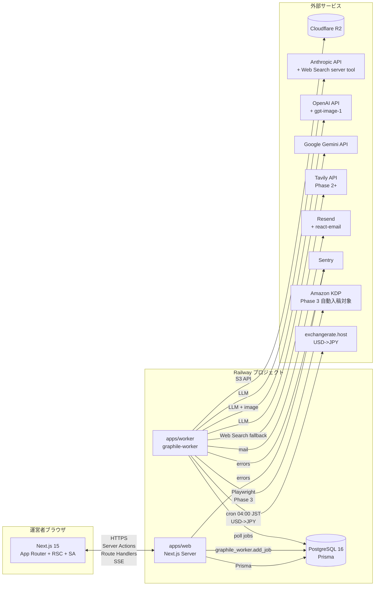
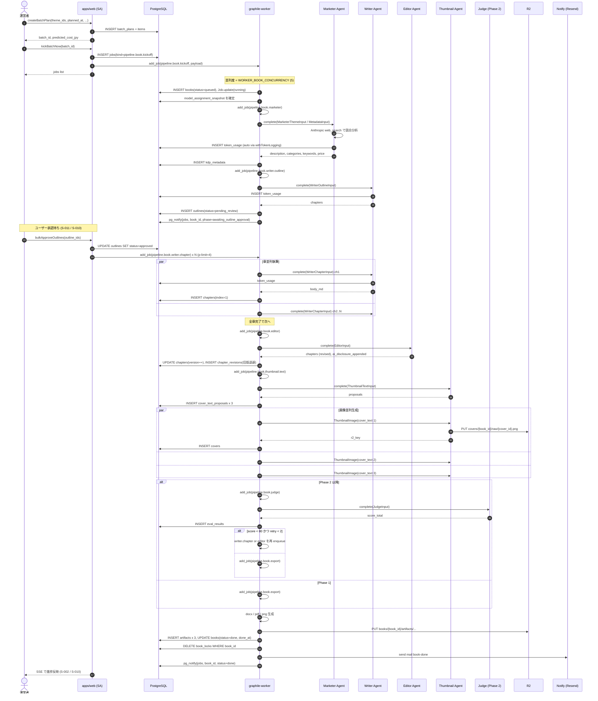
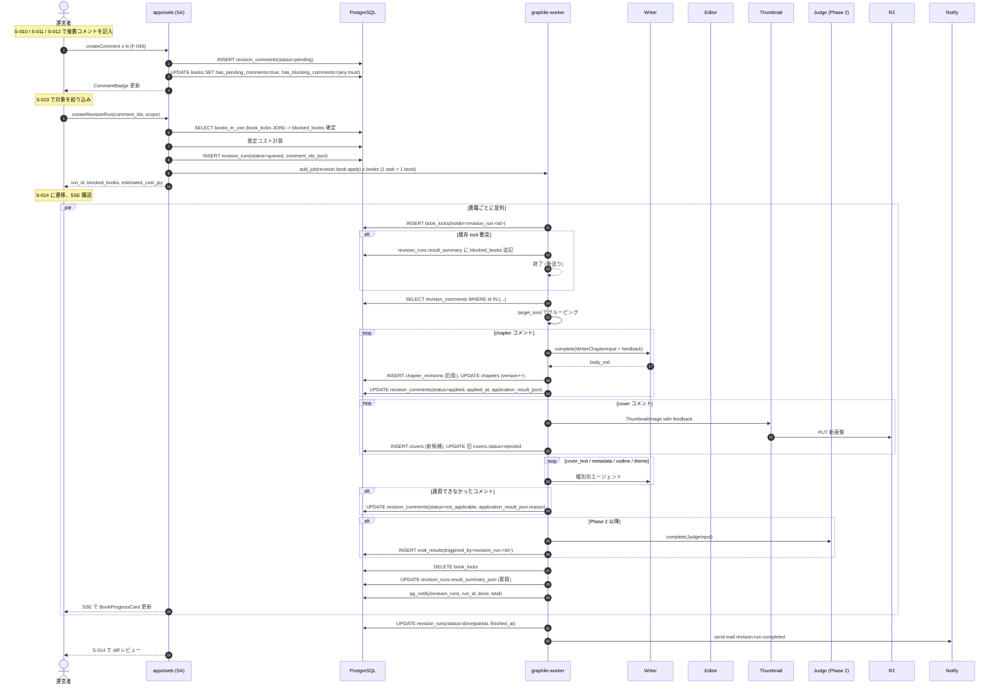

# 05. プログラム設計

> 本ドキュメントは `program-design` ハーネスエージェントが生成・更新する。
> 構造の指示は `.claude/agents/program-design.md` を参照。
> 起点: `CLAUDE.md`, `docs/01-business-requirements.md`, `docs/02-functional-requirements.md`（F-001〜F-050 / UC-01〜UC-06）, `docs/03-tech-selection.md`（確定スタック C-01〜C-14 + 追加選定 A〜J）, `docs/04-ui-design.md`（S-001〜S-029）。
> 本書は `programmer` エージェントの唯一の実装根拠。コードを書く前に再決定をしてはならない。

---

> **関連**: KDP出版事業を丸ごと回す **組織エージェント（CEO→6本部長→担当者＋全社ToDoバックログ）** の
> 設計は [`docs/06-org-agents-design.md`](06-org-agents-design.md) に分離。**P4 増分2 実装済み（2026-07-13）**。
> 既存パイプライン/販促自動運用を実行レイヤーとして再利用し、その上に計画・実行・検証・コスト統治を載せる。
>
> P4増分1: `promotion_accounts`（多アカウント台帳）＋ `plan_accounts`（account_strategist が推奨アカウントを台帳pending＋作成仕様付き create_account(needs_human) で起票。作成は規約/KYC のため人手=connect-once 固定）。
> P4増分2: `promotion_posts.account_id`＋`pickAccountForChannel`。台帳を接続(connect-once, `/org/accounts`)すると `promotion.posts.generate` が投稿を接続済みアカウントへ自動振り分け、`promotion.post.publish` がそのアカウントの資格情報で投稿（未接続なら failed、account_id 無しは channel 既定にフォールバック）。
> P4増分3: `evaluateKdpPublishReadiness`＋`org.kdp.screen`（AppSettings `org_kdp_auto_publish_enabled`(既定OFF)/閾値）。publish_kdp を品質/価格/メタで審査し result_json.kdp_readiness へ。ゲートONかつ合格のみ needs_human→approved(公開クリア)。実入稿(kdp.submit Playwright)は Phase 3 まで人手。
>
> P1（起票）＋P2（制作/出版/分析の実行）＋P3（販促/運用/経営の統合）追加物（本ドキュメントの各レジストリへの反映）:
> - **DB**: `org_objectives` / `org_tasks`（+`token_usage.org_task_id`、`org_tasks.theme_id/account_id`、`app_settings.org_auto_plan_enabled/org_plan_cron/org_auto_execute_enabled/org_execute_cron/org_ops_watch_enabled/org_ops_watch_cron/org_finance_tick_enabled/org_finance_tick_cron`）
> - **worker タスク**: `org.plan`（CEOティック。日次cron 既定05:00 JST）／`org.execute.dispatch`（承認済タスクの実行。15分毎cron）／`org.ops.watch`（運用の自己復旧監視。10分毎cron）／`org.finance.tick`（経営の予算ガード。毎時cron）。いずれも AppSettings フラグで条件付き有効化
> - **dispatch 対象 kind**: 制作 `plan_book`/`write`、出版 `prepare_metadata`/`set_price`、分析 `analyze_sales`/`research_market`/`report`、販促 `create_content`/`publish_post`/`analyze_promo`、運用 `recover_job`、経営 `cost_report`/`budget_review`。`enforce_limit`/`triage_error`/`publish_kdp`/`create_account`/`connect_account` は `needs_human`
> - **エージェント役割**: `ceo` ＋ 6本部長 ＋ 担当者 `sales_analyst`/`market_analyst`/`metadata_worker`（P2）・`promo_analyst`/`cost_accountant`（P3）
> - **画面**: `/org`（経営ダッシュボード）・`/org/tasks`（全社ToDoカンバン＋「承認済タスクを実行」「運用監視を実行」「予算ガードを実行」＋成果/コスト表示）

## 0. 本ドキュメントの読み方

- §3 DB スキーマは **Prisma DSL** で記述する。`programmer` は `packages/db/schema.prisma` にそのまま転記してよい。
- §4 API 仕様は **Next.js Route Handler / Server Action** の単位で zod schema を `TypeScript` で記述する。
- §5 ジョブ仕様は **graphile-worker タスク** の単位で payload schema・リトライ回数・タイムアウトを記述する。
- 各仕様には `[F-xxx]` `[S-xxx]` `[UC-xx]` のトレース ID を付与する。
- 「不確実」または「Phase 後送り」は §12 Open Questions に集約する。

---

## 1. アーキテクチャ概観

### 1.1 全体構成

`CLAUDE.md` の構成を以下に再掲し、Phase ごとの差分を明示する。



### 1.2 サービス構成

| サービス | 役割 | 主な処理 |
|---|---|---|
| `apps/web` | Web/API サーバ | UI (App Router) / Server Actions / Route Handlers / NextAuth / SSE 進捗配信 |
| `apps/worker` | バッチワーカ | graphile-worker タスク実行（パイプライン / 修正反映 / 単価取得 / 為替取得 / KDP 入稿 / 売上取得） |
| PostgreSQL | DB + ジョブキュー | Prisma スキーマ + graphile-worker テーブル (`graphile_worker.*`) |
| Cloudflare R2 | オブジェクトストア | docx/pdf/png/中間 md / KDP スクショの永続化 |

### 1.3 Phase ごとの差分

| Phase | 追加・変更点 |
|---|---|
| **Phase 1 (MVP)** | F-001〜F-007, F-010〜F-025, F-027〜F-028, F-032〜F-037, F-039〜F-040, F-043〜F-046, F-049〜F-050。S-001〜S-015 / S-017〜S-020 / S-022 / S-024〜S-029。`apps/worker` は LLM / 画像 / R2 / 単価取得バッチ / 修正反映ジョブまで実装。KDP 自動入稿関連スキーマ（`accounts.kdp_credentials_enc`, `kdp_submission_progress`, `kdp_2fa_codes`）は **空欄で先取り保持**（§14 設計判断 #5 参照）。 |
| **Phase 2** | F-008 (Quality Judge) / F-009 (Optimizer) / F-026 (A/B 比較) / F-029〜F-031 / F-038 (売上自動取得) を有効化。S-021 / S-023 を追加。`apps/worker` に Judge / Optimizer / Sales Auto Fetch タスクを追加。 |
| **Phase 3** | F-041 (KDP 自動入稿) / F-042 (ASIN 取込) を有効化。S-016 を追加。`apps/worker` に Playwright + stealth プラグインを導入し、KDP タスクを追加。`kdp_credentials_enc` / `kdp_2fa_codes` の本格利用開始。 |
| **Phase 4** | F-047 (note 連携) / F-048 (複数アカウント運用) は本書では枠のみ。 |

### 1.4 リアルタイム更新方針（S-002 / S-014 / S-016 / S-026 用）

- **SSE (Server-Sent Events)** を一次採用する。`docs/03 §G` のオブザーバビリティ方針（個人運用で軽量）と整合。WebSocket は採用しない（双方向通信は不要、Railway での Next.js + WS は複雑化する）。
- エンドポイント: `GET /api/sse/jobs?bookId=...`, `GET /api/sse/revision-runs/:id`, `GET /api/sse/cost`。
- フォールバック: ブラウザがクローズ済みの場合、再オープン時に最新値を 1 回 GET。
- 配信元: Worker は `jobs` / `revision_runs` / `token_usage` 行更新時に Postgres `LISTEN/NOTIFY` を発火、Web は `NOTIFY` を購読して SSE に流す。

---

## 2. モノレポ構成

`pnpm` workspace。`packages/contracts` を中心線として、`apps/web` と `apps/worker` の両方が依存する型定義の単一ソースとする。

```
A2P/
├─ package.json                     # pnpm workspace 定義
├─ pnpm-workspace.yaml
├─ turbo.json                       # optional: タスクキャッシュ（Phase 1 後半）
├─ .env.example                     # docs/03 §5 全 28 項目
├─ .github/workflows/               # I-01 GitHub Actions
├─ apps/
│  ├─ web/                          # Next.js 15 App Router
│  │  ├─ app/
│  │  │  ├─ (auth)/login/page.tsx          # S-001
│  │  │  ├─ (app)/
│  │  │  │  ├─ layout.tsx                  # §3.2 Header/Sidebar
│  │  │  │  ├─ dashboard/page.tsx          # S-002
│  │  │  │  ├─ accounts/page.tsx           # S-003
│  │  │  │  ├─ accounts/[id]/page.tsx      # S-004, S-005
│  │  │  │  ├─ themes/page.tsx             # S-006
│  │  │  │  ├─ themes/[id]/page.tsx        # S-007
│  │  │  │  ├─ batches/new/page.tsx        # S-008
│  │  │  │  ├─ books/page.tsx              # S-009
│  │  │  │  ├─ books/[id]/page.tsx         # S-010 (tabs)
│  │  │  │  ├─ outlines/page.tsx           # S-011
│  │  │  │  ├─ covers/page.tsx             # S-012
│  │  │  │  ├─ comments/page.tsx           # S-013
│  │  │  │  ├─ revision-runs/[id]/page.tsx # S-014
│  │  │  │  ├─ kdp/checklist/page.tsx      # S-015
│  │  │  │  ├─ kdp/monitor/page.tsx        # S-016 (Phase 3)
│  │  │  │  ├─ sales/page.tsx              # S-017
│  │  │  │  ├─ sales/manual/page.tsx       # S-018
│  │  │  │  ├─ models/assignments/page.tsx # S-019
│  │  │  │  ├─ models/catalog/page.tsx     # S-020
│  │  │  │  ├─ models/ab/page.tsx          # S-021
│  │  │  │  ├─ prompts/page.tsx            # S-022
│  │  │  │  ├─ prompts/proposals/page.tsx  # S-023
│  │  │  │  ├─ cost/page.tsx               # S-024
│  │  │  │  ├─ jobs/page.tsx               # S-025
│  │  │  │  ├─ jobs/[id]/page.tsx          # S-026
│  │  │  │  ├─ settings/page.tsx           # S-027
│  │  │  │  ├─ alerts/page.tsx             # S-028
│  │  │  │  └─ audit/page.tsx              # S-029
│  │  │  ├─ api/
│  │  │  │  ├─ auth/[...nextauth]/route.ts
│  │  │  │  ├─ health/route.ts
│  │  │  │  ├─ sse/jobs/route.ts
│  │  │  │  ├─ sse/revision-runs/[id]/route.ts
│  │  │  │  ├─ sse/cost/route.ts
│  │  │  │  ├─ artifacts/[id]/download/route.ts
│  │  │  │  ├─ kdp/2fa/[jobId]/route.ts            # Phase 3
│  │  │  │  └─ webhooks/                            # 将来の外部 webhook 受け口
│  │  │  └─ actions/                                # Server Actions（フォーム送信専用）
│  │  │     ├─ themes.ts                            # F-001/F-017
│  │  │     ├─ batches.ts                           # F-010/F-021
│  │  │     ├─ outlines.ts                          # F-018
│  │  │     ├─ covers.ts                            # F-019
│  │  │     ├─ comments.ts                          # F-049
│  │  │     ├─ revision-runs.ts                     # F-050
│  │  │     ├─ model-assignments.ts                 # F-022/F-023
│  │  │     ├─ prompts.ts                           # F-027〜F-031
│  │  │     ├─ prompt-proposals.ts                  # F-029/F-030
│  │  │     ├─ sales.ts                             # F-037
│  │  │     ├─ jobs.ts                              # F-046
│  │  │     ├─ settings.ts                          # S-027
│  │  │     ├─ accounts.ts                          # F-044
│  │  │     └─ kdp-checklist.ts                     # F-020
│  │  ├─ components/                                # shadcn/ui ベースの UI 部品
│  │  ├─ lib/                                       # auth, sse, prisma クライアント単一インスタンス
│  │  └─ next.config.js
│  └─ worker/                       # graphile-worker プロセス
│     ├─ src/
│     │  ├─ index.ts                # runner 起動 (worker pool, crontab)
│     │  ├─ tasks/
│     │  │  ├─ pipeline.book.kickoff.ts     # F-010
│     │  │  ├─ pipeline.book.marketer.ts    # F-001/F-040
│     │  │  ├─ pipeline.book.writer.outline.ts  # F-003
│     │  │  ├─ pipeline.book.writer.chapter.ts  # F-004
│     │  │  ├─ pipeline.book.editor.ts      # F-005
│     │  │  ├─ pipeline.book.thumbnail.text.ts  # F-006
│     │  │  ├─ pipeline.book.thumbnail.image.ts # F-007
│     │  │  ├─ pipeline.book.judge.ts       # F-008 (Phase 2)
│     │  │  ├─ pipeline.book.export.ts      # F-012/F-013/F-014/F-015
│     │  │  ├─ revision.book.apply.ts       # F-050
│     │  │  ├─ optimizer.prompt.generate.ts # F-009 (Phase 2)
│     │  │  ├─ catalog.fetch.ts             # F-024
│     │  │  ├─ fx.fetch.ts                  # B-04
│     │  │  ├─ sales.fetch.ts               # F-038 (Phase 2)
│     │  │  ├─ kdp.submit.ts                # F-041 (Phase 3)
│     │  │  ├─ kdp.asin.fetch.ts            # F-042 (Phase 3)
│     │  │  ├─ alert.cost.check.ts          # F-034/F-036
│     │  │  └─ archive.jobs.ts              # 90 日超ログ R2 退避
│     │  └─ crontab.ts                      # graphile-worker cron 定義
│     └─ Dockerfile                 # libvips + chromium 同梱
├─ packages/
│  ├─ db/                           # Prisma スキーマ + クライアント
│  │  ├─ schema.prisma              # §3 全体
│  │  ├─ migrations/
│  │  ├─ seed.ts                    # 初期 prompts / model_assignments / settings
│  │  └─ index.ts                   # PrismaClient シングルトン
│  ├─ contracts/                    # 横断型定義
│  │  ├─ env.ts                     # docs/03 §5 zod env スキーマ
│  │  ├─ jobs/*.ts                  # graphile-worker payload zod schema
│  │  ├─ agents/*.ts                # ランタイムエージェント I/O 型
│  │  ├─ api/*.ts                   # SA/RH の入出力 schema
│  │  └─ logger.ts                  # pino logger 共通ファクトリ
│  ├─ agents/                       # ランタイムエージェント
│  │  ├─ lib/
│  │  │  ├─ llm-client.ts           # 統一インターフェース (§6)
│  │  │  ├─ ai-sdk-client.ts        # Vercel AI SDK 実装
│  │  │  ├─ agent-sdk-client.ts     # Anthropic Messages API (@anthropic-ai/sdk) + web_search_20250305 server tool 実装
│  │  │  ├─ with-token-logging.ts   # token_usage 自動 INSERT ミドルウェア
│  │  │  ├─ errors.ts               # PipelineError / AgentError 型
│  │  │  └─ prompt-loader.ts        # prompts テーブルから取得
│  │  ├─ marketer/                  # F-001/F-002/F-040
│  │  ├─ writer/                    # F-003/F-004
│  │  ├─ editor/                    # F-005
│  │  ├─ thumbnail/                 # F-006/F-007
│  │  ├─ judge/                     # F-008
│  │  ├─ optimizer/                 # F-009
│  │  └─ tools/
│  │     ├─ web-search.ts           # Anthropic server tool or Tavily アダプタ
│  │     └─ image-gen.ts            # OpenAI gpt-image-1
│  ├─ storage/                      # R2 クライアント
│  │  ├─ r2.ts                      # S3 互換クライアント
│  │  ├─ keys.ts                    # §8 キー設計
│  │  └─ signed-url.ts
│  ├─ output/                       # 成果物変換
│  │  ├─ word/                      # F-012 docx ビルダ
│  │  ├─ pdf/                       # F-013 @react-pdf/renderer
│  │  └─ image/                     # F-014 sharp 後処理
│  ├─ notify/                       # メール送信
│  │  ├─ email.ts                   # Resend ラッパ
│  │  └─ templates/                 # react-email 5 種
│  ├─ crypto/                       # AES-256-GCM (KDP-04)
│  │  └─ kdp-credentials.ts
│  └─ kdp/                          # Phase 3 Playwright 実装
│     ├─ browser.ts                 # playwright-extra + stealth
│     ├─ submit.ts
│     └─ asin-fetch.ts
└─ tests/
   ├─ e2e/                          # Playwright specs（UC-01〜UC-06）
   ├─ unit/                         # Vitest
   └─ fixtures/                     # msw ハンドラ + testcontainers seed
```

### 2.1 パッケージ責務サマリ

| パッケージ | 責務 | 依存先 |
|---|---|---|
| `apps/web` | UI + API。NextAuth / Server Actions / Route Handlers / SSE | `packages/{db,contracts,storage,notify}` |
| `apps/worker` | graphile-worker タスク群。LLM 実行 / 出力生成 / 単価取得 / 修正反映 / Phase 3 KDP | `packages/{db,contracts,agents,storage,output,notify,crypto,kdp}` |
| `packages/db` | Prisma スキーマ + PrismaClient シングルトン + seed | — |
| `packages/contracts` | env / job payload / API I/O / agent I/O の zod 定義。**他パッケージはここを介してのみ型を共有** | `zod` |
| `packages/agents` | ランタイムエージェント本体 + LLM クライアント二層 + token_usage ミドルウェア | `packages/{db,contracts,storage}`, `ai`, `@anthropic-ai/sdk` |
| `packages/storage` | R2 (S3 互換) クライアント。キー生成 / アップロード / 署名付き URL | `@aws-sdk/client-s3` |
| `packages/output` | Markdown → docx/pdf 変換、画像 sharp 後処理 | `docx`, `@react-pdf/renderer`, `sharp` |
| `packages/notify` | Resend 経由のメール送信 + react-email テンプレ 5 種 | `resend`, `react-email` |
| `packages/crypto` | AES-256-GCM による KDP 認証情報暗号化 | `node:crypto` |
| `packages/kdp` | Phase 3 Playwright 実装 | `playwright-extra` |

---

## 3. DB スキーマ (Prisma)

> `packages/db/schema.prisma` にそのまま転記可能な DSL。22 エンティティ（`docs/02 §4`）+ Phase 3 用 `kdp_2fa_codes`、履歴系 `chapter_revisions`、ロック `book_locks`、設定 `app_settings`、NextAuth 用 `users` を含め全 **30 テーブル**。JSON 列の型は TypeScript コメントで明示する。
>
> **インデックス命名規約**: `{table}_{cols}_idx`、ユニークは `{table}_{cols}_key`。

```prisma
// packages/db/schema.prisma

generator client {
  provider = "prisma-client-js"
  output   = "./generated"
}

datasource db {
  provider = "postgresql"
  url      = env("DATABASE_URL")
}

// =====================================================================
// 認証（単一ユーザー）
// =====================================================================
model User {
  id            String   @id @default(cuid())
  username      String   @unique
  password_hash String   // bcrypt
  failed_count  Int      @default(0)
  locked_until  DateTime?
  created_at    DateTime @default(now())
  updated_at    DateTime @updatedAt

  auditLogs     AuditLog[]
  revisionRuns  RevisionRun[]

  @@map("users")
}

// =====================================================================
// アカウント = KDP ペンネーム単位 [F-044/F-048]
// =====================================================================
model Account {
  id                    String   @id @default(cuid())
  pen_name              String
  display_name          String?
  bio                   String?
  target_reader         String?
  // type: { primary_genre: 'practical'|'business'|'self_help', ratio: Record<string, number>, focus_themes: string[] }
  genre_policy_json     Json
  kdp_credentials_enc   String?  // AES-256-GCM 暗号文 (Phase 3 用、Phase 1 は null)
  kdp_2fa_secret_enc    String?  // TOTP シークレット（任意保管）
  status                String   @default("active") // active | archived
  created_at            DateTime @default(now())
  updated_at            DateTime @updatedAt

  books                 Book[]
  themeCandidates       ThemeCandidate[]
  publishingPlans       PublishingPlan[]

  @@index([status], map: "accounts_status_idx")
  @@map("accounts")
}

// =====================================================================
// 長期出版プラン [F-002]
// =====================================================================
model PublishingPlan {
  id           String   @id @default(cuid())
  account_id   String
  period_from  DateTime
  period_to    DateTime
  // type: { months: Array<{ ym: string; planned_count: number; theme_categories: string[]; series_candidates: string[] }> }
  plan_json    Json
  created_at   DateTime @default(now())

  account      Account  @relation(fields: [account_id], references: [id], onDelete: Cascade)

  @@index([account_id, period_from], map: "publishing_plans_account_period_idx")
  @@map("publishing_plans")
}

// =====================================================================
// テーマ候補 [F-001/F-017]
// =====================================================================
model ThemeCandidate {
  id                 String   @id @default(cuid())
  account_id         String
  theme_session_id   String   // §14 設計判断 #6: 書籍未確定段階の token_usage 集計キー
  genre              String   // practical | business | self_help
  title              String
  subtitle           String?
  hook               String   // 差別化要素
  target_reader      String?
  // type: Array<{ asin?: string; title: string; url: string; rank?: number; review_summary?: string }>
  competitors_json   Json
  // type: { search_volume?: number; rank_estimate?: number; sources: string[] }
  signals_json       Json
  status             String   @default("pending") // pending | accepted | rejected
  rejected_reason    String?
  created_at         DateTime @default(now())
  decided_at         DateTime?

  account            Account  @relation(fields: [account_id], references: [id], onDelete: Cascade)
  books              Book[]

  @@index([account_id, status, created_at], map: "theme_candidates_account_status_idx")
  @@index([theme_session_id], map: "theme_candidates_session_idx")
  @@map("theme_candidates")
}

// =====================================================================
// 書籍 [F-010/F-016/F-033/F-042]
// =====================================================================
model Book {
  id                          String   @id @default(cuid())
  account_id                  String
  theme_id                    String?
  title                       String
  subtitle                    String?
  asin                        String?  @unique
  // queued | running | editing | judging | thumbnail | exporting | done
  // | needs_human_review | failed | cancelled | paused_cost
  status                      String   @default("queued")
  cost_status                 String   @default("normal") // normal | warn | paused | exceeded
  cost_jpy_total              Decimal  @default(0) @db.Decimal(10, 2)
  // type: Record<role, prompt_id> このジョブ実行時の active バージョン
  prompt_version_ids_json     Json
  // type: Record<role, { provider, model, input_price, output_price }>
  model_assignment_snapshot   Json
  has_pending_comments        Boolean  @default(false)
  has_blocking_comments       Boolean  @default(false) // F-049: must コメントが 1 件以上
  created_at                  DateTime @default(now())
  updated_at                  DateTime @updatedAt
  done_at                     DateTime?

  account                     Account          @relation(fields: [account_id], references: [id], onDelete: Cascade)
  theme                       ThemeCandidate?  @relation(fields: [theme_id], references: [id], onDelete: SetNull)
  outline                     Outline?
  chapters                    Chapter[]
  chapterRevisions            ChapterRevision[]
  covers                      Cover[]
  coverTextProposals          CoverTextProposal[]
  kdpMetadata                 KdpMetadata?
  kdpSubmissionProgress       KdpSubmissionProgress?
  artifacts                   Artifact[]
  jobs                        Job[]
  evalResults                 EvalResult[]
  tokenUsages                 TokenUsage[]
  salesRecords                SalesRecord[]
  revisionComments            RevisionComment[]
  batchPlanItems              BatchPlanItem[]

  @@index([account_id, status, created_at(sort: Desc)], map: "books_account_status_idx")
  @@index([status, has_blocking_comments], map: "books_status_blocking_idx")
  @@index([cost_status], map: "books_cost_status_idx")
  @@map("books")
}

// =====================================================================
// アウトライン [F-003/F-018]
// =====================================================================
model Outline {
  id            String   @id @default(cuid())
  book_id       String   @unique
  // type: Array<{ index: number; heading: string; summary: string; target_chars: number; subheadings: string[] }>
  chapters_json Json
  status        String   @default("draft") // draft | pending_review | approved | rejected
  reject_note   String?  // 差戻し時のコメント。Writer 再実行プロンプトに渡す
  approved_at   DateTime?
  created_at    DateTime @default(now())
  updated_at    DateTime @updatedAt

  book          Book     @relation(fields: [book_id], references: [id], onDelete: Cascade)

  @@index([status], map: "outlines_status_idx")
  @@map("outlines")
}

// =====================================================================
// 章 [F-004] + 履歴
// =====================================================================
model Chapter {
  id           String   @id @default(cuid())
  book_id      String
  index        Int
  heading      String
  body_md      String   @db.Text
  status       String   @default("draft") // draft | done | failed
  char_count   Int      @default(0)
  version      Int      @default(1) // 修正反映で +1
  created_at   DateTime @default(now())
  updated_at   DateTime @updatedAt

  book         Book                @relation(fields: [book_id], references: [id], onDelete: Cascade)
  revisions    ChapterRevision[]

  @@unique([book_id, index], map: "chapters_book_index_key")
  @@index([book_id, status], map: "chapters_book_status_idx")
  @@map("chapters")
}

// 章の旧版退避（F-050 ロールバック用）
model ChapterRevision {
  id          String   @id @default(cuid())
  chapter_id  String
  book_id     String
  version     Int
  body_md     String   @db.Text
  reason      String   // "revision_run:<run_id>" | "manual_edit" 等
  created_at  DateTime @default(now())

  chapter     Chapter  @relation(fields: [chapter_id], references: [id], onDelete: Cascade)
  book        Book     @relation(fields: [book_id], references: [id], onDelete: Cascade)

  @@index([chapter_id, version(sort: Desc)], map: "chapter_revisions_chapter_version_idx")
  @@map("chapter_revisions")
}

// =====================================================================
// カバー [F-006/F-007/F-014/F-019]
// =====================================================================
model CoverTextProposal {
  id              String   @id @default(cuid())
  book_id         String
  title           String
  subtitle        String?
  band_copy       String?  // 帯文
  status          String   @default("proposed") // proposed | adopted | rejected
  created_at      DateTime @default(now())

  book            Book     @relation(fields: [book_id], references: [id], onDelete: Cascade)

  @@index([book_id, status], map: "cover_text_proposals_book_status_idx")
  @@map("cover_text_proposals")
}

model Cover {
  id                  String   @id @default(cuid())
  book_id             String
  cover_text_id       String?
  r2_key              String   // 原画像 R2 キー
  artifact_id         String?  // KDP 寸法 PNG 出力後の Artifact ID
  prompt_used         String   @db.Text
  width               Int
  height              Int
  status              String   @default("generated") // generated | adopted | rejected
  // type: { provider: 'openai', model: 'gpt-image-1', cost_jpy: number }
  generation_meta_json Json
  created_at          DateTime @default(now())

  book                Book                @relation(fields: [book_id], references: [id], onDelete: Cascade)

  @@index([book_id, status], map: "covers_book_status_idx")
  @@map("covers")
}

// =====================================================================
// KDP メタデータ [F-040]
// =====================================================================
model KdpMetadata {
  id             String   @id @default(cuid())
  book_id        String   @unique
  description    String   @db.Text
  categories     String[] // KDP 2 カテゴリ
  keywords       String[] // 最大 7 個
  price_jpy      Int
  created_at     DateTime @default(now())
  updated_at     DateTime @updatedAt

  book           Book     @relation(fields: [book_id], references: [id], onDelete: Cascade)

  @@map("kdp_metadata")
}

// =====================================================================
// KDP 入稿チェックリスト [F-020] / 自動入稿進捗 [F-041 Phase 3]
// =====================================================================
model KdpSubmissionProgress {
  id                       String   @id @default(cuid())
  book_id                  String   @unique
  // type: Record<field, { copied: boolean; checked: boolean; checked_at?: string }>
  checklist_state_json     Json
  // null | queued | logging_in | inputting | uploading | pricing | awaiting_2fa | publish_pending | done | failed
  auto_submit_status       String?
  auto_submit_started_at   DateTime?
  auto_submit_finished_at  DateTime?
  last_error               String?
  screenshot_r2_keys       String[] // 失敗時スクショ
  submitted_at             DateTime?
  created_at               DateTime @default(now())
  updated_at               DateTime @updatedAt

  book                     Book     @relation(fields: [book_id], references: [id], onDelete: Cascade)

  @@map("kdp_submission_progress")
}

// KDP 2FA コード受け渡し [KDP-03 Phase 3]
model Kdp2FaCode {
  id           String   @id @default(cuid())
  job_id       String   @unique // graphile-worker のジョブ ID と紐付け
  status       String   @default("awaiting") // awaiting | submitted | timeout
  code         String?  // 運営者入力
  requested_at DateTime @default(now())
  submitted_at DateTime?
  timeout_at   DateTime // 既定 +10 分

  @@index([status, timeout_at], map: "kdp_2fa_codes_status_timeout_idx")
  @@map("kdp_2fa_codes")
}

// =====================================================================
// 成果物 [F-012〜F-015]
// =====================================================================
model Artifact {
  id          String   @id @default(cuid())
  book_id     String
  kind        String   // docx | pdf | png_cover | md_source | kdp_screenshot
  r2_key      String   @unique
  byte_size   Int
  checksum    String   // sha256 hex
  created_at  DateTime @default(now())

  book        Book     @relation(fields: [book_id], references: [id], onDelete: Cascade)

  @@index([book_id, kind], map: "artifacts_book_kind_idx")
  @@map("artifacts")
}

// =====================================================================
// ジョブ実行ログ（graphile-worker とは別に業務用ジョブを記録） [F-010/F-016/F-045/F-046]
// =====================================================================
model Job {
  id              String   @id @default(cuid())
  graphile_job_id BigInt?  // graphile_worker.jobs.id への参照（worker 側で確定後に書き戻し）
  kind            String   // task_identifier と同じ
  book_id         String?
  parent_job_id   String?
  status          String   @default("queued") // queued | running | done | failed | cancelled
  payload_json    Json
  result_json     Json?
  error           String?  @db.Text
  retries         Int      @default(0)
  started_at      DateTime?
  finished_at     DateTime?
  created_at      DateTime @default(now())

  book            Book?    @relation(fields: [book_id], references: [id], onDelete: SetNull)
  parent          Job?     @relation("JobParent", fields: [parent_job_id], references: [id], onDelete: SetNull)
  children        Job[]    @relation("JobParent")
  tokenUsages     TokenUsage[]

  @@index([status, kind, created_at(sort: Desc)], map: "jobs_status_kind_idx")
  @@index([book_id, kind], map: "jobs_book_kind_idx")
  @@map("jobs")
}

// =====================================================================
// 夜間バッチ計画 [F-021]
// =====================================================================
model BatchPlan {
  id                  String   @id @default(cuid())
  planned_at          DateTime
  concurrency         Int      @default(5)
  deadline            DateTime?
  predicted_cost_jpy  Int
  status              String   @default("scheduled") // scheduled | running | done | failed | cancelled
  kicked_at           DateTime?
  created_at          DateTime @default(now())

  items               BatchPlanItem[]

  @@index([status, planned_at], map: "batch_plans_status_planned_idx")
  @@map("batch_plans")
}

model BatchPlanItem {
  id            String   @id @default(cuid())
  batch_id      String
  theme_id      String?  // 採用テーマ
  book_id       String?  // キック後に紐付け
  // type: Record<role, { provider, model }> | null
  override_model_assignments_json Json?
  status        String   @default("pending") // pending | kicked | failed

  batch         BatchPlan       @relation(fields: [batch_id], references: [id], onDelete: Cascade)
  book          Book?           @relation(fields: [book_id], references: [id], onDelete: SetNull)

  @@index([batch_id], map: "batch_plan_items_batch_idx")
  @@map("batch_plan_items")
}

// =====================================================================
// モデルカタログ [F-024/F-025]
// =====================================================================
model ModelCatalog {
  id                        String   @id @default(cuid())
  provider                  String   // anthropic | openai | google
  model                     String   // claude-opus-4-7 等
  input_price_per_mtok_usd  Decimal  @db.Decimal(10, 6)
  output_price_per_mtok_usd Decimal  @db.Decimal(10, 6)
  image_price_per_image_usd Decimal? @db.Decimal(10, 6)
  fx_rate_usd_jpy           Decimal  @db.Decimal(10, 4)
  fetched_at                DateTime @default(now())
  source                    String   // "anthropic_pricing_page_v1" | "openai_pricing_v2" | "manual_edit"
  raw_json                  Json
  is_current                Boolean  @default(true)

  @@unique([provider, model, fetched_at], map: "model_catalog_provider_model_time_key")
  @@index([is_current, provider], map: "model_catalog_current_idx")
  @@map("model_catalog")
}

// =====================================================================
// モデル割当 [F-022/F-023]
// =====================================================================
model ModelAssignment {
  id              String   @id @default(cuid())
  role            String   // marketer | writer | editor | judge | thumbnail_text | thumbnail_image | optimizer
  genre           String?  // null = 全ジャンル既定
  provider        String
  model           String
  status          String   @default("active") // active | archived
  activated_at    DateTime @default(now())
  archived_at     DateTime?
  created_by      String   // user_id

  // パーシャル UNIQUE: status='active' の組合せは 1 つに制限（手書きマイグレーションで設定）
  @@index([role, genre, status], map: "model_assignments_role_genre_status_idx")
  @@index([role, genre, activated_at(sort: Desc)], map: "model_assignments_role_genre_time_idx")
  @@map("model_assignments")
}

// =====================================================================
// プロンプト管理 [F-027〜F-031]
// =====================================================================
model Prompt {
  id                 String   @id @default(cuid())
  role               String
  genre              String?  // null = 役割デフォルト
  version            Int
  body               String   @db.Text
  // type: string[]  例: ["title", "chapter_outline"]
  placeholders_json  Json
  status             String   @default("active") // active | archived
  created_by         String   // "human" | "optimizer:<proposal_id>"
  activated_at       DateTime?
  archived_at        DateTime?
  created_at         DateTime @default(now())

  proposals          PromptProposal[] @relation("PromptProposalSource")

  @@unique([role, genre, version], map: "prompts_role_genre_version_key")
  // パーシャル UNIQUE: status='active' は 1 つに制限（手書きマイグレーション）
  @@index([role, genre, status], map: "prompts_role_genre_status_idx")
  @@index([role, genre, version(sort: Desc)], map: "prompts_role_genre_ver_idx")
  @@map("prompts")
}

model PromptProposal {
  id                 String   @id @default(cuid())
  source_prompt_id   String   // 旧版
  role               String
  genre              String?
  proposed_body      String   @db.Text
  diff               String   @db.Text
  rationale          String   @db.Text
  // type: { score_delta?: number; sales_delta_pct?: number }
  expected_effect_json Json
  sample_output      String?  @db.Text
  status             String   @default("pending") // pending | approved | rejected | auto_approved
  decided_by         String?  // user_id or "auto"
  decided_at         DateTime?
  rejection_note     String?
  rollback_until     DateTime? // 自動承認時の 24h ロールバック猶予
  created_at         DateTime @default(now())

  sourcePrompt       Prompt   @relation("PromptProposalSource", fields: [source_prompt_id], references: [id], onDelete: Cascade)

  @@index([status, created_at(sort: Desc)], map: "prompt_proposals_status_idx")
  @@map("prompt_proposals")
}

// =====================================================================
// 評価結果 [F-008/F-009/F-030]
// =====================================================================
model EvalResult {
  id                       String   @id @default(cuid())
  book_id                  String
  // type: Record<role, prompt_id> 採点対象の生成時バージョン
  prompt_version_ids_json  Json
  score_total              Int      // 0..100
  // type: { benefit_clarity, logical_consistency, style_consistency, japanese_naturalness, title_alignment, genre_fit: number }
  score_breakdown_json     Json
  // type: Record<axis, string>
  judge_comments_json      Json
  triggered_by             String   // "auto" | "manual" | "revision_run:<id>"
  retry_count              Int      @default(0)
  judged_at                DateTime @default(now())

  book                     Book     @relation(fields: [book_id], references: [id], onDelete: Cascade)

  @@index([book_id, judged_at(sort: Desc)], map: "eval_results_book_time_idx")
  @@index([judged_at(sort: Desc)], map: "eval_results_time_idx")
  @@map("eval_results")
}

// =====================================================================
// トークン使用量 [F-032〜F-035] — 観測の中心
// =====================================================================
model TokenUsage {
  id                  String   @id @default(cuid())
  book_id             String?  // nullable: テーマ生成段階等
  theme_session_id    String?  // book_id 未確定時の集計キー
  job_id              String?
  provider            String   // anthropic | openai | google
  model               String
  role                String   // marketer | writer | editor | judge | thumbnail_text | thumbnail_image | optimizer | revision
  input_tokens        Int      @default(0)
  output_tokens       Int      @default(0)
  cached_input_tokens Int      @default(0) // Prompt Caching 利用時の節約分
  image_count         Int      @default(0)
  // type: { input_per_mtok_usd, output_per_mtok_usd, image_per_image_usd?, fx_rate_usd_jpy }
  unit_price_snapshot Json
  cost_jpy            Decimal  @db.Decimal(10, 4)
  created_at          DateTime @default(now())

  book                Book?    @relation(fields: [book_id], references: [id], onDelete: SetNull)
  job                 Job?     @relation(fields: [job_id], references: [id], onDelete: SetNull)

  @@index([book_id, created_at], map: "token_usage_book_time_idx")
  @@index([theme_session_id], map: "token_usage_session_idx")
  @@index([provider, model, created_at], map: "token_usage_provider_model_idx")
  @@index([role, created_at], map: "token_usage_role_idx")
  @@index([created_at(sort: Desc)], map: "token_usage_time_idx") // 月次集計
  @@map("token_usage")
}

// =====================================================================
// 売上 [F-037/F-038/F-039]
// =====================================================================
model SalesRecord {
  id            String   @id @default(cuid())
  book_id       String
  year_month    String   // "2026-05"
  royalty_jpy   Int
  review_count  Int      @default(0)
  avg_stars     Decimal? @db.Decimal(3, 2)
  bsr           Int?     // Amazon Best Seller Rank
  source        String   // manual | auto
  fetched_at    DateTime @default(now())
  updated_at    DateTime @updatedAt

  book          Book     @relation(fields: [book_id], references: [id], onDelete: Cascade)

  @@unique([book_id, year_month], map: "sales_records_book_month_key")
  @@index([year_month], map: "sales_records_month_idx")
  @@map("sales_records")
}

// =====================================================================
// アラート [F-024/F-034/F-036]
// =====================================================================
model Alert {
  id          String   @id @default(cuid())
  kind        String   // cost_per_book_warn | cost_per_book_pause | monthly_cost_80 | monthly_cost_95 | monthly_cost_100 | catalog_price_change | job_failed_3times | catalog_fetch_failed | fx_fetch_failed | revision_run_failed
  severity    String   // info | warning | critical
  payload_json Json
  read_at     DateTime?
  resolved_at DateTime?
  created_at  DateTime @default(now())

  @@index([resolved_at, created_at(sort: Desc)], map: "alerts_resolved_time_idx")
  @@index([kind, created_at(sort: Desc)], map: "alerts_kind_time_idx")
  @@map("alerts")
}

// =====================================================================
// 監査ログ [F-029/F-030/F-046]
// =====================================================================
model AuditLog {
  id          String   @id @default(cuid())
  actor_id    String?  // user_id, "system", "optimizer"
  action      String   // prompt.approve | prompt.rollback | model_assignment.change | job.retry | job.bulk_retry | job.cancel | revision_run.kick | settings.update
  target_kind String
  target_id   String
  before_json Json?
  after_json  Json?
  created_at  DateTime @default(now())

  actor       User?    @relation(fields: [actor_id], references: [id], onDelete: SetNull)

  @@index([created_at(sort: Desc)], map: "audit_log_time_idx")
  @@index([target_kind, target_id], map: "audit_log_target_idx")
  @@map("audit_log")
}

// =====================================================================
// 修正コメント [F-049]
// =====================================================================
model RevisionComment {
  id                       String   @id @default(cuid())
  book_id                  String
  target_kind              String   // chapter | outline | cover | cover_text | metadata | theme
  target_id                String
  // type: { paragraph_range?: [number, number]; line_range?: [number, number]; image_region?: { x, y, w, h } } | null
  range_json               Json?
  body                     String   @db.Text
  priority                 String   // must | should | may
  status                   String   @default("pending") // pending | applied | not_applicable | superseded
  run_id                   String?
  // type: { reason?: string; new_target_id?: string; diff_summary?: string }
  application_result_json  Json?
  created_by               String   // user_id
  created_at               DateTime @default(now())
  applied_at               DateTime?

  book                     Book        @relation(fields: [book_id], references: [id], onDelete: Cascade)
  run                      RevisionRun? @relation(fields: [run_id], references: [id], onDelete: SetNull)

  @@index([book_id, status, priority], map: "revision_comments_book_status_idx")
  @@index([status, created_at], map: "revision_comments_status_time_idx")
  @@index([target_kind, target_id], map: "revision_comments_target_idx")
  @@map("revision_comments")
}

// =====================================================================
// 修正一括反映実行 [F-050]
// =====================================================================
model RevisionRun {
  id                  String   @id @default(cuid())
  triggered_by        String   // user_id
  triggered_at        DateTime @default(now())
  started_at          DateTime?
  finished_at         DateTime?
  status              String   @default("queued") // queued | running | done | failed | partial
  // type: string[]
  book_ids_json       Json
  // type: string[]
  comment_ids_json    Json
  // type: { applied: number; not_applicable: number; failed: number; cost_jpy: number; rescore_delta?: number; blocked_books?: string[] }
  result_summary_json Json?
  error               String?  @db.Text

  triggeredByUser     User             @relation(fields: [triggered_by], references: [id], onDelete: NoAction)
  comments            RevisionComment[]

  @@index([status, triggered_at(sort: Desc)], map: "revision_runs_status_time_idx")
  @@map("revision_runs")
}

// =====================================================================
// 書籍単位の排他制御ロック [§14 設計判断 #4]
// =====================================================================
model BookLock {
  book_id     String   @id
  holder      String   // "revision_run:<id>" | "pipeline:<job_id>" | "kdp_submit:<job_id>"
  acquired_at DateTime @default(now())
  expires_at  DateTime // 既定 +30 分（タスクタイムアウトと整合）

  @@index([expires_at], map: "book_locks_expires_idx")
  @@map("book_locks")
}

// =====================================================================
// アプリ設定（S-027 単一行） [F-030/F-034/F-036/F-038]
// =====================================================================
model AppSettings {
  id                                String   @id @default("singleton")
  notification_email_to             String
  // type: Record<AlertKind, boolean>
  notification_kinds_json           Json
  cost_per_book_warn_jpy            Int      @default(500)
  cost_per_book_pause_jpy           Int      @default(750)
  monthly_cost_yellow_jpy           Int      @default(40000)
  monthly_cost_orange_jpy           Int      @default(47500)
  monthly_cost_red_jpy              Int      @default(50000)
  catalog_price_change_threshold    Decimal  @default(0.10) @db.Decimal(4, 3) // ±10%
  prompt_auto_approval_enabled      Boolean  @default(false)
  prompt_auto_approval_rollback_h   Int      @default(24)
  sales_auto_fetch_enabled          Boolean  @default(false)
  sales_auto_fetch_cron             String   @default("0 17 * * *") // 02:00 JST
  kdp_submit_timeout_minutes        Int      @default(10)
  kdp_submit_retry_count            Int      @default(2)
  job_log_retention_days            Int      @default(90)
  ai_disclosure_text                String   @db.Text  // F-005 巻末挿入文
  updated_at                        DateTime @updatedAt

  @@map("app_settings")
}

// F-051/F-052: AI プロバイダ API キーの UI 設定・暗号化保存
// 設計方針: LLM クライアントは `getApiKey(provider)` で本テーブル優先、env フォールバック (§6.1.x 参照)
model ApiCredential {
  id                       String    @id @default(cuid())
  provider                 String    @unique // "anthropic" | "openai" | "google" | "tavily"
  key_enc                  String    @db.Text // @a2p/crypto AES-256-GCM (T-01-08)
  key_mask                 String    // 表示用 `sk-ant-…••••` (prefix 8 文字 + マスク)
  set_at                   DateTime  @default(now())
  set_by                   String    // 運営者 User.id
  last_tested_at           DateTime?
  last_test_result_json    Json?     // { ok: boolean, latency_ms: number, models_available?: number, error?: string }
  created_at               DateTime  @default(now())
  updated_at               DateTime  @updatedAt

  setter                   User      @relation(fields: [set_by], references: [id])

  @@map("api_credentials")
}
```

### 3.1 graphile-worker テーブル

`graphile_worker` スキーマは別管理（マイグレーションは `graphile-worker --once --schema-only` で初期化）。`Job` モデル側で `graphile_job_id BigInt?` を持たせ、worker タスク内で書き戻す。

### 3.2 パーシャル UNIQUE の補足

Prisma DSL は WHERE 付きユニーク制約をネイティブサポートしないため、以下は手書きマイグレーションで追加する：

```sql
-- ModelAssignment: 役割 × ジャンル × active は 1 行のみ
CREATE UNIQUE INDEX model_assignments_role_genre_active_key
  ON model_assignments (role, COALESCE(genre, ''))
  WHERE status = 'active';

-- Prompt: 役割 × ジャンル × active は 1 行のみ
CREATE UNIQUE INDEX prompts_role_genre_active_key
  ON prompts (role, COALESCE(genre, ''))
  WHERE status = 'active';
```

---

## 4. API 仕様

### 4.1 設計判断: Server Actions vs Route Handlers の使い分け

`docs/03 §10` 申し送り #4 に沿って明確化：

| 種別 | 用途 | 例 |
|---|---|---|
| **Server Action (SA)** | 認証ユーザーが UI フォーム / バルクボタンから起動する mutation。`useFormState` / `useTransition` 連携。Type-safe で `revalidatePath` が使える | テーマ採用 / アウトライン承認 / 修正実行ボタン / 設定保存 |
| **Route Handler (RH)** | NextAuth コールバック / SSE / 外部 webhook / cron からの ping / 認証不要のヘルスチェック / バイナリレスポンス（ファイルダウンロード） | `/api/auth/[...nextauth]` / `/api/sse/*` / `/api/artifacts/:id/download` / `/api/health` / `/api/kdp/2fa/:jobId` |

**原則**: UI 起動の mutation はすべて SA。外部入出力・ストリーミング・バイナリは RH。GET 系のデータ取得は **RSC + Prisma 直接呼び出し**（API ハンドラを介さない）。

### 4.2 Route Handler 一覧

| Method | Path | 認証 | 用途 | Request | Response |
|---|---|---|---|---|---|
| POST | `/api/auth/[...nextauth]` | — | NextAuth | NextAuth 標準 | NextAuth 標準 |
| GET  | `/api/health` | — | ヘルスチェック | — | `{ ok: true, ts }` |
| GET  | `/api/sse/jobs?bookId=...` | 必須 | ジョブ進捗 SSE | query: `{ bookId?: string }` | `text/event-stream` |
| GET  | `/api/sse/revision-runs/[id]` | 必須 | 修正実行進捗 SSE | path: `id` | `text/event-stream` |
| GET  | `/api/sse/cost` | 必須 | CostMeter 用 SSE | — | `text/event-stream` |
| GET  | `/api/artifacts/[id]/download` | 必須 | R2 署名付き URL リダイレクト | path: `id` | 302 → R2 URL |
| GET  | `/api/artifacts/zip?bookIds=...` | 必須 | 一括 zip ダウンロード | query: `{ bookIds: string[] }` | `application/zip` (stream) |
| POST | `/api/kdp/2fa/[jobId]` | 必須 | 2FA コード入力 (Phase 3) | path: `jobId`, body: `{ code: string }` | `{ ok: true }` |
| POST | `/api/kdp/2fa/[jobId]/email-callback` | URL 署名 | メール内ボタンからの 2FA 入力画面 | — | 302 → `/kdp/2fa/[jobId]` |
| GET  | `/api/notify/test` | 必須 (S-027) | テストメール送信 | — | `{ ok: true }` |

#### 4.2.1 SSE イベント形式

```typescript
// packages/contracts/api/sse.ts
export type SseJobEvent =
  | { type: 'job.update'; jobId: string; status: JobStatus; phase?: string; progress?: number }
  | { type: 'book.update'; bookId: string; status: BookStatus; costJpy: number }
  | { type: 'revision_run.progress'; runId: string; done: number; total: number; eta?: string }
  | { type: 'cost.update'; monthlyCostJpy: number; perBookWarn: string[]; perBookPaused: string[] }
  | { type: 'heartbeat'; ts: string }
```

### 4.3 Server Actions 一覧

すべての SA は `apps/web/app/actions/*.ts` に配置し、最初の引数で zod parse を行う。失敗時は `{ ok: false, errors }` を返却、成功時は `{ ok: true, data }` + `revalidatePath()`。

> 型は `packages/contracts/api/*.ts` で再利用される。

#### 4.3.1 アカウント [F-044] — `actions/accounts.ts`

```typescript
// 作成 [S-003, S-004]
export const createAccountInput = z.object({
  pen_name: z.string().min(1).max(50),
  display_name: z.string().max(50).optional(),
  bio: z.string().max(1000).optional(),
  target_reader: z.string().max(500).optional(),
  genre_policy: z.object({
    primary_genre: z.enum(['practical', 'business', 'self_help']),
    ratio: z.record(z.string(), z.number().min(0).max(1)),
    focus_themes: z.array(z.string()).max(20),
  }),
  kdp_credentials: z.object({
    email: z.string().email(),
    password: z.string().min(1),
    totp_secret: z.string().optional(),
  }).optional(), // Phase 3 用、空可
})
export async function createAccount(input: z.infer<typeof createAccountInput>): Promise<ActionResult<{ id: string }>>

// 更新 [S-004]
export const updateAccountInput = createAccountInput.partial().extend({ id: z.string() })
export async function updateAccount(input: z.infer<typeof updateAccountInput>): Promise<ActionResult<void>>

// 削除 (出版済みありはソフト削除)
export async function archiveAccount(id: string): Promise<ActionResult<void>>
```

#### 4.3.2 出版プラン [F-002] — `actions/plans.ts`

```typescript
// S-005
export const regeneratePlanInput = z.object({
  account_id: z.string(),
  months: z.number().int().min(1).max(12).default(3),
  target_count: z.number().int().min(1).max(500),
})
export async function regeneratePlan(input): Promise<ActionResult<{ plan_id: string; job_id: string }>>
```

#### 4.3.3 テーマ候補 [F-001/F-017] — `actions/themes.ts`

```typescript
// S-006: 新規生成 (F-001)
export const generateThemesInput = z.object({
  account_id: z.string(),
  genres: z.array(z.enum(['practical', 'business', 'self_help'])).min(1),
  count: z.number().int().min(1).max(30).default(10),
})
export async function generateThemes(input): Promise<ActionResult<{ session_id: string; job_id: string }>>

// S-006 BulkActionBar: バルク採用/却下 (F-017)
export const bulkDecideThemesInput = z.object({
  theme_ids: z.array(z.string()).min(1).max(100),
  decision: z.enum(['accept', 'reject']),
  reject_reason: z.string().optional(),
})
export async function bulkDecideThemes(input): Promise<ActionResult<{ updated: number }>>

// S-006/S-007: 採用してバッチ計画にハンドオフ
export const acceptThemesAndStageBatchInput = z.object({
  theme_ids: z.array(z.string()).min(1),
})
export async function acceptThemesAndStageBatch(input): Promise<ActionResult<{ staged_count: number; redirect_to: string }>>
```

#### 4.3.4 バッチ計画 / 書籍生成 [F-010/F-021] — `actions/batches.ts`

```typescript
// S-008: 計画作成 + キック
export const createBatchPlanInput = z.object({
  theme_ids: z.array(z.string()).min(1),
  planned_at: z.string().datetime(),
  concurrency: z.number().int().min(1).max(10).default(5),
  deadline: z.string().datetime().optional(),
  override_model_assignments: z.record(
    z.enum(['marketer','writer','editor','judge','thumbnail_text','thumbnail_image','optimizer']),
    z.object({ provider: z.string(), model: z.string() })
  ).optional(),
})
export async function createBatchPlan(input): Promise<ActionResult<{ batch_id: string; predicted_cost_jpy: number; would_exceed_monthly: boolean }>>

// S-008: 即時キック (planned_at を now にして即時 enqueue)
export const kickBatchNowInput = z.object({ batch_id: z.string() })
export async function kickBatchNow(input): Promise<ActionResult<{ jobs: Array<{ book_id: string; job_id: string }> }>>

// 取消 [F-046]
export async function cancelBatch(batch_id: string): Promise<ActionResult<void>>
```

#### 4.3.5 アウトライン [F-018] — `actions/outlines.ts`

```typescript
// S-011: バルク承認
export const bulkApproveOutlinesInput = z.object({ outline_ids: z.array(z.string()).min(1) })
export async function bulkApproveOutlines(input): Promise<ActionResult<{ approved: number }>>

// S-011: バルク差戻し (Writer 再キック)
export const bulkRejectOutlinesInput = z.object({
  items: z.array(z.object({ outline_id: z.string(), reject_note: z.string().min(1) })).min(1),
})
export async function bulkRejectOutlines(input): Promise<ActionResult<{ rejected: number }>>

// S-010: 単冊編集
export const updateOutlineInput = z.object({
  outline_id: z.string(),
  chapters: z.array(z.object({
    index: z.number().int(),
    heading: z.string(),
    summary: z.string(),
    target_chars: z.number().int().positive(),
    subheadings: z.array(z.string()).min(2),
  })),
})
export async function updateOutline(input): Promise<ActionResult<void>>
```

#### 4.3.6 サムネ [F-019] — `actions/covers.ts`

```typescript
// S-012 BulkActionBar
export const bulkAdoptCoversInput = z.object({ cover_ids: z.array(z.string()).min(1) })
export async function bulkAdoptCovers(input): Promise<ActionResult<{ adopted: number }>>

export const regenerateCoverInput = z.object({
  book_id: z.string(),
  count: z.number().int().min(1).max(5).default(3),
  style_tweak: z.string().optional(),
})
export async function regenerateCover(input): Promise<ActionResult<{ job_id: string }>>

// S-012: カバーテキスト再生成
export const regenerateCoverTextInput = z.object({ book_id: z.string() })
export async function regenerateCoverText(input): Promise<ActionResult<{ job_id: string }>>
```

#### 4.3.7 修正コメント [F-049] — `actions/comments.ts`

```typescript
// S-007/S-010/S-011/S-012/S-015 から呼ばれる
export const createCommentInput = z.object({
  book_id: z.string(),
  target_kind: z.enum(['chapter', 'outline', 'cover', 'cover_text', 'metadata', 'theme']),
  target_id: z.string(),
  range: z.union([
    z.object({ paragraph_range: z.tuple([z.number().int(), z.number().int()]) }),
    z.object({ line_range: z.tuple([z.number().int(), z.number().int()]) }),
    z.object({ image_region: z.object({ x: z.number(), y: z.number(), w: z.number(), h: z.number() }) }),
    z.null(),
  ]),
  body: z.string().min(1).max(2000),
  priority: z.enum(['must', 'should', 'may']),
})
export async function createComment(input): Promise<ActionResult<{ comment_id: string }>>

export const updateCommentInput = createCommentInput.partial().extend({ id: z.string() })
export async function updateComment(input): Promise<ActionResult<void>>

export async function deleteComment(id: string): Promise<ActionResult<void>>

export const bulkChangePriorityInput = z.object({
  comment_ids: z.array(z.string()).min(1),
  priority: z.enum(['must', 'should', 'may']),
})
export async function bulkChangePriority(input): Promise<ActionResult<{ updated: number }>>
```

#### 4.3.8 修正一括反映 [F-050] — `actions/revision-runs.ts`

```typescript
// S-013: 「選択を一括反映」ボタン
export const createRevisionRunInput = z.object({
  comment_ids: z.array(z.string()).min(1).max(500),
  scope: z.enum(['selected', 'all_pending_in_selected_books']).default('selected'),
  selected_book_ids: z.array(z.string()).optional(), // scope=all_pending_in_selected_books 時必須
})
export async function createRevisionRun(input): Promise<ActionResult<{
  run_id: string;
  blocked_books: string[]; // 既に他 run/pipeline で占有中
  estimated_cost_jpy: number;
  estimated_minutes: number;
}>>

// S-014: ロールバック (適用失敗時)
export const rollbackRevisionRunInput = z.object({
  run_id: z.string(),
  comment_ids: z.array(z.string()).optional(), // 部分ロールバック
})
export async function rollbackRevisionRun(input): Promise<ActionResult<{ restored: number }>>
```

#### 4.3.9 モデル割当 [F-022/F-023] — `actions/model-assignments.ts`

```typescript
// S-019
export const upsertModelAssignmentInput = z.object({
  role: z.enum(['marketer','writer','editor','judge','thumbnail_text','thumbnail_image','optimizer']),
  genre: z.enum(['practical','business','self_help']).nullable(),
  provider: z.enum(['anthropic','openai','google']),
  model: z.string(),
})
export async function upsertModelAssignment(input): Promise<ActionResult<{ id: string }>>

// 過去版に戻す
export async function revertModelAssignment(assignment_id: string): Promise<ActionResult<void>>
```

#### 4.3.10 モデルカタログ [F-024] — `actions/model-catalog.ts`

```typescript
// S-020: 手動更新トリガー
export async function refreshModelCatalog(): Promise<ActionResult<{ job_id: string }>>

// 手動編集 (B-03 フォールバック)
export const editCatalogEntryInput = z.object({
  provider: z.string(),
  model: z.string(),
  input_price_per_mtok_usd: z.number(),
  output_price_per_mtok_usd: z.number(),
  image_price_per_image_usd: z.number().optional(),
})
export async function editCatalogEntry(input): Promise<ActionResult<void>>
```

#### 4.3.11 プロンプト [F-027〜F-031] — `actions/prompts.ts`

```typescript
// S-022
export const createPromptInput = z.object({
  role: z.string(),
  genre: z.string().nullable(),
  body: z.string().min(1),
  placeholders: z.array(z.string()),
})
export async function createPrompt(input): Promise<ActionResult<{ id: string; version: number }>>

export const activatePromptInput = z.object({ id: z.string() })
export async function activatePrompt(input): Promise<ActionResult<void>>

export const startAbDistributionInput = z.object({
  role: z.string(),
  genre: z.string().nullable(),
  baseline_id: z.string(),
  candidate_id: z.string(),
  ratio_candidate: z.number().min(0).max(1).default(0.5),
})
export async function startAbDistribution(input): Promise<ActionResult<void>>
```

#### 4.3.12 プロンプト提案 [F-029/F-030] — `actions/prompt-proposals.ts`

```typescript
// S-023
export const decideProposalInput = z.object({
  proposal_id: z.string(),
  decision: z.enum(['approve', 'reject', 'edit_and_approve']),
  edited_body: z.string().optional(), // edit_and_approve 時
  rejection_note: z.string().optional(),
})
export async function decideProposal(input): Promise<ActionResult<{ new_prompt_id?: string }>>

export const rollbackAutoApprovedInput = z.object({ proposal_id: z.string() })
export async function rollbackAutoApproved(input): Promise<ActionResult<void>>
```

#### 4.3.13 売上 [F-037] — `actions/sales.ts`

```typescript
// S-018
export const upsertSalesInput = z.object({
  book_id: z.string(),
  year_month: z.string().regex(/^\d{4}-\d{2}$/),
  royalty_jpy: z.number().int().min(0),
  review_count: z.number().int().min(0),
  avg_stars: z.number().min(0).max(5).optional(),
  bsr: z.number().int().optional(),
})
export async function upsertSales(input): Promise<ActionResult<void>>

export const importSalesCsvInput = z.object({
  csv: z.string(), // file contents
})
export async function importSalesCsv(input): Promise<ActionResult<{ inserted: number; updated: number; errors: Array<{ row: number; message: string }> }>>
```

#### 4.3.14 ジョブ操作 [F-016/F-046] — `actions/jobs.ts`

```typescript
// S-025/S-026
export const retryJobInput = z.object({ job_id: z.string(), from_step: z.enum(['auto', 'this_step']).default('auto') })
export async function retryJob(input): Promise<ActionResult<{ new_job_id: string }>>

export const bulkRetryJobsInput = z.object({ job_ids: z.array(z.string()).min(1) })
export async function bulkRetryJobs(input): Promise<ActionResult<{ retried: number }>>

export const cancelJobInput = z.object({ job_id: z.string() })
export async function cancelJob(input): Promise<ActionResult<void>>

// S-024 / S-010: コスト上限到達でポーズ中の書籍を続行
export const resumePausedBookInput = z.object({ book_id: z.string(), decision: z.enum(['continue', 'cancel']) })
export async function resumePausedBook(input): Promise<ActionResult<void>>
```

#### 4.3.15 設定 [S-027] — `actions/settings.ts`

```typescript
export const updateSettingsInput = z.object({
  notification_email_to: z.string().email().optional(),
  notification_kinds: z.record(z.string(), z.boolean()).optional(),
  cost_per_book_warn_jpy: z.number().int().positive().optional(),
  cost_per_book_pause_jpy: z.number().int().positive().optional(),
  monthly_cost_yellow_jpy: z.number().int().positive().optional(),
  monthly_cost_orange_jpy: z.number().int().positive().optional(),
  monthly_cost_red_jpy: z.number().int().positive().optional(),
  catalog_price_change_threshold: z.number().min(0).max(1).optional(),
  prompt_auto_approval_enabled: z.boolean().optional(),
  prompt_auto_approval_rollback_h: z.number().int().min(1).max(168).optional(),
  sales_auto_fetch_enabled: z.boolean().optional(),
  sales_auto_fetch_cron: z.string().optional(),
  kdp_submit_timeout_minutes: z.number().int().min(1).max(60).optional(),
  kdp_submit_retry_count: z.number().int().min(0).max(5).optional(),
  job_log_retention_days: z.number().int().min(7).max(365).optional(),
  ai_disclosure_text: z.string().max(2000).optional(),
})
export async function updateSettings(input): Promise<ActionResult<void>>
```

#### 4.3.15a API キー [F-051/F-052] — `actions/api-credentials.ts`

```typescript
export const apiCredentialProvider = z.enum(['anthropic', 'openai', 'google', 'tavily'])

// prefix 検証（プロバイダ別 typo 検出）
const PROVIDER_PREFIXES: Record<z.infer<typeof apiCredentialProvider>, RegExp> = {
  anthropic: /^sk-ant-[A-Za-z0-9_\-]+$/,
  openai: /^sk-[A-Za-z0-9_\-]+$/,
  google: /^AI[A-Za-z0-9_\-]+$/,
  tavily: /^tvly-[A-Za-z0-9_\-]+$/,
}

export const setApiCredentialInput = z.object({
  provider: apiCredentialProvider,
  key: z.string().min(10).max(500),
})
export async function setApiCredential(input): Promise<ActionResult<{ provider: string; key_mask: string }>>
// 動作: getSessionOrThrow → prefix 検証 → encryptKdpCredentials(key) → upsert api_credentials → audit_log (平文鍵不含) → revalidatePath('/settings')

export async function revokeApiCredential(provider): Promise<ActionResult<void>>
// 動作: getSessionOrThrow → api_credentials 削除 → audit_log → revalidatePath('/settings')
// 削除後は env フォールバックに戻る

export const testApiCredentialInput = z.object({
  provider: apiCredentialProvider,
  key: z.string().min(10).max(500).optional(), // 未指定なら DB 保存済を復号して使う
})
export async function testApiCredential(input): Promise<ActionResult<{
  ok: boolean
  latency_ms: number
  models_available?: number
  error?: string
}>>
// 動作: getSessionOrThrow → 各 provider の最軽量 API (models.list 等) を 10s timeout で呼出
//      → 結果を api_credentials.last_tested_at / last_test_result_json に保存
//      → token_usage には記録しない (生成ではないため)
```

#### 4.3.16 KDP 入稿チェックリスト [F-020/F-041] — `actions/kdp-checklist.ts`

```typescript
// S-015
export const updateChecklistInput = z.object({
  book_id: z.string(),
  field: z.string(),
  copied: z.boolean().optional(),
  checked: z.boolean().optional(),
})
export async function updateChecklist(input): Promise<ActionResult<void>>

// Phase 3: 自動入稿キック
export const submitToKdpInput = z.object({ book_ids: z.array(z.string()).min(1).max(20) })
export async function submitToKdp(input): Promise<ActionResult<{ jobs: Array<{ book_id: string; job_id: string }>; blocked: Array<{ book_id: string; reason: string }> }>>
```

#### 4.3.17 アラート [S-028] — `actions/alerts.ts`

```typescript
export const markAlertsInput = z.object({
  alert_ids: z.array(z.string()).min(1),
  action: z.enum(['mark_read', 'mark_resolved']),
})
export async function markAlerts(input): Promise<ActionResult<{ updated: number }>>
```

### 4.4 共通レスポンス型

```typescript
// packages/contracts/api/result.ts
export type ActionResult<T> =
  | { ok: true; data: T }
  | { ok: false; code: 'validation' | 'auth' | 'conflict' | 'not_found' | 'rate_limit' | 'internal'; message: string; errors?: Record<string, string[]> }
```

### 4.5 画面 ↔ API/SA マッピング

| 画面 | 主要 SA / RH |
|---|---|
| S-001 | `POST /api/auth/[...nextauth]` |
| S-002 | `GET /api/sse/jobs`, `GET /api/sse/cost`, RSC で集計クエリ |
| S-003/S-004 | `createAccount`, `updateAccount`, `archiveAccount` |
| S-005 | `regeneratePlan` |
| S-006 | `generateThemes`, `bulkDecideThemes`, `acceptThemesAndStageBatch` |
| S-007 | `createComment`, `acceptThemesAndStageBatch` |
| S-008 | `createBatchPlan`, `kickBatchNow`, `cancelBatch` |
| S-009 | `GET /api/artifacts/zip`, `GET /api/artifacts/:id/download` |
| S-010 | `createComment`, `updateOutline`, `regenerateCover`, `retryJob` |
| S-011 | `bulkApproveOutlines`, `bulkRejectOutlines` |
| S-012 | `bulkAdoptCovers`, `regenerateCover`, `regenerateCoverText`, `createComment` |
| S-013 | `createRevisionRun`, `bulkChangePriority`, `deleteComment` |
| S-014 | `GET /api/sse/revision-runs/:id`, `rollbackRevisionRun` |
| S-015 | `updateChecklist`, `submitToKdp` |
| S-016 | `POST /api/kdp/2fa/:jobId`, `retryJob` |
| S-017 | RSC 集計 |
| S-018 | `upsertSales`, `importSalesCsv` |
| S-019 | `upsertModelAssignment`, `revertModelAssignment` |
| S-020 | `refreshModelCatalog`, `editCatalogEntry` |
| S-021 | RSC 集計 |
| S-022 | `createPrompt`, `activatePrompt`, `startAbDistribution` |
| S-023 | `decideProposal`, `rollbackAutoApproved` |
| S-024 | RSC 集計, `resumePausedBook` |
| S-025/S-026 | `retryJob`, `bulkRetryJobs`, `cancelJob` |
| S-027 | `updateSettings` |
| S-028 | `markAlerts` |
| S-029 | RSC 読み取りのみ |

---

## 5. ジョブ仕様 (graphile-worker)

### 5.1 タスク命名規約

`docs/03 §10` 申し送り #4 に沿って `<domain>.<entity>.<action>` のドット表記で統一：

| ドメイン | 説明 |
|---|---|
| `pipeline.book.*` | 単発本生成パイプラインの各ステップ |
| `revision.book.*` | F-050 修正一括反映 |
| `optimizer.prompt.*` | F-009 Optimizer |
| `catalog.*` | F-024 モデルカタログ |
| `fx.*` | 為替取得 |
| `sales.*` | F-038 売上自動取得 |
| `kdp.*` | F-041/F-042 KDP 自動入稿 |
| `alert.*` | コスト/単価アラート |
| `archive.*` | ログ退避 |

### 5.2 共通ポリシー

- **冪等性** [§14 設計判断 #3]：すべてのタスクは payload に `job_id`（`Job.id`）を含み、開始時に `Job.status` を `running` に CAS 更新する。既に `done`/`running` ならスキップ。書き込み系副作用は **対象エンティティのバージョン昇順 INSERT** で重複検出。
- **書籍ロック** [§14 #4]：書籍を触るタスクは開始時に `BookLock` を INSERT、ON CONFLICT で衝突検出。`expires_at = now + task_timeout`。完了時に DELETE。Lock 取得失敗時はジョブ自体は `failed`ではなく、`max_attempts` の範囲で再エンキュー（30 秒後）。
- **リトライ**：既定 `max_attempts: 3`、指数バックオフ 5/30/180 秒。例外は §9.3 のエラー分類で `retryable` フラグが false の場合のみ即時 fail。
- **トークン記録**：エージェント呼び出しは `withTokenLogging` 経由（§6.2）。タスク本体に直接書かない。
- **進捗通知**：節目で `pg_notify('jobs', JSON)` を発火、SSE 経由で UI 更新。

### 5.3 タスク一覧

#### 5.3.1 `pipeline.book.kickoff` [F-010]

書籍ジョブの起点。`Book` 行と `Job` 行を作成し、各ステップタスクを子ジョブとして enqueue する。

```typescript
// packages/contracts/jobs/pipeline-book-kickoff.ts
export const PipelineBookKickoffPayload = z.object({
  theme_id: z.string(),
  account_id: z.string(),
  batch_plan_item_id: z.string().optional(),
  model_assignment_overrides: z.record(z.string(), z.object({
    provider: z.string(), model: z.string(),
  })).optional(),
  job_id: z.string(),
})
```

| 項目 | 値 |
|---|---|
| 想定時間 | < 5 秒 |
| timeout | 30 秒 |
| max_attempts | 3 |
| priority | 10 (通常) |
| 実行内容 | `Book` 作成 → `model_assignment_snapshot` 確定 → `pipeline.book.marketer` を子 enqueue |

#### 5.3.2 `pipeline.book.marketer` [F-001/F-040]

```typescript
export const PipelineBookMarketerPayload = z.object({
  book_id: z.string(),
  job_id: z.string(),
})
```

| 項目 | 値 |
|---|---|
| 想定時間 | 1〜3 分 |
| timeout | 10 分 |
| max_attempts | 3 |
| priority | 10 |
| 実行内容 | Marketer エージェント (§6.3.1) でテーマ精査 + KDP メタデータ生成 → `KdpMetadata` INSERT → `pipeline.book.writer.outline` 子 enqueue |

#### 5.3.3 `pipeline.book.writer.outline` [F-003]

```typescript
export const PipelineBookWriterOutlinePayload = z.object({
  book_id: z.string(),
  job_id: z.string(),
  reject_note: z.string().optional(), // 差戻し時の Writer 再実行用
})
```

| 項目 | 値 |
|---|---|
| 想定時間 | 1〜2 分 |
| timeout | 10 分 |
| max_attempts | 3 |
| priority | 10 |
| 実行内容 | Writer エージェント (§6.3.2) → `Outline.status = pending_review` 作成。**ユーザー承認待ちで停止**（後段は `bulkApproveOutlines` の SA から enqueue）。 |

#### 5.3.4 `pipeline.book.writer.chapter` [F-004]

```typescript
export const PipelineBookWriterChapterPayload = z.object({
  book_id: z.string(),
  chapter_index: z.number().int(),
  job_id: z.string(),
})
```

| 項目 | 値 |
|---|---|
| 想定時間 | 5〜15 分/章 |
| timeout | 30 分 |
| max_attempts | 3 |
| priority | 10 |
| 実行内容 | Writer (§6.3.2)。`Chapter` INSERT。最終章完了で `pipeline.book.editor` enqueue（章ジョブの完了は親 `Job.children` のステータスで検知）。 |

並列度：書籍ジョブ起動時に `p-limit(WORKER_CHAPTER_CONCURRENCY=4)` で章ジョブ enqueue をスロットリング。graphile-worker 全体としては `WORKER_BOOK_CONCURRENCY=5 × 4 = 20` 同時実行までを許容。

#### 5.3.5 `pipeline.book.editor` [F-005]

```typescript
export const PipelineBookEditorPayload = z.object({ book_id: z.string(), job_id: z.string() })
```

| 項目 | 値 |
|---|---|
| 想定時間 | 5〜10 分 |
| timeout | 20 分 |
| max_attempts | 3 |
| priority | 10 |
| 実行内容 | Editor (§6.3.3) で全章統合・誤字校閲・AI 開示文挿入。`Chapter.body_md` を更新（version +1, 旧版を `ChapterRevision` 退避）。完了で `pipeline.book.thumbnail.text` enqueue。 |

#### 5.3.6 `pipeline.book.thumbnail.text` [F-006]

```typescript
export const PipelineBookThumbnailTextPayload = z.object({ book_id: z.string(), job_id: z.string() })
```

| 項目 | 値 |
|---|---|
| 想定時間 | 30 秒〜1 分 |
| timeout | 5 分 |
| max_attempts | 3 |
| priority | 10 |
| 実行内容 | Thumbnail Designer (§6.3.4) → `CoverTextProposal` × 3〜5 件 INSERT → `pipeline.book.thumbnail.image` enqueue（既定: 候補 3 案 × 各 1 枚 = 3 並列）。 |

#### 5.3.7 `pipeline.book.thumbnail.image` [F-007]

```typescript
export const PipelineBookThumbnailImagePayload = z.object({
  book_id: z.string(),
  cover_text_id: z.string(),
  job_id: z.string(),
})
```

| 項目 | 値 |
|---|---|
| 想定時間 | 30 秒〜2 分 |
| timeout | 5 分 |
| max_attempts | 3 (画像 API 不安定時) |
| priority | 10 |
| 実行内容 | OpenAI `gpt-image-1` 呼び出し → R2 保存 → `Cover` INSERT。全候補完了で `pipeline.book.judge` enqueue（Phase 1 は直接 `pipeline.book.export`）。 |

#### 5.3.8 `pipeline.book.judge` [F-008] (Phase 2)

```typescript
export const PipelineBookJudgePayload = z.object({ book_id: z.string(), job_id: z.string(), retry_count: z.number().int().default(0) })
```

| 項目 | 値 |
|---|---|
| 想定時間 | 2〜5 分 |
| timeout | 10 分 |
| max_attempts | 2 |
| priority | 10 |
| 実行内容 | Judge (§6.3.5)。スコア >= 80 で `pipeline.book.export` enqueue。< 80 かつ `retry_count < 2` で `pipeline.book.writer.chapter`（全章）または `pipeline.book.editor` を再キック。3 回目失敗で `Book.status = needs_human_review`。 |

#### 5.3.9 `pipeline.book.export` [F-012/F-013/F-014/F-015]

```typescript
export const PipelineBookExportPayload = z.object({ book_id: z.string(), job_id: z.string() })
```

| 項目 | 値 |
|---|---|
| 想定時間 | 1〜5 分（PDF 200 ページの場合 30 秒〜2 分） |
| timeout | 15 分 |
| max_attempts | 3 |
| priority | 10 |
| 実行内容 | `packages/output/word` で docx 生成、`packages/output/pdf` で PDF、`packages/output/image` で KDP 寸法 PNG。`Artifact` 3 件 INSERT。`Book.status = done`、`done_at = now()`、`BookLock` 解放。Resend で完了通知（テンプレ `book-done`）。OQ-01: PDF が 30 秒超なら `alerts` に記録。 |

#### 5.3.10 `revision.book.apply` [F-050]

```typescript
export const RevisionBookApplyPayload = z.object({
  run_id: z.string(),
  book_id: z.string(),       // 1 タスク = 1 書籍（複数書籍 run は複数タスクに分解）
  comment_ids: z.array(z.string()),
  job_id: z.string(),
})
```

| 項目 | 値 |
|---|---|
| 想定時間 | コメント数 × 30 秒〜2 分（平均 3 コメントで 5〜10 分） |
| timeout | 30 分 |
| max_attempts | 2 |
| priority | **5（通常パイプライン 10 より高い）** |
| 実行内容 | `BookLock` 取得 → コメント種別ごとにグルーピング → Writer/Editor/Thumbnail (§6.3.6) を順次起動 → 各コメントを `applied` or `not_applicable` に遷移 → `Chapter` 等を新 version 上書き、旧版 `ChapterRevision` 退避 → Judge 再採点（Phase 2）→ `RevisionRun.result_summary_json` 更新 → 完了で `revision-run-completed` メール送信。 |

書籍単位排他 [§14 #4]：`BookLock` の holder = `revision_run:<run_id>`。同一書籍に既存ロックがあれば失敗扱いで `blocked_books` に積み、その書籍だけ後送り。

#### 5.3.11 `optimizer.prompt.generate` [F-009] (Phase 2)

```typescript
export const OptimizerPromptGeneratePayload = z.object({
  trigger: z.enum(['cron_10_books', 'manual']),
  role: z.enum(['marketer','writer','editor','judge','thumbnail_text','optimizer']).optional(),
  genre: z.string().optional(),
  job_id: z.string(),
})
```

| 項目 | 値 |
|---|---|
| 想定時間 | 5〜15 分 |
| timeout | 30 分 |
| max_attempts | 2 |
| priority | 20 |
| 実行内容 | 直近 10 冊の `eval_results` + `sales_records` を取得 → Optimizer (§6.3.7) で改訂案生成 → `PromptProposal` INSERT。10 冊出版完了をフックとする trigger は `pipeline.book.export` 完了時に件数判定して enqueue。 |

#### 5.3.12 `catalog.fetch` [F-024]

```typescript
export const CatalogFetchPayload = z.object({ trigger: z.enum(['cron', 'manual']) })
```

| 項目 | 値 |
|---|---|
| cron | 既定 `MODEL_CATALOG_FETCH_CRON = "0 19 * * *"` (= UTC 19:00 = JST 04:00) |
| 想定時間 | 1〜3 分 |
| timeout | 5 分 |
| max_attempts | 3 |
| priority | 30 |
| 実行内容 | 各プロバイダ SDK の `models.list()` + cheerio で pricing ページから単価抽出 → `fx.fetch` 結果を JOIN → `ModelCatalog` upsert（`is_current = true` 切替、旧版を `false`）→ 前日比 ±10% 超変動なら `Alert` INSERT + メール送信。失敗時は前日値を継続使用（`is_current` を変更しない）+ `catalog_fetch_failed` Alert。 |

#### 5.3.13 `fx.fetch` [B-04]

```typescript
export const FxFetchPayload = z.object({})
```

| 項目 | 値 |
|---|---|
| cron | `catalog.fetch` の 5 分前 (`55 18 * * *` UTC) |
| 想定時間 | < 10 秒 |
| timeout | 1 分 |
| max_attempts | 3 |
| priority | 30 |
| 実行内容 | `FX_RATE_API_URL` (`open.er-api.com`) から USD/JPY 取得 → KV 風に最新 `ModelCatalog` の `fx_rate_usd_jpy` 更新用に保存（次回 `catalog.fetch` で参照）。 |

#### 5.3.14 `sales.fetch` [F-038] (Phase 2)

```typescript
export const SalesFetchPayload = z.object({ account_id: z.string(), year_month: z.string().regex(/^\d{4}-\d{2}$/) })
```

| 項目 | 値 |
|---|---|
| cron | `AppSettings.sales_auto_fetch_cron` (既定 02:00 JST = `0 17 * * *` UTC) |
| 想定時間 | 5〜10 分 |
| timeout | 20 分 |
| max_attempts | 2 |
| priority | 40 |
| 実行内容 | Playwright で KDP レポート画面ログイン → CSV ダウンロード → `SalesRecord` upsert。2FA 発生時は `Kdp2FaCode` INSERT + メール送信 → ポーリング待ち。 |

#### 5.3.15 `kdp.submit` [F-041] (Phase 3)

```typescript
export const KdpSubmitPayload = z.object({ book_id: z.string(), job_id: z.string() })
```

| 項目 | 値 |
|---|---|
| 想定時間 | 10 分 |
| timeout | 30 分 |
| max_attempts | `AppSettings.kdp_submit_retry_count` (既定 2) |
| priority | 50 |
| 実行内容 | `BookLock` 取得 → Playwright + stealth で KDP ログイン → メタデータ入力 → docx/png アップロード → 価格設定 → 「公開待ち」で停止。2FA 要求時は `Kdp2FaCode` INSERT + メール送信 → `RH POST /api/kdp/2fa/:jobId` 受信を最大 10 分ポーリング待機 → 失敗時はスクショ R2 保存 + `KdpSubmissionProgress.last_error`。 |

#### 5.3.16 `kdp.asin.fetch` [F-042] (Phase 3)

```typescript
export const KdpAsinFetchPayload = z.object({ book_id: z.string() })
```

| 項目 | 値 |
|---|---|
| cron | 入稿翌日 09:00 JST (`kdp.submit` 完了時に `runAt: tomorrow_09_jst` で enqueue) |
| 想定時間 | 1〜3 分 |
| timeout | 10 分 |
| max_attempts | 5 |
| priority | 50 |
| 実行内容 | Playwright で KDP Bookshelf スキャン → ASIN 取得 → `Book.asin` 更新。 |

#### 5.3.17 `alert.cost.check` [F-034/F-036]

```typescript
export const AlertCostCheckPayload = z.object({ scope: z.enum(['per_book', 'monthly']), book_id: z.string().optional() })
```

| 項目 | 値 |
|---|---|
| 起動 | 各 `pipeline.book.*` 完了時に `per_book` を enqueue / cron で `monthly` を毎時 |
| 想定時間 | < 5 秒 |
| timeout | 1 分 |
| max_attempts | 2 |
| priority | 40 |
| 実行内容 | per_book: `Book.cost_jpy_total` が warn/pause 閾値到達 → `Alert` + メール + 750 円到達で `Book.cost_status = paused` + 進行中の章ジョブを cancel 後 `Book.status = paused_cost`。monthly: `token_usage` 月初〜現在合計 → 線形外挿 → 閾値判定。 |

#### 5.3.18 `archive.jobs` [運用]

```typescript
export const ArchiveJobsPayload = z.object({})
```

| 項目 | 値 |
|---|---|
| cron | 毎週日曜 03:00 JST |
| 想定時間 | 5〜30 分 |
| timeout | 1 時間 |
| max_attempts | 2 |
| priority | 90 |
| 実行内容 | `Job` の `created_at < now - retention_days` を R2 (`archive/jobs/{yyyy-mm}.jsonl.gz`) に退避 → DB から削除。 |

### 5.4 crontab 定義

`apps/worker/src/crontab.ts`：

```
55 18 * * *  fx.fetch
0  19 * * *  catalog.fetch ?{"trigger":"cron"}
0  17 * * *  sales.fetch ?{"account_id":"$ALL","year_month":"$CURRENT"}  # Phase 2
0  * * * *   alert.cost.check ?{"scope":"monthly"}
0  18 * * 6  archive.jobs                                                  # 土 18:00 UTC = 日曜 03:00 JST
```

`sales.fetch` の `$ALL` は worker 側で全 active アカウント分に展開。

---

## 6. ランタイムエージェント仕様

### 6.1 LLM クライアント二層構造

`docs/03 §A` の確定方針を実装に落とす。

```typescript
// packages/agents/lib/llm-client.ts
export interface LLMCompleteArgs {
  role: AgentRole;               // 'marketer' | 'writer' | ...
  genre?: Genre | null;
  messages: Array<{ role: 'system' | 'user' | 'assistant'; content: string }>;
  tools?: LLMTool[];             // Web Search 等
  responseSchema?: z.ZodSchema;  // 構造化出力（zod schema）
  bookId?: string;
  themeSessionId?: string;
  jobId?: string;
  maxOutputTokens?: number;
  temperature?: number;
}

export interface LLMCompleteResult<T = string> {
  text: T;
  usage: { inputTokens: number; outputTokens: number; cachedInputTokens?: number; imageCount?: number };
  costJpy: number;
  provider: string;
  model: string;
}

export interface LLMClient {
  complete<T = string>(args: LLMCompleteArgs): Promise<LLMCompleteResult<T>>;
  stream(args: LLMCompleteArgs): AsyncIterable<{ delta: string; usage?: any }>;
}
```

#### 6.1.1 実装

| 実装クラス | 使用条件 | 採用 SDK |
|---|---|---|
| `AgentSdkClient` | `provider === 'anthropic'` かつ `role === 'marketer'`（Web Search server tool 利用時） | **`@anthropic-ai/sdk`**（公式 Messages API クライアント）+ `web_search_20250305` server tool |
| `AISdkClient` | それ以外（Anthropic 以外 / Marketer 以外） | Vercel AI SDK (`ai`) + `@ai-sdk/{anthropic,openai,google}` |

> **【2026-05 改訂】** 当初 `@anthropic-ai/claude-agent-sdk` を採用予定だったが、これは **Claude Code CLI のプログラマブルラッパ**で `claude` バイナリを子プロセス起動する方式のため Railway 本番運用に不適合と判定。`@anthropic-ai/sdk`（公式 Messages API クライアント）に切替。Messages API + `web_search_20250305` server tool を直接 HTTP で叩くため Railway コンテナで純粋に動作する。詳細は `docs/03 §A-02` 参照。

##### AgentSdkClient 実装イメージ

```typescript
// packages/agents/lib/agent-sdk-client.ts
import Anthropic from '@anthropic-ai/sdk';
import pRetry from 'p-retry';
import type { LLMClient, LLMCompleteArgs, LLMCompleteResult, LLMUsage } from './llm-client';
import { calcCostJpy } from './pricing';
import { AgentError } from './errors';

export class AgentSdkClient implements LLMClient {
  private readonly model: string;
  private readonly apiKey: string;

  constructor(opts: { model: string; apiKey: string }) {
    // apiKey は factory が getApiKey('anthropic') で取得して渡す (AISdkClient と対称)。
    // クラス内では DB / env を一切参照しない（テスト容易性 + キー伝搬の単一経路化）。
    this.model = opts.model;
    this.apiKey = opts.apiKey;
  }

  async complete<T = string>(args: LLMCompleteArgs): Promise<LLMCompleteResult<T>> {
    const client = new Anthropic({ apiKey: this.apiKey });

    // system プロンプトは Anthropic API では top-level field なので分離
    const sysMsg = args.messages.find((m) => m.role === 'system');
    const chat = args.messages.filter((m) => m.role !== 'system') as Array<{
      role: 'user' | 'assistant';
      content: string;
    }>;

    const response = await pRetry(
      () =>
        client.messages.create({
          model: this.model,
          max_tokens: args.maxOutputTokens ?? 4096,
          temperature: args.temperature ?? 0.7,
          system: sysMsg?.content,
          messages: chat,
          // Web Search server tool: API レスポンスの content blocks に
          // server-side で検索結果と最終回答が埋め込まれて返るため、
          // クライアント側で tool_use → tool_result のループ処理は不要。
          tools: [{ type: 'web_search_20250305', name: 'web_search' }],
        }),
      {
        retries: 3,
        // 429 は最大 3 回、5xx は 1 回、4xx (それ以外) は即時失敗（AISdkClient と揃える）
        shouldRetry: (err) => {
          const status = (err as { status?: number }).status;
          if (status === 429) return true;
          if (status && status >= 500 && status <= 599) return true;
          return false;
        },
        onFailedAttempt: (err) => {
          // 5xx は 1 回までに制限（pRetry の retries とは別軸）
          const status = (err as { status?: number }).status;
          if (status && status >= 500 && err.attemptNumber >= 2) throw err;
        },
      }
    ).catch((err) => {
      throw new AgentError('anthropic_messages_failed', { cause: err });
    });

    // content blocks から最終テキストを抽出（web_search 結果ブロックは無視）
    const text = response.content
      .filter((b): b is Extract<typeof b, { type: 'text' }> => b.type === 'text')
      .map((b) => b.text)
      .join('\n');

    // usage マッピング（cache_creation_input_tokens / cache_read_input_tokens を cachedInputTokens に集約）
    const usage: LLMUsage = {
      inputTokens: response.usage.input_tokens,
      outputTokens: response.usage.output_tokens,
      cachedInputTokens:
        (response.usage.cache_creation_input_tokens ?? 0) +
        (response.usage.cache_read_input_tokens ?? 0),
    };

    return {
      text: text as T,
      usage,
      costJpy: await calcCostJpy('anthropic', this.model, usage),
      provider: 'anthropic',
      model: this.model,
    };
  }

  async *stream(args: LLMCompleteArgs) {
    // Marketer 用途では streaming は使わない（web_search の server-side 解決と相性が良いため
    // 一括レスポンスを採用）。インターフェース整合のため stub 実装。
    throw new AgentError('not_implemented: AgentSdkClient.stream');
    yield { delta: '' };
  }
}
```

**重要なポイント:**

1. **`@anthropic-ai/sdk` のみに依存**。`@anthropic-ai/claude-agent-sdk` は package.json から削除する。
2. **`tools: [{ type: 'web_search_20250305', name: 'web_search' }]`** を `messages.create()` に渡すだけで、Anthropic が **server-side で検索を実行**し、結果と最終回答を一度のレスポンスにまとめて返す。クライアント側で tool_use ブロックを受けて tool_result を返すループは不要。
3. **`apiKey` は constructor 引数**。`AISdkClient` と完全に対称な API 形状を保ち、factory が `getApiKey('anthropic')` で取得した値を渡す。クラス内で DB / env を読まない。
4. **usage マッピング**: `response.usage.input_tokens` / `output_tokens` をそのまま、`cache_creation_input_tokens` + `cache_read_input_tokens` を `cachedInputTokens` に合算して `LLMUsage` 型に詰める。token_usage テーブル書き込みは `withTokenLogging` ミドルウェアが担当。
5. **リトライ**: `p-retry` で 429 ×3 / 5xx ×1 / 4xx 即時失敗（`AISdkClient` と完全に揃える）。

#### 6.1.2 ファクトリ

```typescript
// packages/agents/lib/llm-client-factory.ts
export async function createLLMClient(role: AgentRole, genre: Genre | null): Promise<LLMClient> {
  const assignment = await prisma.modelAssignment.findFirst({
    where: { role, OR: [{ genre }, { genre: null }], status: 'active' },
    orderBy: { genre: 'desc' }, // genre 指定 > null
  });
  if (!assignment) throw new ConfigError(`no model assignment for ${role}/${genre}`);

  // F-051: API キーは getApiKey(provider) で取得 (DB 優先、env フォールバック)
  const apiKey = await getApiKey(assignment.provider);

  const useAgentSdk = role === 'marketer' && assignment.provider === 'anthropic';
  return useAgentSdk
    ? new AgentSdkClient({ model: assignment.model, apiKey })
    : new AISdkClient({ provider: assignment.provider, model: assignment.model, apiKey });
}
```

> **対称性**: `AgentSdkClient` / `AISdkClient` のいずれも constructor は `{ model, apiKey, ... }` を受け取り、内部で DB / env を一切読まない。API キー取得は本ファクトリの責務（`getApiKey(provider)` 単一経路 / T-02-13 規約）。これにより両クラスは純粋関数的にテストでき、`createAgentClient(role, genre, ctx)` 経由でしかインスタンス化されない（§10.1 CI チェック対象）。

### 6.1.3 API キー取得ヘルパ [F-051]

```typescript
// packages/agents/lib/get-api-key.ts
type Provider = 'anthropic' | 'openai' | 'google' | 'tavily';

const ENV_KEY_MAP: Record<Provider, keyof typeof process.env> = {
  anthropic: 'ANTHROPIC_API_KEY',
  openai: 'OPENAI_API_KEY',
  google: 'GOOGLE_GENERATIVE_AI_API_KEY',
  tavily: 'TAVILY_API_KEY',
};

/** DB の api_credentials 行を優先し、無ければ env を使用 (フォールバック) */
export async function getApiKey(provider: Provider): Promise<string> {
  const row = await prisma.apiCredential.findUnique({ where: { provider } });
  if (row) {
    return decryptKdpCredentials(row.key_enc); // @a2p/crypto AES-256-GCM 流用
  }
  const envKey = process.env[ENV_KEY_MAP[provider]];
  if (envKey) return envKey;
  throw new ConfigError(`No API key for provider=${provider}. Set in /settings or .env.`);
}
```

- **キャッシュ**: 都度 DB を叩くオーバーヘッドを避けるため、`getApiKey` は in-memory LRU で 60 秒キャッシュ可能（実装は SP-02 で判断）。書き換え時は `revalidatePath('/settings')` と合わせて in-memory cache を invalidate。
- **セキュリティ**: 復号した平文 API キーは LLM クライアント引数として渡したら即破棄（変数スコープを最小化）、ログ出力時は `[REDACTED]`、エラー `cause` チェーンにも含めない。
- **暗号化**: `@a2p/crypto/kdp-credentials.ts` の AES-256-GCM (T-01-08) を流用。鍵は同じ `KDP_CRED_KEY` env を使用（Phase 1 から必須化）。

### 6.2 トークン記録ミドルウェア [F-032]

```typescript
// packages/agents/lib/with-token-logging.ts
export function withTokenLogging<T extends LLMClient>(
  client: T,
  ctx: { bookId?: string; themeSessionId?: string; jobId?: string; role: AgentRole }
): T {
  return new Proxy(client, {
    get(target, prop, receiver) {
      const orig = Reflect.get(target, prop, receiver);
      if (prop !== 'complete') return orig;
      return async (args: LLMCompleteArgs) => {
        const result = await orig.call(target, args);
        await prisma.tokenUsage.create({
          data: {
            book_id: ctx.bookId,
            theme_session_id: ctx.themeSessionId,
            job_id: ctx.jobId,
            provider: result.provider,
            model: result.model,
            role: ctx.role,
            input_tokens: result.usage.inputTokens,
            output_tokens: result.usage.outputTokens,
            cached_input_tokens: result.usage.cachedInputTokens ?? 0,
            image_count: result.usage.imageCount ?? 0,
            unit_price_snapshot: await fetchPriceSnapshot(result.provider, result.model),
            cost_jpy: result.costJpy,
          },
        });
        if (ctx.bookId) await updateBookCost(ctx.bookId, result.costJpy);
        return result;
      };
    },
  }) as T;
}
```

**規約**: エージェント実装は `createAgentClient(role, genre, ctx)` ヘルパー経由で必ずミドルウェア付きクライアントを取得する。`LLMClient` を素のまま使ってはならない（CI で grep チェック）。

### 6.3 ランタイムエージェント詳細

すべてのエージェントは：

- システムプロンプトを `packages/agents/lib/prompt-loader.ts#loadActivePrompt(role, genre)` で取得（active がなければジャンル null → 役割デフォルトの順）。
- 入出力は `packages/contracts/agents/*.ts` の zod schema に従う。
- 失敗時は `AgentError`（§9.3）を throw。

#### 6.3.1 Marketer [F-001/F-002/F-040]

```typescript
// packages/contracts/agents/marketer.ts
export const MarketerThemeInput = z.object({
  account_id: z.string(),
  genres: z.array(z.enum(['practical','business','self_help'])),
  count: z.number().int().min(1).max(30),
  exclude_titles_recent: z.array(z.string()), // 過去 90 日
  theme_session_id: z.string(),
})
export const MarketerThemeOutput = z.object({
  themes: z.array(z.object({
    title: z.string(), subtitle: z.string().optional(),
    hook: z.string(), target_reader: z.string(),
    competitors: z.array(z.object({ asin: z.string().optional(), title: z.string(), url: z.string(), rank: z.number().optional(), review_summary: z.string().optional() })),
    signals: z.object({ search_volume: z.number().optional(), rank_estimate: z.number().optional(), sources: z.array(z.string()) }),
  })).min(1),
})

export const MarketerMetadataInput = z.object({ book_id: z.string() })
export const MarketerMetadataOutput = z.object({
  description: z.string().max(4000),
  categories: z.array(z.string()).length(2),
  keywords: z.array(z.string()).max(7),
  suggested_price_jpy: z.number().int().min(99),
})
```

| 項目 | 値 |
|---|---|
| 責務 | テーマ候補生成 (F-001) / 長期プラン (F-002) / KDP メタデータ (F-040) |
| 使うツール | `web_search_20250305` (Anthropic server tool — `@anthropic-ai/sdk` の `messages.create({ tools: [{ type: 'web_search_20250305', name: 'web_search' }] })` 経由で利用) / Tavily (フォールバック A-03) / `db.read`（過去出版・売上） |
| プロンプト | `role='marketer'` の active 版 + ジャンル特化 |
| 想定モデル | Claude Opus 4.7 (初期推奨)、F-022/F-023 で切替可 |

#### 6.3.2 Writer [F-003/F-004]

```typescript
// packages/contracts/agents/writer.ts
export const WriterOutlineInput = z.object({
  book_id: z.string(),
  target_chars: z.tuple([z.number(), z.number()]).default([45000, 55000]),
  genre: z.enum(['practical','business','self_help']),
  reject_note: z.string().optional(),
})
export const WriterOutlineOutput = z.object({
  chapters: z.array(z.object({
    index: z.number().int(), heading: z.string(), summary: z.string(),
    target_chars: z.number().int(), subheadings: z.array(z.string()).min(2),
  })).min(7).max(10),
})

export const WriterChapterInput = z.object({
  book_id: z.string(), chapter_index: z.number().int(),
  outline_chapter: WriterOutlineOutput.shape.chapters.element,
  previous_summary: z.string().optional(),
  style_guide: z.string(),
  feedback: z.array(z.object({ body: z.string(), priority: z.enum(['must','should','may']) })).optional(), // F-050 用
})
export const WriterChapterOutput = z.object({
  heading: z.string(), body_md: z.string(),
  char_count: z.number().int(),
})
```

| 項目 | 値 |
|---|---|
| 責務 | アウトライン / 章執筆 / 修正コメント反映 |
| 使うツール | なし（純テキスト生成） |
| プロンプト | `role='writer'` + ジャンル別文体ガイド |
| 想定モデル | Claude Sonnet 4.6 |

#### 6.3.3 Editor [F-005]

```typescript
export const EditorInput = z.object({
  book_id: z.string(),
  chapters: z.array(z.object({ index: z.number(), heading: z.string(), body_md: z.string() })),
  feedback: z.array(z.object({ body: z.string(), priority: z.enum(['must','should','may']) })).optional(),
})
export const EditorOutput = z.object({
  chapters: z.array(z.object({ index: z.number(), body_md: z.string(), diff_summary: z.string() })),
  ai_disclosure_appended: z.boolean(),
})
```

| 項目 | 値 |
|---|---|
| 責務 | 表記ゆれ / 論理矛盾 / AI 開示文挿入 |
| 使うツール | なし |
| プロンプト | `role='editor'` |
| 想定モデル | Claude Sonnet 4.6 |

#### 6.3.4 Thumbnail Designer [F-006/F-007]

```typescript
export const ThumbnailTextInput = z.object({
  book_id: z.string(), genre: z.string(), count: z.number().int().min(3).max(5).default(3),
})
export const ThumbnailTextOutput = z.object({
  proposals: z.array(z.object({ title: z.string(), subtitle: z.string().optional(), band_copy: z.string().optional() })),
})

export const ThumbnailImageInput = z.object({
  book_id: z.string(), cover_text_id: z.string(),
  style_guide: z.string(), width: z.number().default(2560), height: z.number().default(1600),
})
export const ThumbnailImageOutput = z.object({
  r2_key: z.string(), prompt_used: z.string(),
})
```

| 項目 | 値 |
|---|---|
| 責務 | カバーテキスト案 (F-006) / 画像生成 (F-007) |
| 使うツール | `openai.image`（gpt-image-1）/ `r2.upload` / `sharp` リサイズ |
| プロンプト | `role='thumbnail_text'` / `role='thumbnail_image'`（画像プロンプトテンプレ）|
| 想定モデル | テキスト: Claude Sonnet 4.6 / 画像: OpenAI gpt-image-1 |

#### 6.3.5 Quality Judge [F-008] (Phase 2)

```typescript
export const JudgeInput = z.object({ book_id: z.string() })
export const JudgeOutput = z.object({
  score_total: z.number().int().min(0).max(100),
  score_breakdown: z.object({
    benefit_clarity: z.number().int(), logical_consistency: z.number().int(),
    style_consistency: z.number().int(), japanese_naturalness: z.number().int(),
    title_alignment: z.number().int(), genre_fit: z.number().int(),
  }),
  judge_comments: z.record(z.string(), z.string()),
})
```

| 項目 | 値 |
|---|---|
| 責務 | 6 軸採点 + 80 未満で再生成判定 |
| 使うツール | `db.read`（本文・タイトル・テーマ） |
| プロンプト | `role='judge'` |
| 想定モデル | Claude Sonnet 4.6 または Haiku（コスト最優先） |

#### 6.3.6 Revision Applier（既存エージェントの再利用）

F-050 は専用エージェントではなく、コメントの `target_kind` ごとに既存エージェント（Writer/Editor/Thumbnail）を `feedback` 引数付きで再呼出する。`revision.book.apply` タスクが種別別にディスパッチ。

| target_kind | 呼ばれるエージェント | role for token_usage |
|---|---|---|
| `chapter` | Writer | `revision` |
| `outline` | Writer (Outline モード) | `revision` |
| `cover` | Thumbnail (image) | `revision` |
| `cover_text` | Thumbnail (text) | `revision` |
| `metadata` | Marketer (metadata モード) | `revision` |
| `theme` | Marketer (theme モード) | `revision` |

#### 6.3.7 Prompt Optimizer [F-009] (Phase 2)

```typescript
export const OptimizerInput = z.object({
  role: z.string(), genre: z.string().nullable(),
  recent_evals: z.array(z.object({ book_id: z.string(), score_total: z.number(), score_breakdown: z.record(z.string(), z.number()), prompt_version_id: z.string() })),
  recent_sales: z.array(z.object({ book_id: z.string(), royalty_jpy: z.number(), avg_stars: z.number().nullable() })),
  current_prompt: z.object({ id: z.string(), body: z.string(), version: z.number() }),
})
export const OptimizerOutput = z.object({
  proposed_body: z.string(),
  diff: z.string(),
  rationale: z.string(),
  expected_effect: z.object({ score_delta: z.number().optional(), sales_delta_pct: z.number().optional() }),
  sample_output: z.string().optional(),
})
```

| 項目 | 値 |
|---|---|
| 責務 | プロンプト改訂案生成 |
| 使うツール | `db.read`（eval/sales）|
| プロンプト | `role='optimizer'` |
| 想定モデル | Claude Opus 4.7 |

---

## 7. パイプラインシーケンス

### 7.1 UC-01 単発本生成（夜間バッチの 1 冊分）



### 7.2 UC-06 修正コメント一括反映（運営者トリガー）



---

## 8. ファイルストレージ規約 (R2)

`packages/storage/keys.ts` でキー生成を一元化。バケットは `R2_BUCKET_NAME` 単一。

```
{R2_BUCKET_NAME}/
├── accounts/{account_id}/
│   └── meta/avatar.png                          # 任意
├── books/{book_id}/
│   ├── manuscript/
│   │   ├── final.docx                           # F-012 最終版
│   │   ├── final.pdf                            # F-013 最終版
│   │   └── source/chapter-{nn}.md               # 中間 Markdown（参照用）
│   ├── covers/
│   │   ├── raw/{cover_id}.png                   # gpt-image-1 生 (1024 or 1536)
│   │   └── kdp/{cover_id}-2560x1600.png         # F-014 KDP 寸法
│   └── kdp/
│       └── screenshots/{job_id}-{step}.png      # KDP 自動入稿失敗時 (Phase 3)
├── archive/
│   ├── jobs/{yyyy-mm}.jsonl.gz                  # archive.jobs 退避
│   └── db/{yyyy-mm-dd}.sql.gz                   # archive.db.backup 週次 pg_dump 退避 (R-12 緩和)
└── catalog/
    └── snapshots/{yyyy-mm-dd}.json              # 任意: ModelCatalog 日次バックアップ
```

### 8.1 規約

- すべてのキーは **小文字 + ハイフン**。空白・全角文字禁止。
- `book_id` は `cuid()` のため URL-safe。
- 署名付き URL の TTL は 15 分（`packages/storage/signed-url.ts#getDownloadUrl`）。
- アップロード時は SHA-256 を計算し `Artifact.checksum` に保存。重複検出に利用。
- 削除は **論理削除のみ**（`Artifact` 行を残して `r2_key` をリネーム `_deleted/...`）。R2 のオブジェクト削除は別途週次バッチで。

---

## 9. エラー処理方針

### 9.1 層別の例外型

```typescript
// packages/contracts/errors.ts
export class A2PError extends Error {
  constructor(
    public code: ErrorCode,
    message: string,
    public retryable: boolean = false,
    public userMessage?: string,
    public cause?: unknown,
  ) { super(message); }
}

export class ValidationError extends A2PError { /* code='validation', retryable=false */ }
export class AuthError       extends A2PError { /* code='auth', retryable=false */ }
export class ConflictError   extends A2PError { /* code='conflict', retryable=false */ }
export class NotFoundError   extends A2PError { /* code='not_found', retryable=false */ }
export class RateLimitError  extends A2PError { /* code='rate_limit', retryable=true */ }
export class ProviderError   extends A2PError { /* code='provider', retryable=変動 */ }
export class PipelineError   extends A2PError { /* code='pipeline', retryable=true */ }
export class AgentError      extends A2PError { /* code='agent', retryable=true */ }
export class ConfigError     extends A2PError { /* code='config', retryable=false */ }
export class StorageError    extends A2PError { /* code='storage', retryable=true */ }
export class KdpError        extends A2PError { /* code='kdp', retryable=true */ }
```

### 9.2 層ごとの扱い

| 層 | 捕捉位置 | ユーザー向け文言 | 内部ログ |
|---|---|---|---|
| **Server Action** | 各 SA の最外 `try/catch` | `userMessage` か汎用「処理に失敗しました。時間を空けて再試行してください」 | Pino `error` + Sentry capture + `audit_log` 候補 |
| **Route Handler** | Next.js 標準 `error.tsx` + 各 RH の `try/catch` | API レスポンス `{ ok: false, code, message }` | Pino `error` + Sentry |
| **Worker タスク** | タスク関数の最外 | UI 非表示。`Job.error` に message、`Alert` 起票（`job_failed_3times` は 3 連続失敗で 1 件） | Pino `fatal`/`error` + Sentry + `pg_notify` |
| **Agent** | `withTokenLogging` の外側で `AgentError` 化 | Worker 経由で `PipelineError` に変換 | Pino `error` + Sentry |

### 9.3 リトライ判定（worker 内）

```typescript
function shouldRetry(err: unknown, attempt: number, max: number): boolean {
  if (err instanceof A2PError && !err.retryable) return false;
  if (err instanceof RateLimitError) return attempt < max;  // バックオフ長め
  if (isProviderTransient(err)) return attempt < max;       // 5xx / network
  return attempt < max;
}
```

- リトライは graphile-worker の `max_attempts` に委譲。タスク関数は **`throw` だけ**で再試行をトリガする。
- `revision.book.apply` の部分失敗は `RevisionRun.status = 'partial'` で記録し、コメント単位で `not_applicable` に。run 全体としては成功扱い。

### 9.4 「人間に止まる」分岐

- F-008 で 2 回再生成しても 80 未満 → `Book.status = needs_human_review` + `Alert` 起票 + メール
- F-034 で 750 円到達 → `Book.cost_status = paused`、進行中 child jobs を cancel、`paused_cost` を立てる
- F-036 で月次 100% 到達 → SA 側で `createBatchPlan` / `kickBatchNow` を拒否（強制続行スイッチで解除）
- F-049 `must` コメント残 → `submitToKdp` / `updateChecklist`（最終チェック行）拒否

---

## 10. オブザーバビリティ

### 10.1 `token_usage` 書き込みフック箇所（漏れ防止）

唯一のフック地点は `packages/agents/lib/with-token-logging.ts`。

- アプリケーションコードから `LLMClient` を直接生成することを禁止する。`createAgentClient(role, genre, ctx)` ヘルパーのみ公開する。
- 画像生成（gpt-image-1）も `image-gen.ts` 内で同等の `withTokenLogging` 風ヘルパーを通す（`role='thumbnail_image'`, `image_count` をセット）。
- CI で `grep -r "AISdkClient\|AgentSdkClient" --include="*.ts"` を実行し、`packages/agents/lib/` 以外で参照されたら fail させる（Hard Rule 5 の機械的保証）。

### 10.2 Pino ログ構造

`packages/contracts/logger.ts`：

```typescript
export const logger = pino({
  level: env.LOG_LEVEL ?? 'info',
  base: { service: process.env.SERVICE_NAME ?? 'a2p', env: env.NODE_ENV },
  formatters: { level: (label) => ({ level: label }) },
  redact: ['*.password', '*.kdp_credentials_enc', '*.access_key', '*.api_key', 'authorization'],
})
```

各タスク開始時に `logger.child({ jobId, taskName, bookId })` で context を持たせる。

| ログレベル | 用途 |
|---|---|
| `trace` | LLM の全プロンプト（dev のみ） |
| `debug` | ステップ単位の進捗、payload |
| `info` | タスク開始 / 完了、job 状態変化 |
| `warn` | リトライ発生、コスト閾値到達 |
| `error` | タスク失敗、Agent 失敗、外部 API 失敗 |
| `fatal` | プロセスクラッシュ、設定不整合（起動時 env 検証 NG 等） |

### 10.3 Sentry 連携

- `apps/web` は `@sentry/nextjs` を導入し `sentry.client.config.ts` + `sentry.server.config.ts` を配置。
- `apps/worker` は `@sentry/node` で `init({ tracesSampleRate: 0.1 })`。
- `A2PError.retryable === false` は必ず capture、`retryable === true` は最終リトライ失敗時のみ capture（重複削減）。
- 個人情報は `beforeSend` でフィルタ（KDP 認証情報・メール本文）。

### 10.4 メトリクス

専用 Prometheus は導入しない（`docs/03 §G-03`）。DB 直集計で代替：

| 指標 | クエリ元 | 表示画面 |
|---|---|---|
| 直近 24h 成功率 | `jobs WHERE finished_at > now - 24h GROUP BY status` | S-025 |
| 平均章執筆時間 | `jobs WHERE kind='pipeline.book.writer.chapter'` の `finished_at - started_at` | S-025 |
| 当月コスト | `SUM(token_usage.cost_jpy) WHERE created_at >= month_start` | S-002, S-024 |
| 並列実行中ジョブ | `jobs WHERE status='running'` | サイドバー JobTicker, S-002 |

集計が重くなったら **マテリアライズドビュー** `cost_daily_mv` / `job_stats_daily_mv` を導入（`docs/04 §9` 申し送り #3）。Phase 1 は通常クエリで開始、100 冊規模で問題が出たら導入。

### 10.5 ヘルスチェック

- `GET /api/health` → `{ ok: true, db: 'ok', r2: 'ok', ts }` を返す。`db` は `SELECT 1`、`r2` は HEAD 一発。
- Railway の healthcheck を `/api/health` に設定。
- Worker 側は graphile-worker の内蔵 ping を利用（プロセスが落ちたら Railway が再起動）。

---

## 11. テスト戦略

### 11.1 Vitest（unit / integration）

| カテゴリ | 対象 | フィクスチャ |
|---|---|---|
| **schema 検証** | `packages/contracts/*.ts` の zod スキーマ | サンプル JSON |
| **Prisma クエリ** | `packages/db/*` のヘルパー、SA 内集計クエリ | Testcontainers (`@testcontainers/postgresql`) + `prisma migrate deploy` + `seed.ts` |
| **エージェント I/O** | `packages/agents/*/` の各エージェント | msw で Anthropic/OpenAI/Gemini HTTP 応答をモック。fixtures は `tests/fixtures/agents/<role>/*.json` |
| **トークン記録** | `withTokenLogging` | msw + Testcontainers。1 完了 = 1 `token_usage` 行を assertion |
| **エラー分類** | `shouldRetry`, `A2PError` 派生 | 各エラーパターン |
| **R2 クライアント** | `packages/storage` | LocalStack S3 互換コンテナ |
| **出力ビルダ** | `packages/output/{word,pdf,image}` | サンプル Markdown → ファイル生成 → 構造アサーション (`docx-validator` 等) |
| **暗号化** | `packages/crypto` | 単体（外部不要） |

### 11.2 Playwright（E2E）

ユースケース単位で 1 spec：

| spec | 対応 UC | モック範囲 |
|---|---|---|
| `tests/e2e/uc01-batch-night.spec.ts` | UC-01 | LLM/画像は msw、R2 は LocalStack。1 冊分を 1 分以内に完走（時間圧縮テスト用フラグでスリープ無効化） |
| `tests/e2e/uc02-model-switch.spec.ts` | UC-02 | カタログを seed で投入、モデル切替後ジョブが新 provider を呼ぶことを msw で検証 |
| `tests/e2e/uc03-prompt-optimizer.spec.ts` | UC-03 | seed で eval_results 10 件投入 → optimizer 起動 → 承認フロー |
| `tests/e2e/uc04-cost-alert.spec.ts` | UC-04 | token_usage を直接 INSERT で閾値超過させ、UI に赤バッジ表示 + ジョブ paused を確認 |
| `tests/e2e/uc05-kdp-submit.spec.ts` | UC-05 (Phase 3) | KDP は Playwright のローカルダミー HTML サーバを fixture とする |
| `tests/e2e/uc06-revision-run.spec.ts` | UC-06 | コメント作成 → run kick → diff レビュー → 適用検証 |

### 11.3 フィクスチャ方針

- `tests/fixtures/db/seed.ts` … 全 E2E 共通の初期 seed（account 1, prompts 各役割の default 版, model_assignments デフォルト）
- `tests/fixtures/agents/` … エージェントの想定 I/O JSON。msw ハンドラがリクエスト識別子で対応 fixture を返却
- `tests/fixtures/r2/` … LocalStack 起動時にアップロードしておくサンプル成果物
- 各 spec は `beforeEach` で `prisma migrate reset --force` ではなく **トランザクションロールバック**（`testcontainers` の savepoint）で高速化

### 11.4 CI 上の実行

`docs/03 §H-05` の通り GitHub Actions で：

| ジョブ | コマンド | 並列 |
|---|---|---|
| lint | `pnpm lint` | yes |
| typecheck | `pnpm typecheck` | yes |
| vitest | `pnpm test:unit` | yes |
| e2e | `pnpm test:e2e`（Playwright Docker image） | 直列（DB 起動の都合） |

---

## 12. Open Questions

`docs/03 §8` を引き継ぎつつ、本設計で発生した新規問いを追加。`pm` エージェントが優先度を判断する。

| # | 問い | 検討要否のタイミング | 既定動作 |
|---|---|---|---|
| OQ-D-01 | SSE のコネクション数上限（1 ブラウザで複数タブ × 3 SSE = 6 接続） | Phase 1 中盤 | 既定で許容、超過時は polling フォールバック実装を追加 |
| OQ-D-02 | `Decimal` 列で `cost_jpy` を保持しているが、JS 側の `number` 計算で誤差が出るケース | Phase 1 実装初期 | `decimal.js-light` を `packages/contracts/money.ts` に追加するか判断 |
| OQ-D-03 | `prisma migrate deploy` の Railway リリースフック失敗時の挙動 | Phase 1 デプロイ前 | Railway の自動ロールバックに任せる |
| OQ-D-04 | graphile-worker の `concurrency` 設定変更を運用中に動的反映できるか | Phase 1 運用 1 週間で評価 | 不可なら worker 再起動運用 |
| OQ-D-05 | `BookLock` の `expires_at` を超過したロックの自動解放（運用ジョブ要否） | Phase 1 運用 1 週間で評価 | 必要なら `alert.cost.check` と同 cron で掃除 |
| OQ-D-06 | revision_run の同一書籍多重起動を `BookLock` ではなく DB ユニーク制約で防げるか（簡素化） | Phase 1 実装中 | 当面は `BookLock` 方式。代替案として `revision_runs.book_ids_json` の GIN UNIQUE index 検討 |
| OQ-D-07 | F-005 巻末 AI 開示文の文言（KDP の最新規約に追従する仕組み） | Phase 1 実装中 | `AppSettings.ai_disclosure_text` カラムを採用（本書 §3 で確定） |
| OQ-D-08 | 画像コスト（`gpt-image-1`）の `cost_jpy` 算出。1 枚 ≒ $0.02 を `image_price_per_image_usd` ベースで計算するが、サイズ別単価差をどう扱うか | Phase 1 実装中 | 単一価格で開始、Phase 2 でサイズ別に分離 |
| OQ-D-09 | `packages/contracts/logger.ts` の redact ネスト深度が 2 階層止まり。`kdpCredentials` 等 3 階層以上のネスト構造（例: `req.body.account.kdpCredentials.password`）が SP-04 (KDP 連携) 周辺で発生する見込み | SP-04 着手時 | Follow-up: `kdpCredentials.*`, `*.kdpCredentials.*`, `*.*.kdpCredentials.*` の 3 階層 redact パターンを追加し、SP-04 で実 payload に対する redact テストを追加 |
| OQ-D-10 | Marketer エージェントの Anthropic SDK 選定（`@anthropic-ai/claude-agent-sdk` vs `@anthropic-ai/sdk`） | SP-02 T-02-03 で発生 | **【決定 2026-05】SDK は `@anthropic-ai/sdk`**（公式 Messages API クライアント）。`@anthropic-ai/claude-agent-sdk` は Claude Code CLI のプログラマブルラッパで `claude` バイナリ子プロセス起動方式のため Railway 不適合。`web_search_20250305` server tool は Messages API の `tools` パラメータで直接利用可能。詳細は §6.1.1 / §13 #11 / `docs/03 §A-02` 参照。 |
| 既存 (docs/03 §8) | OQ-01〜OQ-07 | 各タイミング | docs/03 既定通り |

---

## 13. `programmer` への申し送り（運用ルール）

1. **Prisma クライアントは `packages/db/index.ts` の `prisma` シングルトンを必ず import** [§14 #2]。Next.js dev mode のホットリロード対策として：
   ```typescript
   // packages/db/index.ts
   import { PrismaClient } from './generated';
   const globalForPrisma = globalThis as unknown as { prisma?: PrismaClient };
   export const prisma = globalForPrisma.prisma ?? new PrismaClient({ log: ['warn', 'error'] });
   if (process.env.NODE_ENV !== 'production') globalForPrisma.prisma = prisma;
   ```
2. **`packages/contracts/env.ts` で `zod` 検証 → `apps/web` `apps/worker` 起動時に `parse` する**。失敗で起動止める（fatal）。
3. **Server Action / Route Handler は最初に zod parse**。`unauthorized()` ヘルパで認証チェック。
4. **`audit_log` への記録対象**：プロンプト承認 (F-029), プロンプト rollback (F-030), モデル割当変更 (F-022), ジョブリトライ (F-046), ジョブ中止, 設定保存 (S-027), KDP 認証情報変更 (F-044)。
5. **冪等性チェックリスト**（タスク実装時に必ず適用）:
   - payload に `job_id` がある？
   - 開始時に `Job` 行を CAS で `running` に更新できる？
   - 副作用テーブルにバージョン/インデックスがある？
   - 完了 / 失敗で必ず `Job.status` を遷移させる？
   - `BookLock` を取得・解放しているか？
6. **エージェント呼び出しは必ず `createAgentClient(role, genre, ctx)` を経由**。生クライアント禁止（CI チェック対象）。
7. **R2 アクセスは `packages/storage` のみ**。`@aws-sdk/client-s3` の直接 import 禁止。
8. **NextAuth の `getServerSession` ラッパ `getSessionOrThrow()` を `apps/web/lib/auth-helpers.ts` に置き、SA / RH の最初で呼ぶ**（SP-01 T-01-09 実装で `auth-helpers.ts` 配置とした経緯あり、本ファイルが正本）。
9. **シードデータ**：`packages/db/seed.ts` で：
   - User (env から)
   - AppSettings (singleton)
   - Prompts（Marketer/Writer/Editor/Thumbnail/Judge/Optimizer × {practical, business, self_help, null} の最低限）
   - ModelAssignments（業務要件 §7.3 初期推奨表）
10. **Phase 3 用テーブル（`kdp_credentials_enc`, `kdp_2fa_codes`, `kdp_submission_progress.auto_*` 列）は Phase 1 で空欄保持** [§14 #5]。Phase 3 でマイグレーション追加せずに済む。
11. **【2026-05 改訂】AgentSdkClient 実装 SDK を `@anthropic-ai/claude-agent-sdk` から `@anthropic-ai/sdk` (Messages API クライアント) に変更**。理由: 前者は Claude Code CLI ラッパで `claude` バイナリを子プロセス起動する方式 → Railway 本番運用に不適。後者は Messages API + `web_search_20250305` server tool を直接 HTTP で利用可能。実装イメージは §6.1.1 参照。`package.json` の `@anthropic-ai/claude-agent-sdk` 依存は削除し `@anthropic-ai/sdk` を追加すること。`AgentSdkClient` の interface (`complete(args: LLMCompleteArgs): Promise<LLMCompleteResult>`) は維持しているため、上位呼び出し側 (`createAgentClient` / Marketer / withTokenLogging) は無変更。

---

## 14. 主要設計判断（明示）

| # | 判断 | 理由 |
|---|---|---|
| 1 | **SA = UI mutation / RH = SSE・webhook・バイナリ / RSC = GET 集計** | Next.js 15 App Router 標準に沿い、認証は `getSessionOrThrow()` でラップして統一 |
| 2 | **Prisma クライアントはシングルトン**（`globalThis` キャッシュ）| Next.js dev mode の Hot Reload で connection leak しないため |
| 3 | **タスクの冪等性は `Job.id` + CAS + 副作用テーブルの version カラム** | graphile-worker のリトライで重複実行されてもデータ破損を防ぐ |
| 4 | **書籍排他は `BookLock` テーブル**（`book_id` 主キー、`expires_at` 自動解放） | revision_run と pipeline と KDP submit が衝突しないことを保証 |
| 5 | **Phase 3 用スキーマは Phase 1 で先取り**（`accounts.kdp_credentials_enc` 等 null 許容） | マイグレーション回数を減らす。本番 DB の生きた状態でカラム追加するリスク回避 |
| 6 | **テーマセッション ID は `theme_session_id` (cuid)**、Marketer 起動時に発行 | 書籍 ID 未確定の段階の `token_usage` を集計可能にする |
| 7 | **LLM クライアント二層 + ファクトリ** | Marketer の Anthropic Web Search server tool 対応と他 4 役の AI SDK 統一を両立 |
| 8 | **コスト即時記録 + `Book.cost_jpy_total` の atomic increment** | F-034 の 500/750 円判定を遅延なく実行できる |
| 9 | **修正コメントは「適用結果を別レコードに新版として保存、旧版は退避」** | UI で diff を見せるため、また安全なロールバックを実現するため |
| 10 | **SSE 一次採用、WebSocket は将来検討** | 個人運用で SSE で十分。Railway + Next.js での WS 構成複雑化を避ける |

---

## 15. トレーサビリティサマリ

### 15.1 機能 ID → 主担当 (DB / API / Job / Agent)

| F-ID | DB | API/SA | Job | Agent |
|---|---|---|---|---|
| F-001 | ThemeCandidate, TokenUsage | `generateThemes` | `pipeline.book.marketer` | Marketer |
| F-002 | PublishingPlan | `regeneratePlan` | (SA 内同期) | Marketer |
| F-003 | Outline | `updateOutline` | `pipeline.book.writer.outline` | Writer |
| F-004 | Chapter | — | `pipeline.book.writer.chapter` | Writer |
| F-005 | Chapter, ChapterRevision | — | `pipeline.book.editor` | Editor |
| F-006 | CoverTextProposal | `regenerateCoverText` | `pipeline.book.thumbnail.text` | Thumbnail |
| F-007 | Cover, Artifact | `regenerateCover` | `pipeline.book.thumbnail.image` | Thumbnail |
| F-008 | EvalResult | — | `pipeline.book.judge` | Judge |
| F-009 | PromptProposal | — | `optimizer.prompt.generate` | Optimizer |
| F-010 | Book, Job | `createBatchPlan`,`kickBatchNow` | `pipeline.book.kickoff` | — |
| F-011 | — | — | graphile concurrency / p-limit | — |
| F-012 | Artifact | — | `pipeline.book.export` (docx 部) | — |
| F-013 | Artifact | — | `pipeline.book.export` (pdf 部) | — |
| F-014 | Artifact | — | `pipeline.book.export` (png 部) | — |
| F-015 | Artifact | `GET /api/artifacts/:id/download` | (各 export) | — |
| F-016 | Job, ChapterRevision | `retryJob`, `bulkRetryJobs`, `resumePausedBook` | (各タスクの max_attempts) | — |
| F-017 | ThemeCandidate | `bulkDecideThemes`, `acceptThemesAndStageBatch` | — | — |
| F-018 | Outline | `bulkApproveOutlines`, `bulkRejectOutlines` | `pipeline.book.writer.chapter` 再キック | — |
| F-019 | Cover | `bulkAdoptCovers`, `regenerateCover` | `pipeline.book.thumbnail.image` 再キック | — |
| F-020 | KdpSubmissionProgress | `updateChecklist` | — | — |
| F-021 | BatchPlan, BatchPlanItem | `createBatchPlan` | crontab (planned_at で起動) | — |
| F-022 | ModelAssignment | `upsertModelAssignment` | — | — |
| F-023 | ModelAssignment | `upsertModelAssignment` | — | — |
| F-024 | ModelCatalog, Alert | `refreshModelCatalog`,`editCatalogEntry` | `catalog.fetch`, `fx.fetch` | — |
| F-025 | ModelCatalog | — (RSC) | — | — |
| F-026 | TokenUsage, EvalResult, SalesRecord | — (RSC) | — | — |
| F-027 | Prompt | — | — | (全エージェント) |
| F-028 | Prompt | `createPrompt`, `activatePrompt` | — | — |
| F-029 | PromptProposal | `decideProposal` | — | — |
| F-030 | PromptProposal, AuditLog | (自動承認 worker 内) | `optimizer.prompt.generate` 完了時判定 | — |
| F-031 | Prompt, Book | `startAbDistribution` | — | — |
| F-032 | TokenUsage | — | (全 LLM 呼び出し) | — |
| F-033 | TokenUsage | — (RSC) | — | — |
| F-034 | Book, Alert | `resumePausedBook` | `alert.cost.check` | — |
| F-035 | TokenUsage | — (RSC) | — | — |
| F-036 | Alert, AppSettings | `createBatchPlan` 内検証 | `alert.cost.check (monthly)` | — |
| F-037 | SalesRecord | `upsertSales`, `importSalesCsv` | — | — |
| F-038 | SalesRecord | — | `sales.fetch` | — |
| F-039 | Book, SalesRecord, EvalResult, TokenUsage | — (RSC) | — | — |
| F-040 | KdpMetadata | — | `pipeline.book.marketer` | Marketer |
| F-041 | KdpSubmissionProgress, Kdp2FaCode | `submitToKdp`, `POST /api/kdp/2fa/:jobId` | `kdp.submit` | — |
| F-042 | Book | — | `kdp.asin.fetch` | — |
| F-043 | User | NextAuth `/api/auth/[...nextauth]` | — | — |
| F-044 | Account | `createAccount`, `updateAccount`, `archiveAccount` | — | — |
| F-045 | Job, TokenUsage | — (RSC) | — | — |
| F-046 | Job, AuditLog | `retryJob`, `bulkRetryJobs` | (再 enqueue) | — |
| F-049 | RevisionComment, Book | `createComment`, `updateComment`, `deleteComment`, `bulkChangePriority` | — | — |
| F-050 | RevisionRun, RevisionComment, ChapterRevision | `createRevisionRun`, `rollbackRevisionRun` | `revision.book.apply` | Writer/Editor/Thumbnail/Marketer |

### 15.2 統計

- **DB エンティティ数 (Prisma model 数)**: 30 — User / Account / PublishingPlan / ThemeCandidate / Book / Outline / Chapter / ChapterRevision / CoverTextProposal / Cover / KdpMetadata / KdpSubmissionProgress / Kdp2FaCode / Artifact / Job / BatchPlan / BatchPlanItem / ModelCatalog / ModelAssignment / Prompt / PromptProposal / EvalResult / TokenUsage / SalesRecord / Alert / AuditLog / RevisionComment / RevisionRun / BookLock / AppSettings
- **API エンドポイント数 (Route Handler)**: 10
- **Server Actions 数**: 37
- **graphile-worker タスク数**: 18

（以上、設計初版。次フェーズ `pm` が本書を入力にスプリント分解する。）

---

## 16. 設計決定記録 (ADR 風メモ)

### ADR-001 LISTEN/NOTIFY チャネル名は `'jobs'` に統一する (2026-05-22, T-03-11 実装中)

**背景**: SSE 進捗配信 (§1.4 / §4.2 / §5.2 / §7) で worker 側が `pg_notify(...)` を発火し、Web 側が `LISTEN ...` で購読する。本書本文では §1.4 line 89・§5.2 line 1497・§7 line 2289/2346 で **`'jobs'`** が記載される一方、sprint detail `docs/sprints/SP-03-marketer-themes-bulk.md` §4 (T-03-11) では `'jobs_progress'` と派生命名がされていた。

**決定**: **本書 (`docs/05-program-design.md`) を真本** とし、SSE / NOTIFY チャネル名は **`'jobs'`** に統一する。`apps/web/lib/sse-jobs-core.ts` の `JOB_NOTIFY_CHANNEL` と `apps/worker/src/lib/notify-job-change.ts` の同名定数、両ユニットテストも `'jobs'` に揃える。

**理由**:
- 本書 §1.4 (リアルタイム更新方針の中心定義) と §5.2 (worker 共通ポリシー) の 2 箇所で `'jobs'` 確定済。
- §7 シーケンス図 (line 2289 / 2346) でも `pg_notify(jobs, ...)` 記述で整合。
- sprint detail は本書から派生する 1 段階下流のドキュメントであり、命名差異は本書側を真として吸収する方針 (CLAUDE.md Hard Rule #3 「設計書にないアーキテクチャ変更をしない」)。

**申し送り**: 後続 pm エージェントは `docs/sprints/SP-03-marketer-themes-bulk.md` §4 T-03-11 内の `'jobs_progress'` 記述を **本書と整合させる修正** (置換 `'jobs'` 化) を実施すること。`docs/dev-plan.md` 側に「sprint detail の SSE チャネル名は本書 ADR-001 に従う」と明記して再発防止する。

**影響**: `/api/sse/jobs` を購読する全クライアント (S-002 / S-010 / S-014 / S-026 のフロント) と、`pipeline.book.*` を含む全 worker タスクから呼ばれる `notifyJobChange` ヘルパが同一チャネル `'jobs'` を共有する。チャネル分割 (`'cost'` / `'revision_run'` 別系統) は §1.4 で別エンドポイント (`/api/sse/cost` / `/api/sse/revision-runs/:id`) として分離されるため、本 ADR は `/api/sse/jobs` 経路のみが対象。


---

# 追補 — 2026-07 機能拡張ログ (Phase 1+ 実装後の反映)

> Hard Rule #7 に従い、設計書とコードの乖離を防ぐための追補。以下は当初設計 (§1〜) 以降に
> 追加・変更された要素の要約。詳細は各コミット/コードを正とする。

## 追加 DB テーブル / カラム

- **`author_names`** / **`label_names`** (著者名・レーベル名マスタ, F-050系)。`theme_candidates`
  に `author_name_id` / `label_name_id` (FK, SetNull) を追加。テーマ作成時にプルダウンで選択し、
  表紙の著者名・KDP著者名に優先使用する。
- **`promotion_plans`** (販促プラン, F-051)。`book_id @unique`, `plan_json` (PromotionPlanOutput),
  `status`。出版後の販促施策プランを 1 冊 1 件保持。
- **`outlines.review_json`** — 章立て構成レビュー (outline_review) の結果を保存。
- **`kdp_metadata`** に読み系カラム `title_kana/title_romaji/subtitle_kana/subtitle_romaji/
  author_kana/author_romaji` (F-020b フリガナ/ローマ字)。
- **`promotion_channel_settings`** (F-052 販促チャンネル設定)。`channel @unique` (sns/note/blog),
  `auto_enabled`, `handle`, `token_enc`/`token_mask` (AES-256-GCM), `config_json` (webhook_url等)。
- **`promotion_posts`** (F-052 販促投稿キュー)。`book_id`, `channel`, `title?`, `body`, `scheduled_for`,
  `status` (draft/scheduled/posting/posted/failed/skipped/canceled), `external_url?`, `error?`, `posted_at?`。
  channel は **x / instagram / tiktok / note / blog** (旧 sns を X/IG/TikTok に分割)。
- **`blog_posts`** (F-052b 所有ブログ)。`slug @unique`, `title`, `body_md`, `status`, `published_at?`。
  ツール自身が公開・運用するブログ (第三者接続・KYC 不要で「作成〜運用まで完全自律」)。公開 URL `/blog`, `/blog/[slug]`。
- **`app_settings`** に `promo_auto_on_publish_enabled` / `promo_auto_post_enabled` / `promo_dispatch_cron`。
- **`bakeoff_runs`** / **`bakeoff_results`** (F-053 モデル比較)。同一役割×同一入力を複数モデルで
  走らせ、出力・コスト(cost_jpy)・レイテンシ(latency_ms)を保存、comparator が rank/quality_score を付与。
- **`model_catalog`** に OpenAI(GPT) をキュレート単価で登録可能に (pricing ページが SPA でスクレイプ不能なため
  `catalog-fetch` に `OPENAI_CURATED_PRICING` フォールバックを追加)。

## 追加エージェントロール (prompts / model_assignments 対象)

| role | 用途 | 既定モデル |
|---|---|---|
| `cover_text_check` | 生成カバーの文字崩れをビジョン検証 | anthropic/claude-sonnet-4-6 |
| `cover_art_direction` | **web_search で Amazon 売れ筋「表紙」を実地リサーチ**し、本ごとに最適な画風(写真/イラスト/タイポ/象徴等)を判断して画像チームに発注。画風は固定しない。AgentSdkClient 経由(responseSchema不可のため text→JSON抽出) | anthropic/claude-opus-4-7 |
| `outline_review` | 章立ての構成校正 (重複/網羅漏れ/順序/粒度) | anthropic/claude-sonnet-4-6 |
| `readings` | タイトル/著者名のカタカナ読み生成 (ローマ字は決定的変換) | anthropic/claude-sonnet-4-6 |
| `promoter` | 出版後の販促施策プラン生成 (価格戦略/レビュー/告知文) | anthropic/claude-opus-4-7 |

`marketer` プロンプトを改訂し、テーマ生成時に **Amazon Kindle 売れ筋ランキングを web_search で
リサーチ**して需要(demand_level)/競合(competition_level)/売れ筋根拠(bestseller_evidence)/推薦理由
を signals に出すよう強化 (signals_json に格納、DB変更なし)。

## 追加 worker タスク

- `pipeline.book.readings.generate` (F-020b フリガナ生成)
- `pipeline.book.cover.recheck` (既存カバーの文字崩れ後追い検証)
- `pipeline.book.cover.regenerate` (旧方式カバーを新方式=文字なしAI画+実フォント合成で作り直し、再エクスポート)
- `pipeline.book.promotion.generate` (F-051 販促プラン生成)
- `sales.fetch` を **実ブラウザ (Playwright + Chromium)** で実装 (Phase 3 SP-14)。KDPログイン→
  TOTP(otplib)で2FA自動突破→レポート取得。証跡(screenshot/HTML)を `debug/sales-fetch/` に保存。
- **販促自動運用 (F-052)** の 3 タスク:
  - `promotion.posts.generate` — 販促プラン(`promotion_plans.plan_json`)から `buildPromotionPosts`
    (contracts/promotion/channels、純関数) で SNS/note/blog の投稿を日程付き生成し `promotion_posts` に登録。
    未投稿(scheduled/draft)分を作り直す冪等設計。`pipeline.book.promotion.generate` 成功時に連鎖起動。
  - `promotion.post.publish` — 1 投稿を PublisherPort で実投稿。`auto_enabled` ガード (手動 force で回避可)、
    scheduled→posting→posted/failed の CAS。token を復号して port へ渡す。
  - `promotion.dispatch` (cron) — `auto_enabled` チャンネル × `publish_status='published'` の本 ×
    期限到来 scheduled 投稿を publish に流す。`AppSettings.promo_auto_post_enabled` で cron を条件付き有効化
    (sales.fetch.dispatch と同じ `buildCronItemsWithSettings` 方式、worker再起動で反映)。
  - **PublisherPort** DI 境界 (`apps/worker/src/tasks/promotion-post/`): 契約+stub は publisher-port.ts、
    実 HTTP (Webhook 汎用経路 / X API v2) は http-publisher-port.ts に隔離。env `PROMOTION_PUBLISHER=stub`。
  - **トリガー**: `updateBookPublishStatus` で「未出版→published」かつ `promo_auto_on_publish_enabled` の時に
    `pipeline.book.promotion.generate` を enqueue → プラン生成 → 投稿キュー生成 → dispatcher が自動投稿。

## サムネ生成方式の変更 (F-007)

gpt-image-1 に日本語文字を描かせず、**文字なしイラストを生成 → タイトル/サブタイトル/著者名を
Noto Sans JP で実フォント合成** (`packages/output/image/compose-cover.ts`, opentype.js→SVG→sharp)。
アート方向性は `cover_art_direction` が本ごとに決定。カバーは JPEG・縦 1600×2560。文字化けは原理的に発生しない。
- **タイポグラフィ再描画パス**: 実フォント合成した「下絵」を gpt-image-1 の **images.edit** に渡し、
  タイトル等を正確に保ったまま魅力的なタイポグラフィへ描き直す (`editImage`, `buildRefinePrompt`)。
  ベストエフォート (失敗時は合成版を採用)、2 回目の呼び出しも `token_usage` に記録。
  `generation_meta.typography_refined` でどちらを採用したか記録。

## 追加画面 (App Router)

- `/content-review` (本文承認ゲート — outline/thumbnail 承認と同列のパイプライン画面)
- `/masters` (著者名・レーベル名マスタ管理)
- `/promotion` + `/promotion/[bookId]` (販促施策プランの生成・閲覧、施策ごとタブ切替、告知文コピペ)。
  サイドバー「販促施策」を独立大項目に昇格。
- `/promotion/channel/[channel]` (F-052 SNS/note/ブログの自動運用ボード — チャンネル切替タブ・
  自動運用トグル・接続設定(handle/webhook/token)・投稿キュー(手動投稿/取消))。
- **章タイトル正規化 (F-055)**: `@a2p/contracts/book/chapter-title` の `normalizeChapters` で
  埋め込み「第N章」の除去・はじめに/おわりに を前書き/後書き扱い・本文のみ連番振り直しを決定的に行う。
  Web 表示 (章本文/アウトライン/章セレクタ) と DOCX/PDF 出力 (export タスクで正規化しビルダは前置しない)
  の双方に適用し「第2章: 第1章 …」の二重番号を根絶。
- **本文承認で「修正を依頼」(F-055)**: `requestContentRevision` — 承認一択ではなく、運営者が
  修正指示を書くと outline 対象の must コメントを作成し `createRevisionRun` で修正ラン
  (revision.book.apply) を起動。再生成後に再び本文承認へ戻る。
- `/progress` (F-054 進行状況 — テーマ生成・書籍パイプラインの進捗を8秒自動更新で一覧。
  Book.status→フェーズ、執筆は章 done/total をサブ進捗に、30分以上放置+失敗ジョブは「停滞」検知)。
  併せて writer.chapter の文字数許容を ±20%→±35% に緩和 (±20% だと創作文で頻繁に外れ、
  1章の恒久失敗で書籍が「実行中」のまま無限停止する事故があったため)。
- `/models/bakeoff` (F-053 モデル比較 — 役割/ジャンル/サンプル入力＋候補モデル選択で `bakeoff.run` 起動、
  順位・品質・コスト・速度・出力を比較表示)。`createAgentClient` に `assignmentOverride` を追加し、
  同一役割・同一プロンプトを任意モデルで実行できるようにした (割当DBをバイパス)。
- 設定に「販促自動運用」セクション (入稿で自動立案 / 自動投稿ディスパッチャの 2 トグル)。
- **KDP レポート取込 (F-056)**: `/sales/manual` に KDP ダッシュボードの .xlsx をアップロードすると
  「電子書籍のロイヤリティ」シートを SheetJS で解析し、(ASIN, 年月) ごとに JPY ロイヤリティを合算して
  SalesRecord に upsert。書籍照合は ASIN → タイトル完全一致 → 主題(コロン前)一致の順。非JPY行は集計外。
  (`lib/kdp-report-core.ts` + `app/actions/kdp-report.ts` + `KdpReportImportPanel`)
- テーマ詳細に「Amazon 売れ筋レコメンド」「著者名・レーベル名」セクション追加。
- KDP入稿チェックリストを一覧→詳細構成に変更、フリガナ/ローマ字項目・入稿ステータス手動切替・一括DL追加。

## デザイン / インフラ

- **デザイントークンをクール・ニュートラルSaaSへ刷新** (`packages/ui/tokens.ts` + `globals.css`)。
  グレーキャンバス+白カード+クールインク+indigoアクセント。サイドバーにアクティブ表示、ヘッダー白。
  シェルを `h-screen` 化し **サイドバーと本文を独立スクロール** (サイドバーは `.scrollbar-none` でバー非表示)。
- 本番: Railway Hobby プラン (Trial上限解消)。worker Dockerfile に Chromium 同梱。
  env `KDP_CRED_KEY` (KDP認証情報の暗号化), `SALES_FETCH_BROWSER`, `KDP_SIGNIN_URL`/`KDP_REPORT_URL_TEMPLATE`。
