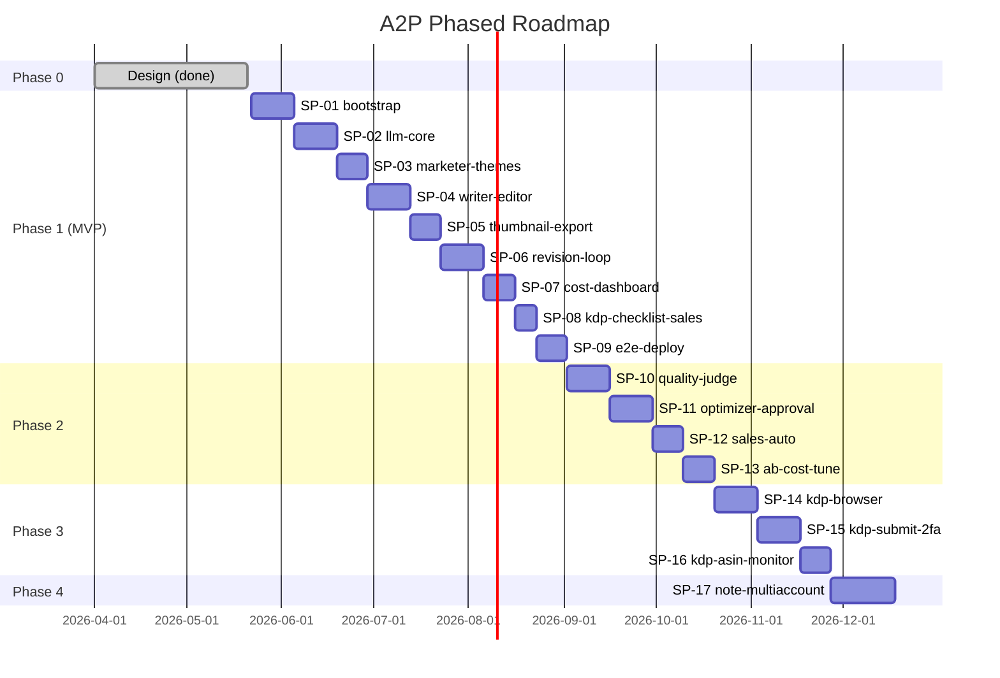
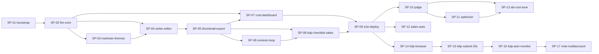

# 開発計画 (dev-plan)

> 本ドキュメントは `pm` ハーネスエージェントが計画モードで生成・更新する。
> 起点ドキュメント: `CLAUDE.md`, `docs/01-business-requirements.md`, `docs/02-functional-requirements.md`, `docs/03-tech-selection.md`, `docs/04-ui-design.md`, `docs/05-program-design.md`。
> スプリント詳細は `docs/sprints/SP-NN-*.md` を参照。
> 完了確認は同じ pm を `MODE: REVIEW` で起動し、`## PHASE_COMPLETE` の出力を以て次フェーズへ進む。

---

## 1. 目的

A2P（Amazon Automated Publishing）の段階開発を、**個人開発・副業時間（週 10〜15 時間）** の制約下で破綻なく回すための実行計画を定義する。具体的には：

- Phase 1 (MVP) を **9 スプリント / 約 12〜16 週** で完走させ、夜セット → 朝レビュー → 修正コメント一括反映のループを稼働状態にする
- 月額コスト 5 万円・1 冊コスト 500 円・100 冊/月のスループットが **計測可能** な状態を作る（観測フックを Phase 1 から完備）
- Phase 2 以降の「Quality Judge / Prompt Optimizer / KDP 自動入稿 / note 連携」を増分追加できる土台（マルチプロバイダ抽象・プロンプト DB バージョニング・書籍排他・冪等ジョブ）を Phase 1 で確立する
- `programmer` エージェントが `/iterate` で 1 タスク = 1 起動・5 iteration 以内に `## DONE` までたどり着く粒度のタスク分解を提供する

---

## 2. マイルストーン

期間目安は週単位。1 週 = 副業時間 10〜15 時間想定。`PHASE_COMPLETE` 判定は pm `MODE: REVIEW` で機械的に行う。

| Phase | 期間目安 | 主目的 | 完了条件（PHASE_COMPLETE 判定基準） |
|---|---|---|---|
| **Phase 0** (設計) | 完了済 | 10 ハーネスエージェント整備 + `docs/01..05` + ワイヤーフレーム + 本 dev-plan | `docs/01..05` 実体あり / `docs/wireframes/` 1 ファイル以上 / `docs/dev-plan.md` と `SP-01` 存在 / `docs/01` 申し送り 7 項が `docs/02` で参照 |
| **Phase 1** (MVP) | 12〜16 週（SP-01 〜 SP-09） | パイプライン (Marketer → Writer → Editor → Thumbnail) + Word/PDF/PNG 出力 + ダッシュボード + コメント→一括反映 + マルチプロバイダ抽象 + コスト/単価カタログ + バッチ計画 + KDP 入稿チェックリスト | SP-01〜SP-09 全タスク `## DONE` / Phase 1 対象 P0 機能（F-001〜F-007, F-010〜F-025, F-027〜F-028, F-032〜F-037, F-039〜F-040, F-043〜F-046, F-049〜F-050）が実装かつ E2E PASS / 月額コスト試算が 5 万円以内に収まる実測あり |
| **Phase 2** (品質ループ) ✅**完了 (2026-06-14, コード/設計/テスト)** | 6〜10 週（SP-10 〜 SP-13） | Quality Judge / Prompt Optimizer + 自動承認 / プロンプト A/B 配信 / 売上 Amazon 自動取得 / モデル A/B 比較ビュー / Prompt Caching | F-008, F-009, F-026, F-029〜F-031, F-038 実装 / UC-02・UC-03 E2E PASS / Prompt Optimizer 1 サイクル稼働 |
| **Phase 3** (KDP 自動入稿) ⏸**保留（KDP は当面手動運用, 2026-06-15 決定）** | 6〜8 週（SP-14 〜 SP-16） | Playwright + stealth による KDP 自動入稿 (F-041) + 2FA push-and-wait + ASIN 取り込み (F-042) | F-041, F-042 実装 / UC-05 E2E PASS / 本番 KDP で 1 冊以上を「公開待ち」まで到達確認 ／ ※保留中は F-020 入稿チェックリスト(S-015)で運営者が手動入稿 |
| **Phase 4** (他チャネル) | 未確定（SP-17 〜） | note 記事化 (F-047) + 複数 KDP アカウント運用 (F-048) | Phase 3 完了後に詳細化（本書では枠のみ） |

### 2.1 マイルストーンガント（概観）



---

## 3. Phase 1 スプリント一覧（詳細化対象）

Phase 1 は **9 スプリント**。各スプリントの目的・期間目安・主な成果物・対応機能 ID を以下に列挙する。タスク詳細は各 `docs/sprints/SP-NN-*.md` を参照。

| SP | スラッグ | 目的 | 期間目安 | 主な成果物 | 主な対応機能 |
|---|---|---|---|---|---|
| **SP-01** | `bootstrap-monorepo` | pnpm モノレポ・Prisma・NextAuth・最小ダッシュボード骨格・env 検証・Pino ロガー・Resend メール基盤を確立 | 2 週 | `apps/web` `apps/worker` 起動 / `packages/{db,contracts,storage,notify,crypto}` 雛形 / `docs/03 §5` env 28 項目 / Railway デプロイ通る | F-043, F-044, インフラ全般 |
| **SP-02** | `llm-core-cost-foundation` | マルチプロバイダ LLM 二層クライアント / `withTokenLogging` / `BookLock` / モデル単価カタログ + 為替日次バッチ / モデル割当 UI（最小） | 2 週 | `packages/agents/lib/*` 完成 / `catalog.fetch` `fx.fetch` 動作 / S-019 / S-020 最小実装 | F-022, F-023, F-024, F-025, F-032 |
| **SP-03** | `marketer-themes-bulk` | Marketer エージェント（Web Search + テーマ生成） / `theme_session_id` / テーマバルク承認 UI / 夜間バッチ計画 UI / `Book` 行作成 | 1.5 週 | S-006, S-007, S-008 動作 / `pipeline.book.kickoff` `pipeline.book.marketer` タスク | F-001, F-010, F-017, F-021, F-040 |
| **SP-04** | `writer-editor-pipeline` | Writer（アウトライン + 章執筆） / Editor / アウトライン承認 UI / 章並列実行 (p-limit) / book ステータス遷移 / 修正コメント反映後の Writer/Editor 再呼出基盤 | 2 週 | `pipeline.book.writer.outline/chapter` `pipeline.book.editor` / S-010 章エディタ / S-011 バルク承認 | F-003, F-004, F-005, F-011, F-016, F-018, F-027, F-028 |
| **SP-05** | `thumbnail-export-artifacts` | Thumbnail Designer（テキスト + gpt-image-1） / R2 永続化 / docx + PDF + KDP 寸法 PNG 出力 / サムネ承認 UI / 成果物ダウンロード | 1.5 週 | `pipeline.book.thumbnail.*` `pipeline.book.export` / S-009 ライブラリ / S-012 バルクサムネ / R2 キー規約 | F-006, F-007, F-012, F-013, F-014, F-015, F-019 |
| **SP-06** | `revision-comments-loop` | F-049 コメント記録（章/サムネ/メタ/アウトライン横断） / F-050 ユーザートリガー一括反映 / `revision_runs` + `chapter_revisions` + `BookLock` 衝突制御 / 差分レビュー UI | 2 週 | S-013, S-014 動作 / `revision.book.apply` タスク / Resend `revision-run-completed` メール | F-049, F-050（+ F-016 ロールバック） |
| **SP-07** | `cost-dashboard-alert` | F-033 書籍別コスト集計 / F-034 1 冊 500/750 円アラート + 自動ポーズ / F-035 月次ダッシュボード / F-036 月末予測アラート / Alert 通知メール / S-024 / S-027 / S-028 | 1.5 週 | S-024, S-027, S-028 動作 / `alert.cost.check` cron / Resend `cost-exceeded` `monthly-budget-alert` | F-033, F-034, F-035, F-036, F-046 |
| **SP-08** | `kdp-checklist-sales-kpi` | F-020 KDP 入稿チェックリスト（手動転記支援、`must` コメントで入稿ブロック） / F-037 売上手動入力 + CSV インポート / F-039 売上 KPI ダッシュボード / S-005 長期出版プラン（F-002） | 1 週 | S-015, S-017, S-018, S-005 動作 | F-002, F-020, F-037, F-039 |
| **SP-09** | `e2e-deploy-harden` | Playwright 環境構築（playwright.config + tests/e2e/、@playwright/test 導入）/ SP-01 から繰越したスモーク `tests/e2e/smoke-login-dashboard.spec.ts` / UC-01・UC-04・UC-06 本格 E2E / ジョブログ UI（S-025, S-026） / 監査ログ（S-029） / `archive.jobs` cron / Railway 本番デプロイ手順固め / 1 冊実走でコスト・リードタイム実測 | 1.5 週 | E2E spec 4 本 PASS（スモーク + UC×3） / S-025, S-026, S-029 / 本番運用ハンドブック | F-045, F-046, F-029(枠), F-030(枠), 観測 / Phase 1 完了判定 |

合計 **Phase 1 スプリント数: 9**、想定タスク総数: 約 **80〜95 タスク**（各スプリント詳細ファイル参照）。

---

## 4. Phase 2-4 スプリント一覧（枠のみ）

各スプリントは skelton ファイル（目的・対応機能 ID・想定タスク数）のみ作成。タスク詳細化は Phase 1 完了後に PM を再起動して行う。

### Phase 2 (品質ループ)

| SP | スラッグ | 目的 | 主な対応機能 |
|---|---|---|---|
| **SP-10** | `quality-judge` | Quality Judge エージェント (F-008) + 80 未満再生成ループ + 評価履歴 UI | F-008 |
| **SP-11** | `prompt-optimizer-approval` | Prompt Optimizer (F-009) + 改訂承認 UI (F-029) + 自動承認 5 冊連続改善ルール (F-030) + A/B 配信 (F-031) | F-009, F-029, F-030, F-031 |
| **SP-12** | `sales-auto-fetch` | KDP レポート Playwright 取得 (F-038) / 売上ダッシュボード自動更新 | F-038 |
| **SP-13** | `ab-comparison-cost-tune` | モデル A/B 比較ビュー (F-026) / Prompt Caching 有効化 (`AgentSdkClient` + `AISdkClient` 双方) / 比較集計クエリ + S-021 UI 実装 | F-026, OQ-07 |

### Phase 3 (KDP 自動入稿)

| SP | スラッグ | 目的 | 主な対応機能 |
|---|---|---|---|
| **SP-14** | `kdp-browser-base` | Playwright + stealth + Dockerfile 整備 / KDP 認証情報暗号化（既存 `crypto`）/ ローカルダミー HTML での E2E fixture | KDP-01〜KDP-05 |
| **SP-15** | `kdp-submit-2fa` | KDP 自動入稿実装 (F-041) / 2FA push-and-wait（Resend + 承認画面）/ S-016 モニター UI | F-041 |
| **SP-16** | `kdp-asin-monitor` | ASIN 自動取り込み (F-042) / KDP 入稿失敗時のスクショ保管 + リトライ | F-042 |

### Phase 4 (他チャネル / マルチアカウント)

| SP | スラッグ | 目的 | 主な対応機能 |
|---|---|---|---|
| **SP-17** | `note-multiaccount` | note 記事化 (F-047) + 複数 KDP アカウント運用 UI (F-048) | F-047, F-048 |

---

## 5. 依存関係

スプリント間の主要依存。前提が揃わないと後段は開始不可。



### 5.1 クリティカルパス（Phase 1）

`SP-01 → SP-02 → SP-04 → SP-05 → SP-06 → SP-09` がクリティカルパス。SP-03 は SP-02 完了後に SP-04 と部分並列可能、SP-07 / SP-08 は SP-05 完了後に部分並列可能。

### 5.2 共通前提（全スプリント）

- `CLAUDE.md` の Hard Rule 6 項を必ず守る（特に Rule 4 プロンプト DB / Rule 5 token_usage / Rule 6 secrets）
- 新スプリント開始時、pm を `MODE: REVIEW TARGET: SP-NN-1` で起動し前スプリント完了を機械検証してから着手
- 各タスクは `/iterate "<T-NN-MM>"` で起動。programmer → code-reviewer → e2e-tester の 3 段ループを APPROVED+PASS まで回す
- UI 実装タスクは `docs/wireframes/{S-xxx}-*/prompt.md`（運営者が ChatGPT 投入する手動デザインのプロンプト型ワイヤー）を必ず参照すること

---

## 6. リスクと緩和策

### 6.1 コスト関連

| # | リスク | 影響度 | 緩和策 | 関連スプリント |
|---|---|---|---|---|
| R-01 | 月額 5 万円上限の張り付き（`docs/03 §6.2` 試算 42,000〜57,500 円） | 高 | SP-02 で `token_usage` を必ず仕込み、SP-07 でアラート + 自動ポーズ。SP-13 で Prompt Caching + Gemini Flash 切替を A/B 検証 | SP-02, SP-07, SP-13 |
| R-02 | OQ-01: `@react-pdf/renderer` が 5 万字 PDF で性能不足 | 中 | SP-05 のタスクに「200 ページ 30 秒以内」ベンチを含め、未達なら Puppeteer フォールバック切替判断を SP-09 で記録 | SP-05, SP-09 |
| R-03 | OpenAI gpt-image-1 価格変動 / レート制限 | 中 | SP-02 のカタログバッチでサイズ別価格追跡（OQ-D-08）。SP-05 で再生成リトライ実装 | SP-02, SP-05 |
| R-04 | Anthropic Web Search server tool のレート/コスト超過 (OQ-02) | 中 | SP-03 で Tavily フォールバックの I/F だけ用意（Phase 2 で有効化） | SP-03 |

### 6.2 仕様・規約関連

| # | リスク | 影響度 | 緩和策 | 関連スプリント |
|---|---|---|---|---|
| R-05 | KDP 規約変更（AI 開示文・サムネ規則の改定） | 高 | F-005 で挿入する AI 開示文は `AppSettings.ai_disclosure_text` に保存（OQ-D-07）。SP-04 で実装、SP-09 で運用ハンドブック化 | SP-04, SP-09 |
| R-06 | KDP の Bot 検出による Playwright 自動入稿失敗 (OQ-03) | 高 | Phase 3 開始（SP-14）で stealth プラグイン PoC を最初に実施。失敗時はローカル PC 常駐 worker への切替を SP-14 完了判定に組込 | SP-14 |
| R-07 | プロバイダ価格 API 非提供 → スクレイピング破綻 | 中 | SP-02 で手動編集 UI（B-03）+ 前日値継続使用 + `catalog_fetch_failed` Alert を必ず実装 | SP-02 |

### 6.3 副業時間・運用関連

| # | リスク | 影響度 | 緩和策 | 関連スプリント |
|---|---|---|---|---|
| R-08 | 副業時間（週 10〜15h）でスプリント遅延 | 高 | 各スプリントを 1〜2 週 × 12 タスク以下に抑制。`/iterate` 5 iteration で完了しない場合は escalate して人間判断 | 全 SP |
| R-09 | 30 分/冊の操作時間制約が UI 設計どおりに守れない | 高 | SP-03/SP-04/SP-05/SP-06 のバルク UI を実装後、SP-09 の UC-01 E2E で「1 操作 20 件処理可能」を必ず assertion | SP-03〜SP-09 |
| R-10 | OQ-D-05: `BookLock` の expires 超過解放の運用 | 低 | SP-07 の `alert.cost.check` cron と同 worker に `book_locks` 掃除ロジック相乗り | SP-07 |
| R-11 | Resend 無料 3,000 通超過 (OQ-05) | 低 | SP-01 で実装時に送信ログを `Alert` に記録。Phase 1 末で実測し、超過なら $20 プランに切替 | SP-01 |
| R-12 | Railway 障害で全停止 | 中 | SP-01 で `pg_dump` を週次 R2 退避する cron を設定。SP-09 で復旧手順をハンドブック化 | SP-01, SP-09 |

### 6.4 設計トレース

| # | リスク | 影響度 | 緩和策 |
|---|---|---|---|
| R-13 | `token_usage` の記録漏れ（Hard Rule 5 違反） | 高 | SP-02 で `withTokenLogging` ミドルウェアを必須化、CI で `grep -r "AISdkClient\|AgentSdkClient"` が `packages/agents/lib/` 以外に出たら fail（`docs/05 §10.1`） |
| R-14 | プロンプトをコードに直書き（Hard Rule 4 違反） | 中 | SP-01 の seed 実装で `prompts` 全件投入。SP-04 から `prompt-loader.ts` 経由のみ許可。CI で grep |
| R-15 | 申し送り 7 項（`docs/01` 末尾）の未対応 | 中 | 各スプリントの「完了判定」に該当項目を明示。SP-09 完了時に pm `MODE: REVIEW` で全件チェック |

---

## 7. 意思決定ログ

主要な決定事項を日付付きで列挙。新規決定が発生したら追記する（運用ルール）。

| 日付 | 決定 | 根拠ドキュメント |
|---|---|---|
| 2026-05-21 | Phase 1 から **マルチプロバイダ二層**（`AISdkClient` + `AgentSdkClient`）を採用。Marketer の Anthropic Web Search server tool と他 4 役の Vercel AI SDK 統一を両立 | `docs/03 §A`, `docs/05 §6.1` |
| 2026-05-21 | F-050 修正一括反映は **運営者の明示的ボタン押下のみがトリガー**（自動スケジュール実行は採用しない） | `docs/01 §申し送り 7`, `docs/02 F-050`, `docs/04 S-013` |
| 2026-05-21 | 1 冊あたり想定文字数を **45,000〜55,000 字** に確定。章数 7〜10、章あたり 5,000〜7,500 字 | `docs/02 §Assumptions 1-2`, `docs/05 §6.3.2` |
| 2026-05-21 | カバー画像は **OpenAI gpt-image-1**（KDP 2560×1600 を直接生成）。日本語タイポ品質を優先 | `docs/03 C-07`, `docs/05 §6.3.4` |
| 2026-05-21 | ワイヤーフレーム画像は **運営者が ChatGPT で手動生成** する「投入プロンプト型 designer」運用とする。各 UI 実装タスクは `docs/wireframes/{S-xxx}-*/prompt.md` を必ず参照 | `docs/04 §8 申し送り 1` |
| 2026-05-21 | 月額コスト上限 **5 万円 / 1 冊 500 円**、100 冊/月目標。コスト/売上比率 33% 上限 | `docs/01 §3.2 §7.3` |
| 2026-05-21 | プロンプトは DB (`prompts` テーブル) に格納し、コード直書き禁止。シードスクリプトで初期投入 | `CLAUDE.md` Hard Rule 4 |
| 2026-05-21 | `token_usage` は `withTokenLogging` ミドルウェア経由でのみ INSERT（CI で grep チェック） | `CLAUDE.md` Hard Rule 5, `docs/05 §10.1` |
| 2026-05-21 | 書籍排他は `BookLock` テーブル（`book_id` 主キー + `expires_at` 自動解放）で行い、`revision_run` × `pipeline` × `kdp_submit` の衝突を防ぐ | `docs/05 §14 #4` |
| 2026-05-21 | リアルタイム進捗は **SSE 一次採用**、WebSocket は将来検討。Postgres `LISTEN/NOTIFY` でブリッジ | `docs/05 §1.4 §14 #10` |
| 2026-05-21 | SA = UI mutation / RH = SSE・バイナリ / RSC = GET 集計、の使い分けを固定 | `docs/05 §4.1 §14 #1` |
| 2026-05-21 | KDP 関連（F-041, F-042）は **Phase 3**。Phase 1 では F-020 入稿チェックリスト UI のみ実装 | `docs/02 §4.1 工程 8`, `docs/05 §1.3` |
| 2026-05-21 | 売上自動取得 (F-038) は **Phase 2**。Phase 1 では F-037 手動入力 + CSV インポートで運用 | `docs/02 F-037 F-038`, `docs/05 §1.3` |
| 2026-05-21 | Quality Judge (F-008) と Prompt Optimizer (F-009) は **Phase 2** 開始時に有効化。Phase 1 の `pipeline.book.judge` はスキップ枝で出荷 | `docs/05 §1.3 §5.3.8` |
| 2026-05-21 | Phase 3 用スキーマ（`accounts.kdp_credentials_enc`, `kdp_2fa_codes`, `kdp_submission_progress.auto_*`）は **Phase 1 で先取り保持**（null 許容） | `docs/05 §14 #5` |
| 2026-05-21 | メール送信は **Resend + react-email**。Phase 1 から `cost-exceeded` / `monthly-budget-alert` / `pricing-changed` / `revision-run-completed` の 4 テンプレを実装、`kdp-2fa` は Phase 3 で追加 | `docs/03 §D`, `docs/03 §10 申し送り 7` |
| 2026-05-21 | 環境変数は `packages/contracts/env.ts` で zod 検証、起動時に必須項目を verify。CI で `.env.example` との差分検出 | `docs/03 §J`, `docs/05 §13 #2` |
| 2026-06-14 | **Phase 2（品質ループ, SP-10〜SP-13）をコード/設計/テスト面で完了**。F-008/009/026/029-031/038 実装＋ユニット/E2E 検証済み。残るは実 LLM/本番実走を要する人間ゲートのみ | 各 `docs/sprints/SP-10..13`, pm `MODE: REVIEW TARGET: Phase 2` |
| 2026-06-15 | **KDP へのアップロードは当面「人間が手動」運用**とする（運営者決定）。Phase 1 実装済みの F-020 KDP 入稿チェックリスト UI（S-015）で生成成果物（docx/PDF/PNG＋メタデータ）を確認し、運営者が KDP へ手動転記・入稿する。**Phase 3（KDP 自動入稿 F-041/F-042, SP-14〜16）は保留**（実 Amazon への Playwright 自動操作は bot 検出による BAN リスク R-06 が高く、実認証・2FA も要するため、必要になった時点で別途着手） | `docs/02 F-020/F-041/F-042`, `docs/04 S-015`, `docs/dev-plan §6.2 R-06` |

---

## 8. 完了確認の運用

各スプリント / Phase の完了は pm エージェントを `MODE: REVIEW TARGET: <対象>` で起動し、機械検証する。

### スプリント完了確認

```
/iterate(... )  # 各タスクを APPROVED+PASS まで回す
↓ 全タスク完了
pm MODE: REVIEW TARGET: SP-NN  # → ## PHASE_COMPLETE or ## PHASE_INCOMPLETE
```

### Phase 完了確認

```
SP-01..SP-09 全完了
↓
pm MODE: REVIEW TARGET: Phase 1
↓ PHASE_COMPLETE
Phase 2 のスプリントを詳細化 (pm 計画モード再起動)
```

各スプリントファイルの「完了判定」セクションには上記運用が明記されている。

---

## 9. トレーサビリティ：機能 ID → スプリント

Phase 1 対象の全 P0/P1 機能（F-001〜F-050 のうち Phase 1 / Phase 2 期待開始）と担当スプリントのマッピング。

| F-ID | 機能名 | 主担当 SP | 補助 SP |
|---|---|---|---|
| F-001 | テーマ候補生成 | SP-03 | — |
| F-002 | 長期出版プラン | SP-08 | — |
| F-003 | アウトライン生成 | SP-04 | — |
| F-004 | 章執筆 | SP-04 | SP-06 (修正反映で再呼出) |
| F-005 | 校閲 | SP-04 | SP-06 |
| F-006 | カバーテキスト | SP-05 | SP-06 |
| F-007 | カバー画像 | SP-05 | SP-06 |
| F-008 | Quality Judge | SP-10 (Phase 2) | — |
| F-009 | Prompt Optimizer | SP-11 (Phase 2) | — |
| F-010 | 書籍ジョブ作成 | SP-03 | SP-04 |
| F-011 | 並列実行 | SP-04 | SP-01 (worker 起動), SP-05 |
| F-012 | Word 出力 | SP-05 | — |
| F-013 | PDF 出力 | SP-05 | — |
| F-014 | カバー PNG | SP-05 | — |
| F-015 | R2 永続化 | SP-05 | SP-01 (storage 雛形) |
| F-016 | リトライ/部分再開 | SP-04 | SP-06, SP-09 |
| F-017 | テーマバルク承認 | SP-03 | — |
| F-018 | アウトラインバルク承認 | SP-04 | — |
| F-019 | サムネバルク承認 | SP-05 | — |
| F-020 | KDP 入稿チェックリスト | SP-08 | — |
| F-021 | 夜間バッチ計画 | SP-03 | — |
| F-022 | モデル割当 | SP-02 | — |
| F-023 | UI モデル切替 | SP-02 | — |
| F-024 | 単価カタログ日次取得 | SP-02 | — |
| F-025 | カタログダッシュボード | SP-02 | — |
| F-026 | モデル A/B 比較 | SP-13 (Phase 2) | — |
| F-027 | DB プロンプトテンプレ | SP-01 (seed), SP-04 (loader) | 全 SP |
| F-028 | プロンプトバージョン履歴 | SP-04 | SP-11 |
| F-029 | プロンプト改訂承認 UI | SP-11 (Phase 2) | — |
| F-030 | プロンプト自動承認 | SP-11 (Phase 2) | — |
| F-031 | プロンプト A/B 配信 | SP-11 (Phase 2) | — |
| F-032 | トークン使用量記録 | SP-02 | 全 SP |
| F-033 | 書籍別コスト集計 | SP-07 | — |
| F-034 | 1 冊 500 円超過アラート | SP-07 | — |
| F-035 | 月次コストダッシュボード | SP-07 | — |
| F-036 | 月次予測アラート | SP-07 | — |
| F-037 | 売上手動入力 | SP-08 | — |
| F-038 | 売上自動取得 | SP-12 (Phase 2) | — |
| F-039 | 書籍 KPI ダッシュボード | SP-08 | — |
| F-040 | KDP メタデータ生成 | SP-03 | — |
| F-041 | KDP 自動入稿 | SP-15 (Phase 3) | — |
| F-042 | ASIN 取り込み | SP-16 (Phase 3) | — |
| F-043 | NextAuth 認証 | SP-01 | — |
| F-044 | アカウント管理 | SP-01 | SP-15 (KDP 認証情報暗号化) |
| F-045 | ジョブログ UI | SP-09 | — |
| F-046 | 失敗ジョブリトライ | SP-09 | SP-07 |
| F-047 | note 連携 | SP-17 (Phase 4) | — |
| F-048 | 複数 KDP アカウント | SP-17 (Phase 4) | — |
| F-049 | 修正コメント記録 | SP-06 | — |
| F-050 | 修正一括適用 | SP-06 | — |

### 9.1 docs/03 申し送り 7 項 のスプリント割当

| docs/03 §10 申し送り | 担当 SP |
|---|---|
| 1. LLM クライアント二層構造 | SP-02 |
| 2. `token_usage` は middleware 経由のみ | SP-02 |
| 3. 環境変数 zod スキーマ + CI 差分検出 | SP-01 |
| 4. graphile-worker task_identifier 命名規約 | SP-01（規約）, SP-03 以降（実装） |
| 5. R2 キー設計 | SP-01（規約）, SP-05（実装） |
| 6. PDF 出力性能ベンチ | SP-05（実測）, SP-09（判断記録） |
| 7. メールテンプレ 5 種（kdp-2fa は Phase 3） | SP-01（基盤）, SP-07（cost）, SP-06（revision）, SP-15（kdp-2fa） |

### 9.2 docs/05 申し送り 10 項 のスプリント割当

| docs/05 §13 申し送り | 担当 SP |
|---|---|
| 1. Prisma シングルトン | SP-01 |
| 2. env zod 検証 | SP-01 |
| 3. SA/RH の最初に zod parse + auth | SP-01（auth ラッパ）, 全 SP |
| 4. audit_log 記録対象 | SP-02（モデル切替）, SP-06（ジョブ操作）, SP-07（設定）, SP-11（プロンプト承認） |
| 5. 冪等性チェックリスト | SP-02（基盤）, SP-04 以降（タスク実装） |
| 6. createAgentClient 経由のみ | SP-02 |
| 7. R2 アクセスは packages/storage のみ | SP-01 |
| 8. getSessionOrThrow() | SP-01 |
| 9. シードデータ | SP-01（Account/Settings/Prompts/Assignments） |
| 10. Phase 3 用テーブル空欄保持 | SP-01（schema.prisma に nullable 列） |

---

## 10. 横断規約（ADR ハイライト）

スプリント間で揺らぎがちな技術判断を ADR として `docs/05-program-design.md §16` に記録し、本ファイルからも参照する。新規 sprint detail を起こす際は必ず該当 ADR に従うこと。

| ADR | 内容 | 影響範囲 |
|---|---|---|
| **ADR-001** | PostgreSQL `LISTEN/NOTIFY` チャネル名は **`'jobs'`** に統一（SP-03 T-03-11 SSE 配信、worker 側 `notifyJobChange` ヘルパ） | SP-03 以降の全 worker タスクで `pg_notify` を使う箇所、`/api/sse/jobs` route handler |

**Sprint detail 執筆時の注記**: SSE / pg_notify を参照する箇所では必ず `docs/05 §16 ADR-001` に従う（`'jobs'`）。旧表記 `'jobs_progress'` は誤りで、過去 sprint detail (SP-03 T-03-11, SP-04 T-04-04) は ADR-001 確定時に修正済み。

---

（以上、Phase 1 を 9 スプリント / Phase 2 を 4 / Phase 3 を 3 / Phase 4 を 1 で分解。詳細は各 `docs/sprints/SP-NN-*.md` を参照。）
